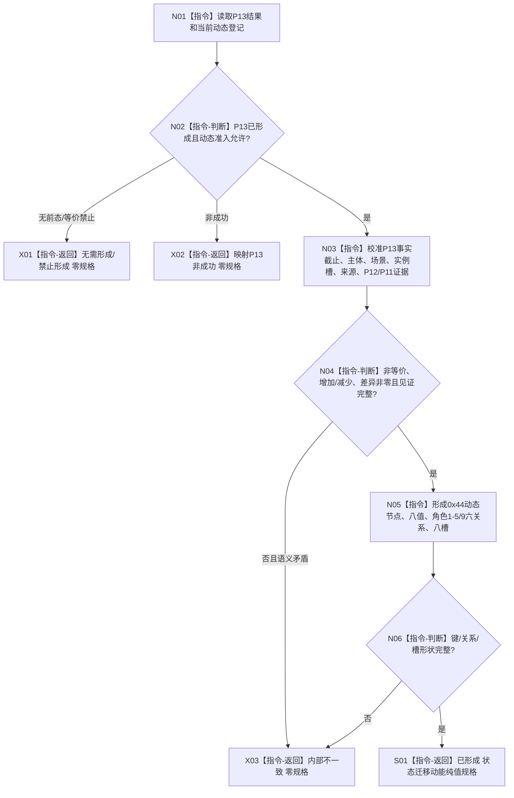
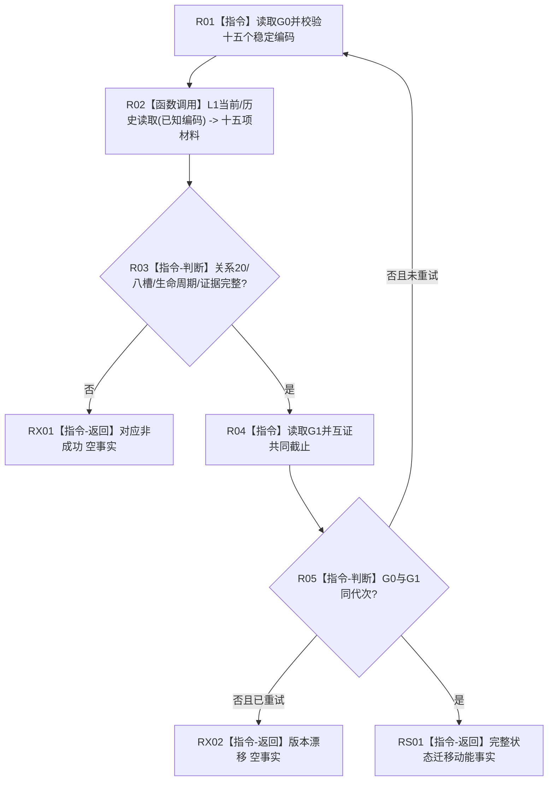

# L1-SIMPLIFY-P14-DYNAMIC-SPEC 形成与读取状态迁移动能函数流程图 v0.2

对应详细设计：`规范/详细设计/20260805_L1-SIMPLIFY-P14-DYNAMIC-SPEC_关系20状态迁移动能登记规格与读取详细设计_v0.2.md`

正式基线：`12bc9678d49971356da19b8e897926054c909bce`

## 函数合同

```text
根函数：L1动态服务::形成状态迁移动能规格
归属模块/文件：海中鱼巣.领域.服务.L1动态 / 海中鱼巣/领域/服务.L1动态.ixx
现有或待新增：待新增（P14 v0.2施工目标）
完整签名：状态迁移动能规格结果 L1动态服务::形成状态迁移动能规格(const 实际存在I64后继状态规格结果& P13结果) const
参数：P13值式结果只读借用；不含动态身份、关系角色、算法、注册、截止、许可或事务
返回：已形成、无需形成/禁止形成、入口拒绝、未找到、不可比较、版本漂移、许可拒绝、资源失败或内部不一致；非成功零规格
```

## 流程图



读取根函数：

```text
状态迁移动能结果 L1动态服务::读取状态迁移动能(const 状态迁移动能读取请求& 请求) const
```



P12/P13 专项均由顺序360承载；P14 自有专项顺序390。P14 形成和读取均不调用 P11、不提交 L1、不建立最终幂等账。
