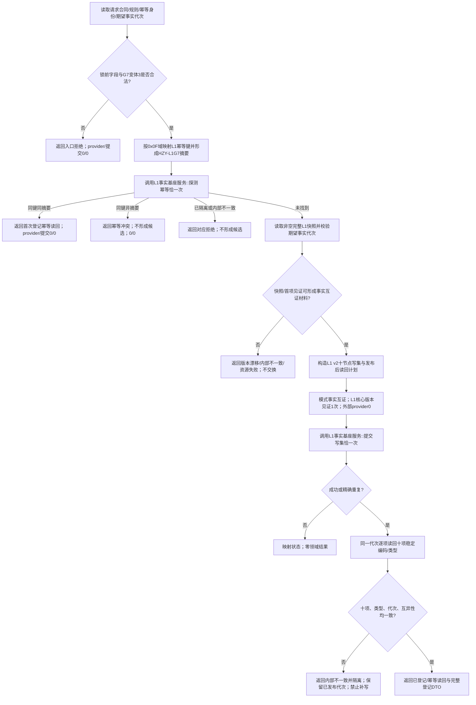
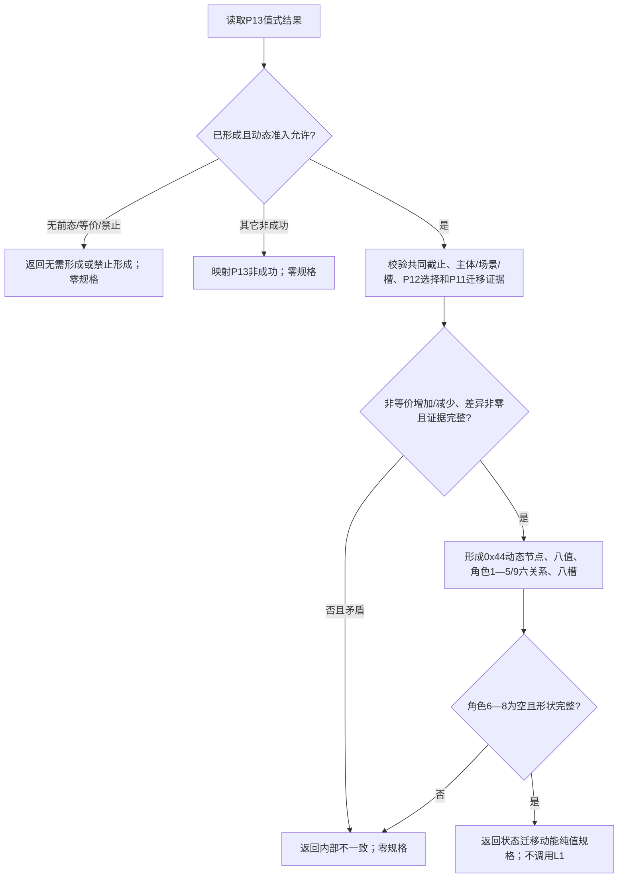
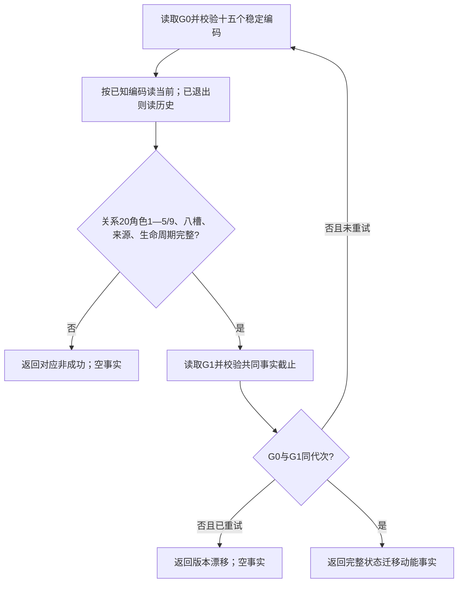

# L1-SIMPLIFY-P14-DYNAMIC-SPEC 形成与读取状态迁移动能函数流程图 v0.3

对应详细设计：`规范/详细设计/20260805_L1-SIMPLIFY-P14-DYNAMIC-SPEC_关系20状态迁移动能登记规格与读取详细设计_v0.3.md`

创建侧基线：`5c549f2adf9f19b9f1f495231c4694aba63c8a77`

## 身份裁决

P14 是关系20状态迁移动能领域，使用 G7 状态/状态动态意图组的入口变体3，固定标签
`0x15000F01`、幂等域 `0x0F`。G7 T01/T02 标签不复用；G9 留给 P78 动态因果领域。

## 1. 登记函数合同与流程

```text
根函数：L1动态服务::建立登记
签名：L1动态登记结果 建立登记(const L1动态登记请求& 请求)
公开 DTO：合同版本1、规则版本1、动态操作幂等身份、期望事实代次
L1写集：合同版本2；十节点；零关系/值/槽/退出
凭证：请求意图组7、格式1、标签0x15000F01、变体3、结果计划摘要全零
```



## 2. 纯值规格函数合同与流程

```text
根函数：L1动态服务::形成状态迁移动能规格
输入：P13 v0.2 实际存在I64后继状态规格结果（值式只读）
L1写入/provider/幂等/领域意图：全部0
```



## 3. 读取函数合同与流程

```text
根函数：L1动态服务::读取状态迁移动能
输入：十五个已发布稳定编码
L1写入/provider/幂等/领域意图：全部0；只调用L1当前/历史读取入口
```



## 验证与边界

一图一个根函数；三段图各自的 provider、提交、纯G0、G7变体3、G9隔离、十项登记、
`0x44`形状和十五项读回路径必须与 v0.3 详细设计逐字一致。只证明设计合同，不证明
代码、构建、运行、接线、恢复、跨域发布或治理闭环。
