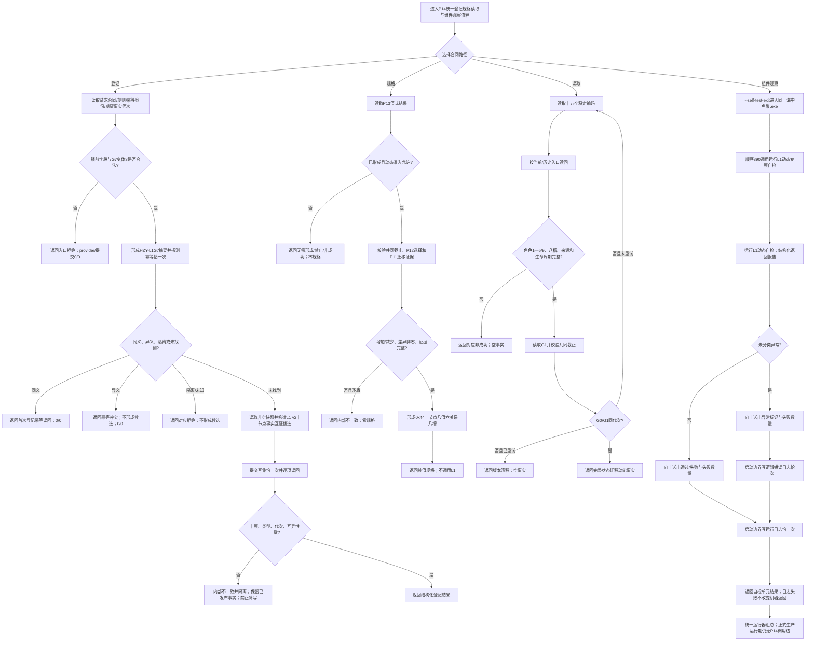

# L1-SIMPLIFY-P14-DYNAMIC-SPEC 形成与读取状态迁移动能函数流程图 v0.4

对应详细设计：`规范/详细设计/20260805_L1-SIMPLIFY-P14-DYNAMIC-SPEC_关系20状态迁移动能登记规格与读取详细设计_v0.4.md`

创建侧支撑基线：`a300acd47465e62b1df0366d600ec6eda878d0fe`

## 身份与边界

P14 继续使用 G7、入口变体3、`0x15000F01U`、幂等域 `0x0F` 和既有 L1 v2 合同；P78/P16
不进入本图。生产运行期没有 P14 消费边，属于原目标预期边界；`--self-test-exit` 只是同一
`海中鱼巣.exe` 的受控自检模式，不是第二目标。

## 1. 登记、规格和读取流程

登记、纯值规格和十五项读取的三个根函数流程与 v0.3 完全保持：

日志固定写入现有 `日志/运行.log`，模块为 `L1-SIMPLIFY-P14-DYNAMIC-SPEC`，入口为
`运行L1动态专项自检`，内容含 S01、结果、28项数量、失败数量、未分类异常和“正式接线/读回
不适用”。只有未分类异常进入现有 `逻辑错误.log`；合法拒绝、重复、漂移和资源失败不被
伪造为逻辑错误。两个日志 API 均为
`bool(std::wstring_view 模块, std::wstring_view 入口, std::wstring_view 内容)`，返回值只表示
观察写入是否成功，不进入机器结果。日志是人读诊断，不能替代结构化结果或 L1 事实。

## 3. 诊断责任与观察范围

32个可执行函数的责任逐项以详细设计 §4 为唯一表；责任备注物理落在各自
`L1动态.数据.h`、`服务.L1动态.ixx`、`自检.L1动态.ixx` 和 `启动.应用程序.ixx` 的函数合同
附近。P14 内部只向上送出，`运行L1动态专项自检` 是当前 P14 自检的唯一本地记录边界；
`运行完整自检模式` 只汇总并向程序顶层送出。不得在锁内日志、不得改日志系统、不得建立
第二自检解释者。

当前没有生产消费者，正式接线和正式读回不进入本图的组件观察路径；后继 P16 必须另行从
自己的新 HEAD 复核真实消费者和服务导向验收。

本图只冻结 v0.4 设计合同，不证明代码、构建、日志已实际产生、正式接线、正式读回、恢复、
跨进程恢复、P16 原子发布或治理闭环完成。
