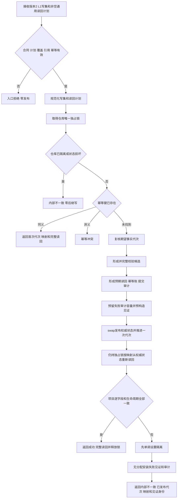
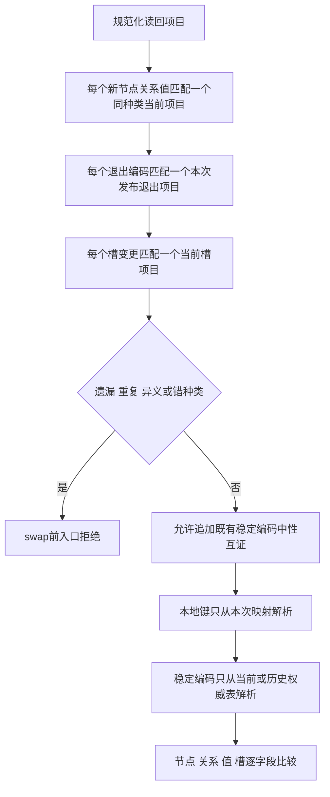
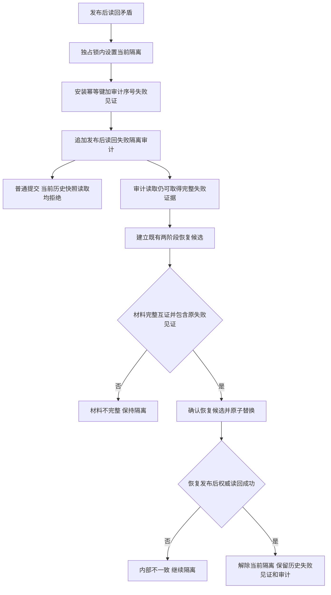

# L1-SIMPLIFY-P15-POST-PUBLISH-READBACK L1提交内通用发布后读回隔离函数流程图 v0.1

日期：2026-08-05

状态：设计就绪；代码未实现

## 1. 普通提交与通用发布后读回

## 2. 通用计划覆盖与解析

## 3. 失败见证与隔离恢复

流程中不存在领域回调、第二L1写请求、SQL运行期裁决、事实扫描猜测、swap回滚、删除或补偿写。
