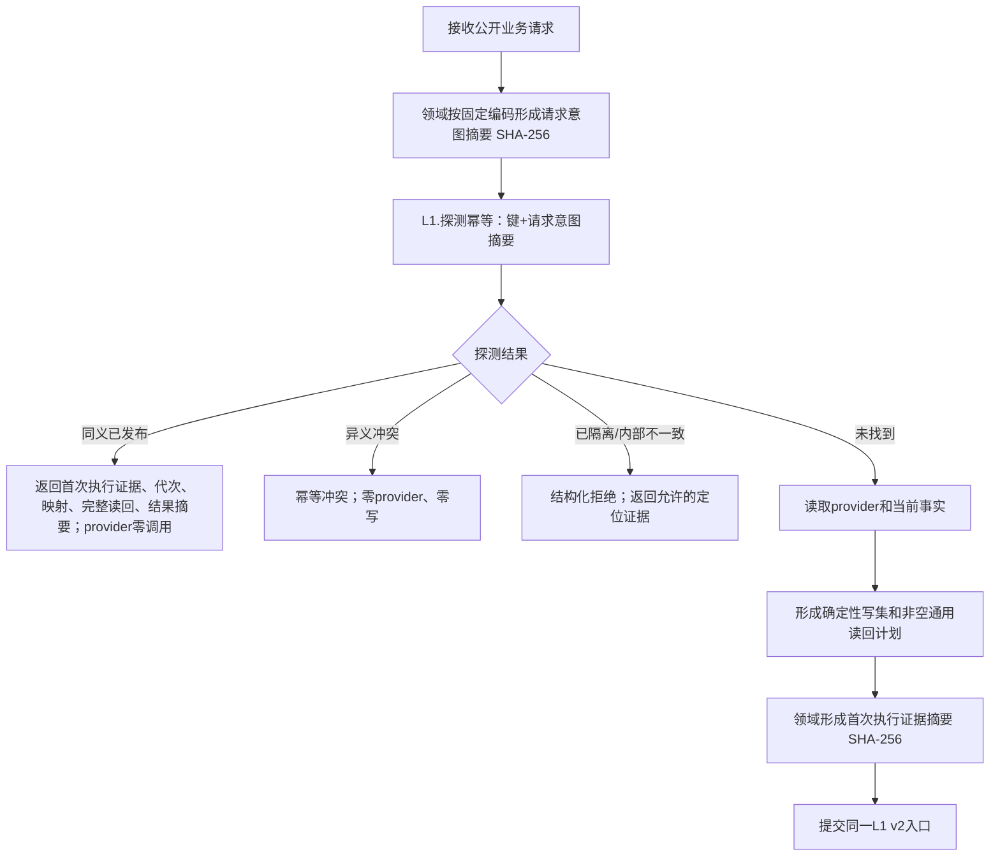
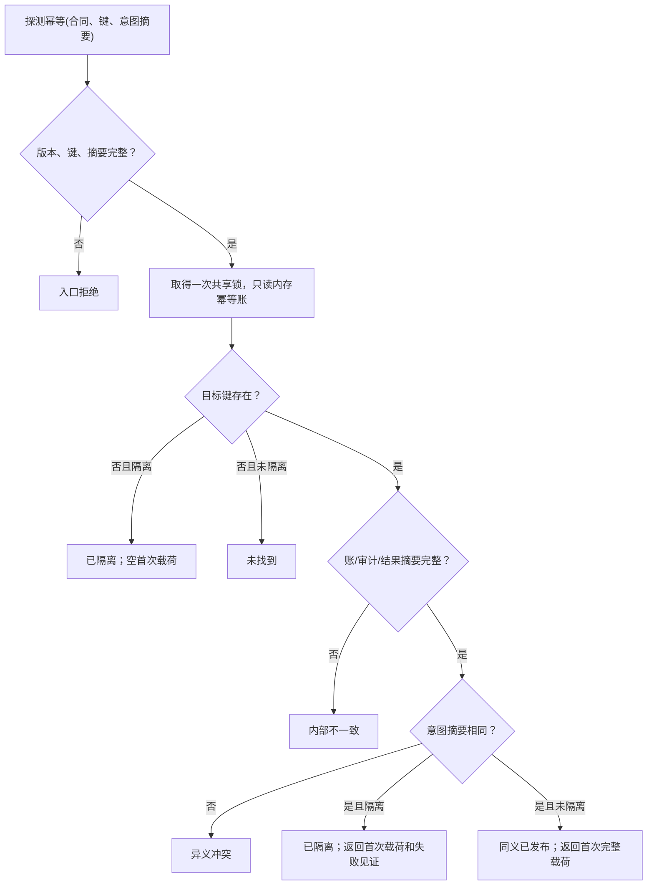
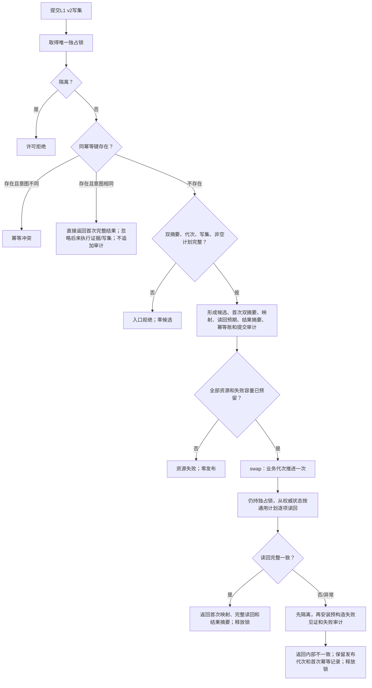
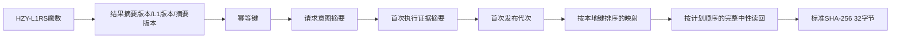
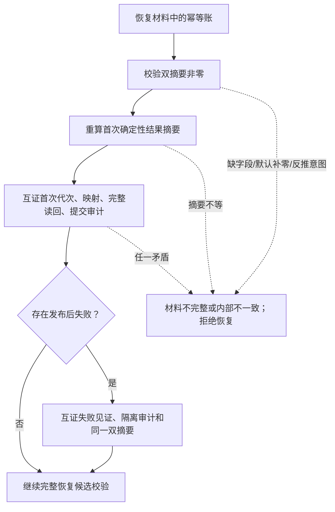

# L1-SIMPLIFY-P15 L1双摘要幂等探测、提交内读回与隔离函数流程图 v0.2

对应详细设计：`规范/详细设计/20260805_L1-SIMPLIFY-P15-POST-PUBLISH-READBACK_L1提交内通用发布后读回隔离详细设计_v0.2.md`

v0.2 完整替代 v0.1；v0.1 禁止施工。

## 1. 领域写入口与幂等探测

## 2. L1 探测函数

探测不访问 SQL、provider、普通事实、索引，不写审计、不推进代次、不外泄锁或容器引用。

## 3. L1 提交和双摘要裁决

## 4. 结果摘要编码

整数网络字节序；集合先写 U64 数量，空集合写 U64 零；禁止地址、padding、`std::hash`、容器迭代序或平台布局。

## 5. 恢复互证

