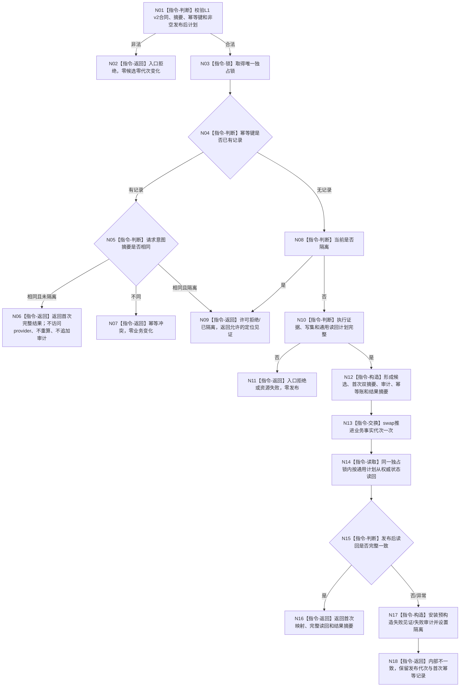

# L1-SIMPLIFY-P15 L1提交内通用发布后读回隔离函数流程图 v0.3

对应详细设计：`规范/详细设计/20260805_L1-SIMPLIFY-P15-POST-PUBLISH-READBACK_L1提交内通用发布后读回隔离详细设计_v0.3.md`

v0.3 完整替代 v0.2 的调用点清单和白名单部分；v0.2 其它双摘要机器合同保持有效。

## 依据与调用点边界

```text
正式基线：ba3a2e39c7b0a68dede15cc870ab52c2fc388ba0
实际代码调用点：14 个文件、39 处 `.提交写集(...)`
流程图文本命中：1 个，仅作证据，不是代码调用
v0.3 新增白名单：服务.L1实际存在、组合.L1实际存在场景、自检.L1实际存在、自检.L1实例特征、自检.特征比较
```

## 函数合同

```text
根函数：L1事实基座服务::提交
归属模块 / 文件 / 层级：海中鱼巣.核心.服务.L1事实基座 / 海中鱼巣/核心/服务.L1事实基座.ixx / L1核心
现有或待新增：现有函数，v0.2 -> v2合同迁移
完整签名：L1写入结果 L1事实基座服务::提交(const L1写集请求& 请求)
参数：请求；const 引用借用，仅调用期间有效，不保留
返回结果：L1写入结果；首次成功、精确重复、幂等冲突、隔离拒绝、资源失败或内部不一致
被调函数流程图：本图冻结提交内探测/候选/swap/读回/隔离；所有14个调用点只作为调用方清单，不形成第二个根函数
```

## 流程图



## 调用点合同

所有以下调用点必须在进入 `提交` 前完成意图摘要和 `探测幂等`；只有探测未找到才形成 provider 执行证据。调用点总数固定为 39：

```text
核心/自检.L1可重建索引.ixx             2
核心/自检.L1事实基座.ixx               13
领域/服务.世界登记.ixx                  1
领域/服务.L1场景结构.ixx                1
领域/服务.L1特征定义.ixx                2
领域/服务.L1实例特征.ixx                3
领域/服务.特征比较.ixx                  2
领域/服务.L1实际存在.ixx                1  [v0.3新增]
领域/组合.L1实际存在场景.ixx            2  [v0.3新增]
领域/自检.世界登记.ixx                  1
领域/自检.L1实际存在.ixx                2  [v0.3新增]
领域/自检.L1实例特征.ixx                7  [v0.3新增]
领域/自检.特征比较.ixx                  1  [v0.3新增]
自检/运行期上下文.ixx                   1
```

## 关键边界

```text
流程图中的调用点清单不是额外代码根函数；它们共享唯一L1 v2提交合同。
流程图文件中的文字命中不计入代码调用数，不能成为白名单路径。
遗漏任一新增五文件即为P15不完整，不能以“核心六文件已迁移”替代。
```

## 验证

执行前检查本图 Mermaid 和唯一根函数合同；执行时用限定 rg/AST 复核 14 个代码文件、39 处调用、20 文件白名单和 provider 前探测边界。文档不证明代码已实现或运行通过。
