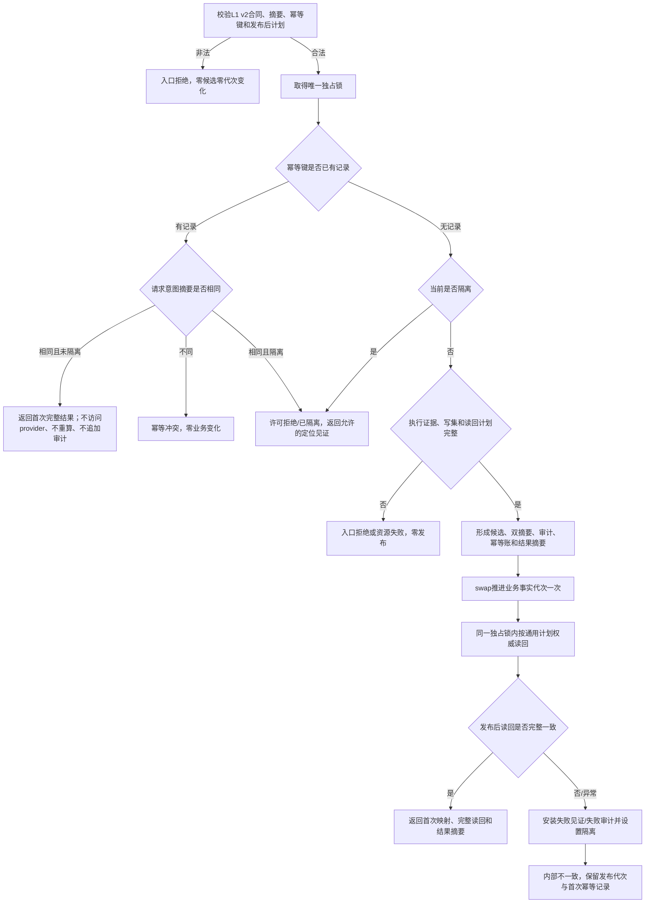

# L1-SIMPLIFY-P15 L1提交内通用发布后读回隔离函数流程图 v0.5

对应详细设计：`规范/详细设计/20260805_L1-SIMPLIFY-P15-POST-PUBLISH-READBACK_L1提交内通用发布后读回隔离详细设计_v0.5.md`

正式基线：`e254f5a67d98340d8f32f56343edd05e12a67600`

v0.5 完整替代 v0.4 的调用点清单、迁移矩阵和激活门禁；v0.4 双摘要机器合同保持有效。

## 调用点边界

```text
实际代码调用点：16 个文件、46 处 `.提交写集(...)`
v0.5 新增：领域/服务.特征比较.ixx 在P11结果后的第3处调用
流程图/Markdown 命中：仅证据文本，不是代码调用
代码白名单：20 个代码文件；另有2份专属记录，共22路径
```

## 函数合同

```text
根函数：L1事实基座服务::提交
归属模块/文件：海中鱼巣.核心.服务.L1事实基座 / 海中鱼巣/核心/服务.L1事实基座.ixx
现有或待新增：现有函数，v0.4 -> v2合同迁移
完整签名：L1写入结果 L1事实基座服务::提交(const L1写集请求& 请求)
参数：const 引用借用，仅调用期间有效，不保留
返回：首次成功、精确重复、幂等冲突、隔离拒绝、资源失败或内部不一致
```

## 流程图



## 16文件/46调用点清单

```text
核心/自检.L1可重建索引.ixx             2
核心/自检.L1事实基座.ixx               13
领域/服务.世界登记.ixx                  1
领域/服务.L1场景结构.ixx                1
领域/服务.L1特征定义.ixx                2
领域/服务.L1实例特征.ixx                3
领域/服务.特征比较.ixx                  3 [v0.5新增1点]
领域/服务.L1实际存在.ixx                1
领域/组合.L1实际存在场景.ixx            2
领域/服务.L1状态.ixx                    2
领域/自检.世界登记.ixx                  1
领域/自检.L1实际存在.ixx                2
领域/自检.L1实例特征.ixx                7
领域/自检.特征比较.ixx                  1
领域/自检.L1状态.ixx                    4
自检/运行期上下文.ixx                   1
```

每处调用均须在 provider 前完成公开请求意图摘要和 `探测幂等`；只有未找到才读取 provider 并形成执行证据，随后进入唯一 L1 v2 提交合同。清单不是额外根函数，流程图文本命中不计数。

## 验证边界

执行前检查 Mermaid、唯一根函数合同、16文件/46调用点和22路径白名单；执行时复核双摘要同义/异义、首次结果、同锁读回、失败见证、隔离、审计/恢复互证。本文不证明代码已实现、编译或运行通过。
