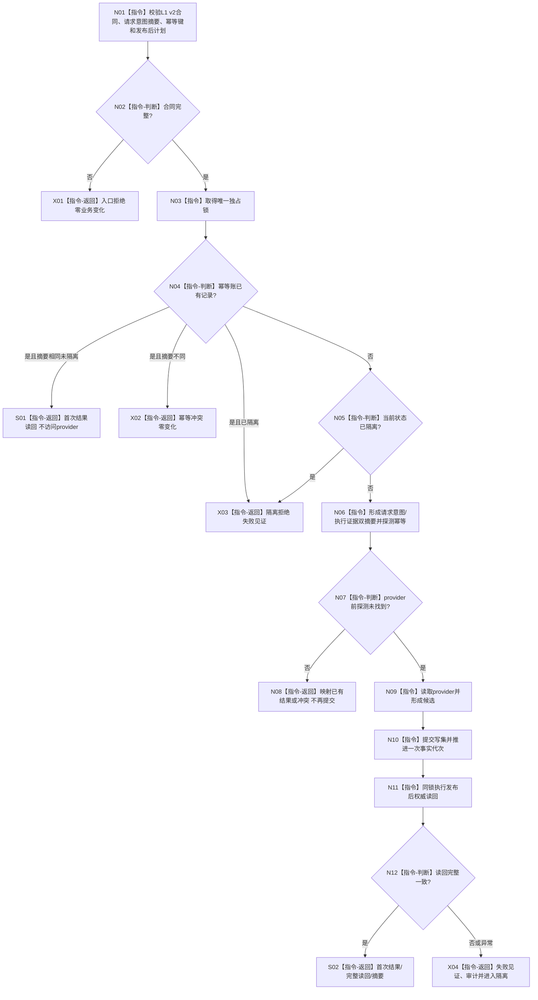

# L1-SIMPLIFY-P15 L1提交内通用发布后读回隔离函数流程图 v0.6

对应详细设计：`规范/详细设计/20260805_L1-SIMPLIFY-P15-POST-PUBLISH-READBACK_L1提交内通用发布后读回隔离详细设计_v0.6.md`

正式基线：`973aa24a189bd548b22774e051ba9eeca044ec81`

## 调用点边界

```text
实际代码调用点：16 个文件、50 处 `.提交写集(...)`
v0.6 新增：领域/自检.L1状态.ixx 新增4处 P12状态专项调用
流程图/Markdown 命中：仅证据文本，不是代码调用
代码白名单：20 个代码文件；另有2份专属记录，共22路径
```

## 函数合同

```text
根函数：L1事实基座服务::提交
归属模块/文件：海中鱼巣.核心.服务.L1事实基座 / 海中鱼巣/核心/服务.L1事实基座.ixx
现有或待新增：现有函数，v0.6 继续迁移至 L1 v2 合同
完整签名：L1写入结果 L1事实基座服务::提交(const L1写集请求& 请求)
参数：const 引用借用，仅调用期间有效，不保留
返回：首次成功、精确重复、幂等冲突、隔离拒绝、资源失败或内部不一致
```

## 流程图



## 调用点清单

```text
核心/自检.L1可重建索引.ixx             2
核心/自检.L1事实基座.ixx               13
领域/服务.世界登记.ixx                  1
领域/服务.L1场景结构.ixx                1
领域/服务.L1特征定义.ixx                2
领域/服务.L1实例特征.ixx                3
领域/服务.特征比较.ixx                  3
领域/服务.L1实际存在.ixx                1
领域/组合.L1实际存在场景.ixx            2
领域/服务.L1状态.ixx                    2
领域/自检.世界登记.ixx                  1
领域/自检.L1实际存在.ixx                2
领域/自检.L1实例特征.ixx                7
领域/自检.特征比较.ixx                  1
领域/自检.L1状态.ixx                    8 [v0.6 新增4点]
自检/运行期上下文.ixx                   1
合计                                    16文件/50调用点
```

每处调用均须在 provider 前完成双摘要和 `探测幂等`；流程图文本命中不计数。本文不证明代码已实现、编译或运行通过。
