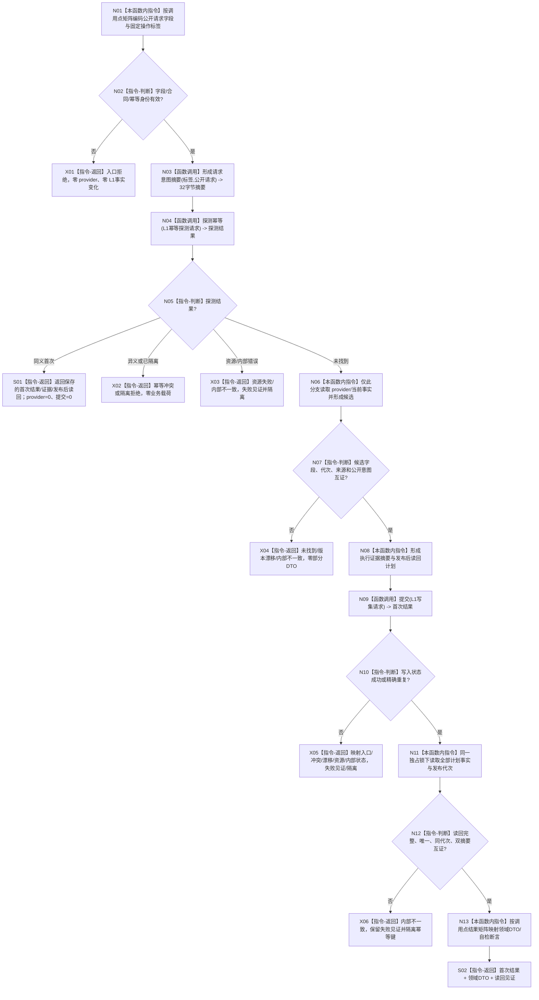

# L1-SIMPLIFY-P15 L1提交内通用发布后读回隔离函数流程图 v0.7

对应详细设计：`规范/详细设计/20260805_L1-SIMPLIFY-P15-POST-PUBLISH-READBACK_L1提交内通用发布后读回隔离详细设计_v0.7.md`

正式基线：`0659707586c149b6f85d453f362a1ecc32098594`

具名漂移：`DESIGN-DRIFT-P15-PROVIDER-PRE-PROBE-MATRIX-MISSING`

## 身份与调用边界

```text
正式代码机械事实：16 个代码文件、50 处 .提交写集(...)
根函数：L1事实基座服务::提交(const L1写集请求& 请求) -> L1写入结果
provider 前函数：L1事实基座服务::探测幂等(const L1幂等探测请求& 请求) -> L1幂等探测结果
调用点三张矩阵：见同版本详细设计 §3.1—§3.3；执行者不得另造字段、标签或 DTO 映射
流程图文本命中不计入代码调用；本图不证明代码已迁移或已通过构建
```

## 根函数合同

```text
归属模块 / 文件：海中鱼巣.核心.服务.L1事实基座 / 海中鱼巣/核心/服务.L1事实基座.ixx
现有或待新增：现有 L1 v2 根函数；v0.7 只冻结调用方前置矩阵
参数：const L1写集请求& 请求，调用期间借用，不保存
返回：L1写入结果；状态为成功、精确重复、幂等冲突、事实代次漂移、入口拒绝、资源失败或内部不一致；成功/重复携带首次执行证据、发布代次、结果摘要和发布后读回
前置调用：每个调用点先按详细设计逐点字段表形成请求意图摘要，再调用探测幂等；不得先读取 provider/当前事实
被调函数：L1事实基座服务::探测幂等、唯一锁内仓库提交、同锁发布后权威读回、失败见证/隔离记录
```

## 流程图



## 节点合同与调用点绑定

| 节点 | 输入/结果绑定 | 事实读写 | 验证 |
| --- | --- | --- | --- |
| N01 | 50 个调用点分别绑定详细设计 C01—SC01 的字段组和标签 | 只读调用方请求材料 | 50 行矩阵逐一存在 |
| N03 | `L1写集请求`公开字段→请求意图摘要 | 不读 provider | 摘要长度32、字段顺序固定 |
| N04 | `L1幂等探测请求{幂等键,请求意图摘要}`→探测结果 | 只读幂等账 | provider 前调用边扫描 |
| N06 | 仅未找到分支→各领域已有 provider/当前事实读取 | 只读领域/L1事实 | 同义路径 provider=0 |
| N08 | 候选→执行证据摘要、发布后读回计划 | 只读候选材料 | 计划与候选字段互证 |
| N09 | 规范化写集→首次结果 | 一次 L1 提交 | 单次提交/单次代次 |
| N11 | 首次结果读回计划→完整读回 | 同锁权威读回 | 节点/关系/值/属性槽/代次/摘要互证 |
| N13 | 首次结果→W/S/D/F/E/T/M/X DTO，核心自检→断言材料 | 不改机器事实 | 详细设计 §3.3 映射表 |
| X01—X06 | 具名失败状态/零载荷 | 失败见证、隔离账 | 非成功矩阵与隔离读回 |

## 逐点索引

```text
C01-C13 核心事实基座自检13点；I01-I02 可重建索引2点；R01 运行期1点；
W01/S01/D01-D02/F01-F03/E01/T01-T02/M01-M03/X01-X02 生产与组合15点；
SW01/SE01-SE02/SF01-SF07/SE03-SE10/SC01 领域自检19点；合计50点。
每个点的公开字段、标签、首次结果映射及同义/异义/失败路径唯一见详细设计 §3.3。
```

## 关键边界

```text
探测幂等必须发生在 provider 或当前事实读取之前；提交内部再次探测不能替代它。
同义结果直接读回首次结果，异义/已隔离零业务载荷；不得重试 provider 或提交。
发布后读回缺字段、重复键、错代次、摘要不一致或证据不一致均为内部不一致并隔离。
本图只冻结施工合同，不证明20个代码WIP已迁移、构建、自检、生产装配或治理完成。
```

## 验证

1. 机械扫描正式 HEAD 仅得 16 文件/50 点，且与详细设计逐点索引相等。
2. 检查图中只有一个根函数；所有执行节点为函数调用或本函数内具体指令，返回路径具名。
3. 运行 `git diff --check` 与 `python .\\tools\\check_specs.py --strict`；不新增 HTML。
