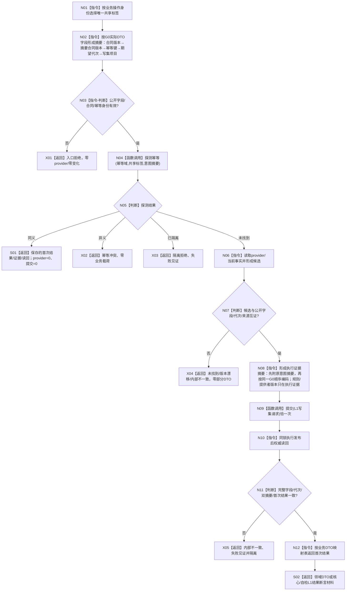

# L1-SIMPLIFY-P15 L1提交内通用发布后读回、双摘要幂等与隔离函数流程图 v0.9

对应详细设计：`规范/详细设计/20260805_L1-SIMPLIFY-P15-POST-PUBLISH-READBACK_L1提交内通用发布后读回隔离详细设计_v0.9.md`

正式基线：`619ae2244ed67c00d7febd785351197a6093a768`

具名漂移：`DESIGN-DRIFT-P15-V08-G0-RULE-VERSION-NOT-IN-L1-WRITESET`

## 函数合同

```text
根函数：L1事实基座服务::提交(const L1写集请求& 请求) -> L1写入结果
前置函数：L1事实基座服务::探测幂等(const L1幂等探测请求& 请求) -> L1幂等探测结果
归属：海中鱼巣/核心/服务.L1事实基座.ixx
调用点边界：正式 HEAD 下16文件/50处 .提交写集(...)
标签来源：v0.9业务操作身份矩阵；首次、同义和异义材料使用同一业务标签
G0编码：`HZY-L1ID`+U32格式1+U32标签+U8模式+U32合同版本+U32摘要合同版本+U64幂等键+U64期望事实代次+节点/关系/值/属性槽/退出事实项目；G0无规则版本字段
```

## 流程图



## 关键矩阵节点

| 节点 | 固定合同 | 验证点 |
| --- | --- | --- |
| N01 | C01/C02同标签、C08/C10/C11同标签、C09/C12/C13同标签、X01/X02同标签；其余按 v0.9 表唯一身份 | 标签按业务身份去重，不能按调用序号生成 |
| N02 | G0先编码合同版本、摘要合同版本、幂等键、期望代次及五类写集项目；G1—G8只编码其实际DTO字段 | 无规则版本伪造，摘要输入无provider材料 |
| N04 | `L1幂等探测请求`携带幂等域、共享标签形成的摘要和幂等键 | 调用发生在provider/当前事实读取前 |
| S01 | 读取幂等账首次执行证据、首次代次、结果摘要、完整读回 | provider与提交均为0 |
| N06 | 只有未找到才访问provider/当前事实 | 同义/异义路径调用边为0 |
| N09/N10 | 单次L1提交、同锁发布后权威读回 | 代次、节点/关系/值/属性槽和摘要互证 |
| N12 | 世界/场景/定义/实例/存在/状态/比较 DTO，核心/自检保留L1结果 | 非成功零部分载荷 |

## 50点索引

```text
C01-C13(13)、I01-I02(2)、R01(1)、W01/S01/D01-D02/F01-F03/E01/T01-T02/M01-M03/X01-X02(15)、
SW01/SE01-SE02/SF01-SF07/SE03-SE10/SC01(19) = 50。
详细设计 §4 的业务身份行是逐点标签唯一来源；X01是X02保存请求的同义重试，C11/C13是C08/C09异义材料。
```

## 边界与验证

```text
提交内部的防御性探测不能替代provider前探测；不得为测试分支新增标签。
读回缺字段、重复键、错代次、摘要不互证或同义首次结果不一致均隔离。
本图不证明代码实现、构建、自检、P44/P45或下游状态/动态完成；执行者不得新增`规则版本`字段或改变G0顺序。
```

验证：`git diff --check`、`python .\\tools\\check_specs.py --strict`，并机械确认正式 HEAD 为16文件/50点、所有点落入唯一业务身份行。
