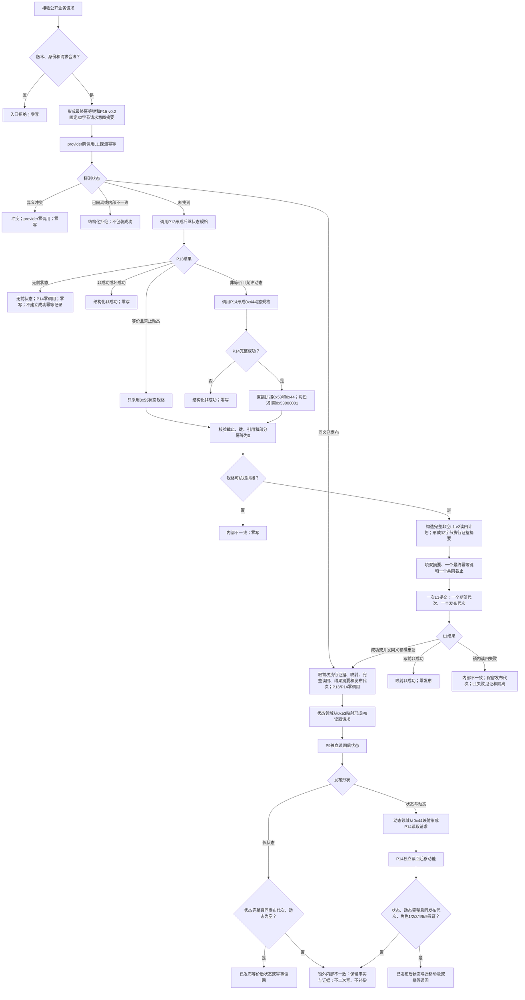
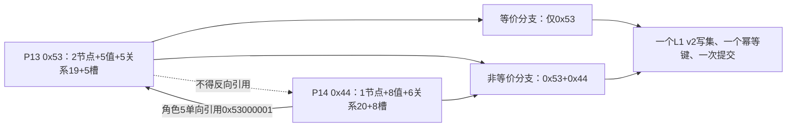
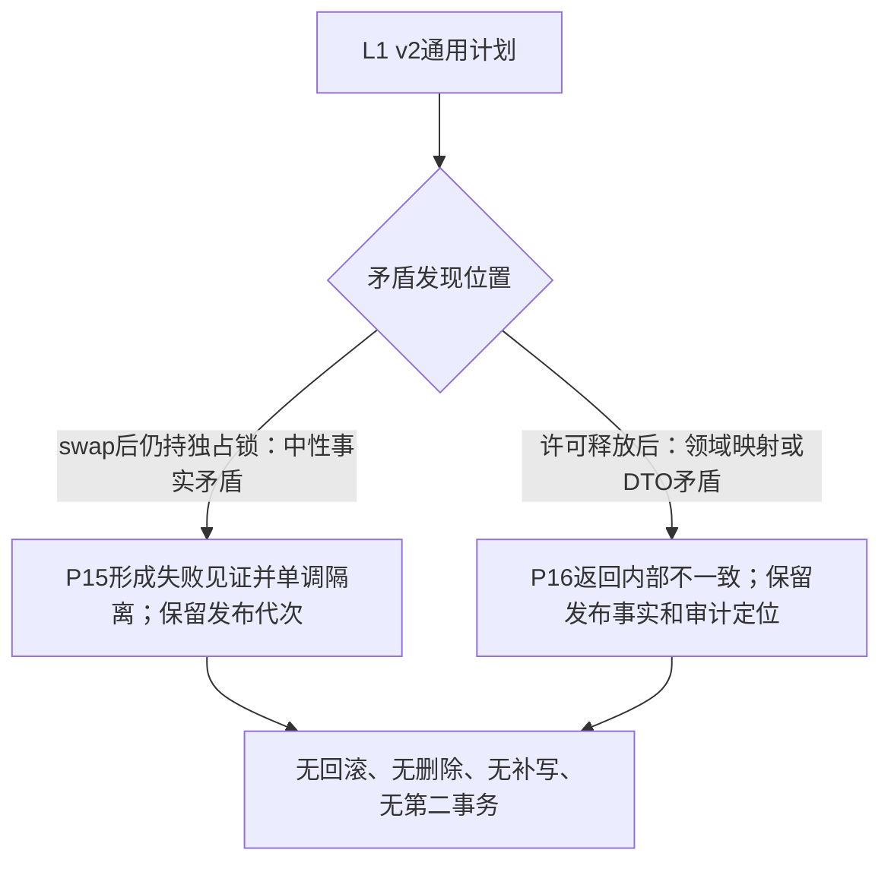
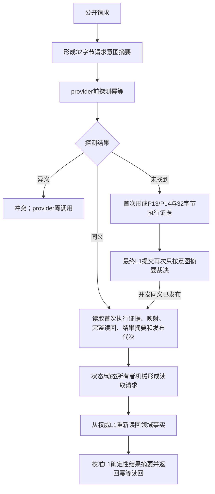

# L1-SIMPLIFY-P16 实际存在 I64 后继状态动态原子发布函数流程图 v0.1

对应详细设计：`规范/详细设计/20260805_L1-SIMPLIFY-P16-STATE-DYNAMIC-ATOMIC-PUBLISH_实际存在I64后继状态动态原子发布详细设计_v0.1.md`

## 1. 唯一公开函数

```cpp
状态动态原子发布结果 发布实际存在I64后继状态与迁移动能(
    L1事实基座服务& L1,
    L1实例特征服务& 实例特征,
    L1状态服务& 状态,
    特征比较服务& 比较,
    L1动态服务& 动态,
    const 状态动态原子发布请求& 请求);
```



## 2. 写集形状



关系20角色6—8真正为空：不创建节点、值、关系、属性槽或占位项目。

## 3. 失败边界



## 4. P15 v0.2 双摘要精确重复



不得因后来 provider、登记、当前值、执行证据或写集变化改判同义；不得扫描稳定编码猜测首次映射。P13无前态不提交幂等记录，后续仍未找到时可以重新评估。
