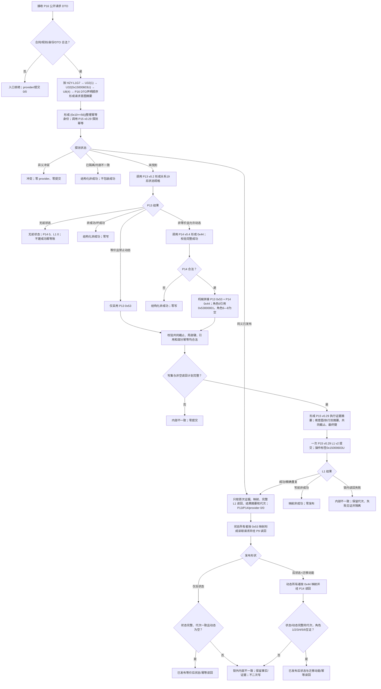

# L1-SIMPLIFY-P16 实际存在 I64 后继状态动态原子发布函数流程图 v0.2

对应详细设计：`规范/详细设计/20260805_L1-SIMPLIFY-P16-STATE-DYNAMIC-ATOMIC-PUBLISH_实际存在I64后继状态动态原子发布详细设计_v0.2.md`

P16 是 G7 状态/状态变化族的独立发布入口：变体4、生产标签 `0x15000603U`、独立幂等域 `0x10`。G7 T01/T02、P14 变体3/`0x15000F01U`、G9 和 L1 自检标签均不复用。请求意图字节顺序固定为 `ASCII HZY-L1G7 → U32格式版本1 → U32标签0x15000603U → U8变体4 → P16公开请求DTO全部字段（声明顺序、现有字段头/大端/嵌套规则）→ SHA-256`，标签和变体只出现一次。

唯一公开函数：

```cpp
状态动态原子发布结果 发布实际存在I64后继状态与迁移动能(
    L1事实基座服务& L1,
    L1实例特征服务& 实例特征,
    L1状态服务& 状态,
    特征比较服务& 比较,
    L1动态服务& 动态,
    const 状态动态原子发布请求& 请求);
```



同义只由 P16 全部公开请求字段的确定性字节完全相等决定；provider 结果、共同截止、P13/P14 结果、写集、映射、稳定编码和读回不进入同义判定。单一生产程序和正式日志仅作人读观察，日志不是机器事实；崩溃、重启、断电、跨进程恢复及 P82 不在本叶范围。
