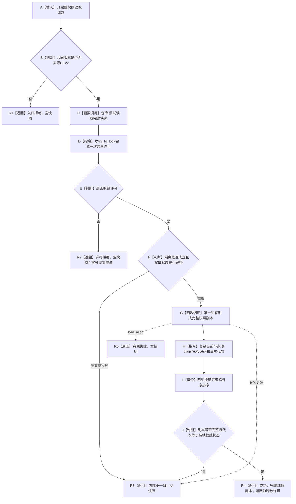
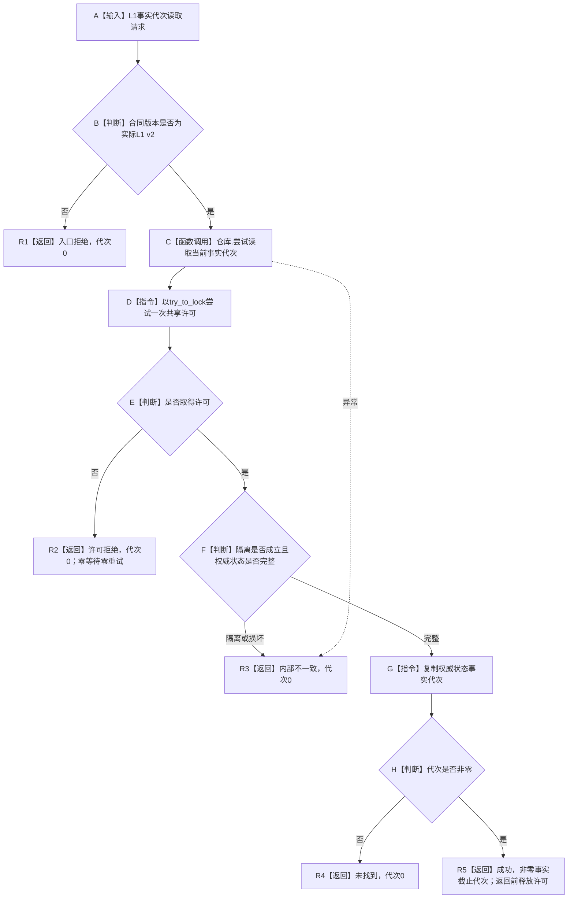
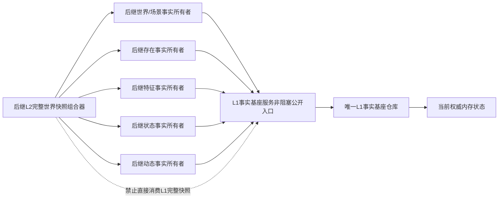

# L1-SIMPLIFY-P17-NONBLOCKING-READ L1 非阻塞当前快照与事实代次读取函数流程图 v0.1

对应详细设计：`规范/详细设计/20260805_L1-SIMPLIFY-P17-NONBLOCKING-READ_L1非阻塞当前快照与事实代次读取详细设计_v0.1.md`

## 1. `L1事实基座服务::尝试读取完整快照`

既有阻塞式 `读取完整快照` 也复用 `形成完整快照副本`，但本叶不迁移旧调用点。STEP-4 后继领域读取只能使用本图的新非阻塞入口。

## 2. `L1事实基座服务::尝试读取当前事实代次`

## 3. 调用边界

本叶不建立图中的任何后继领域入口或 L2 组合器。
