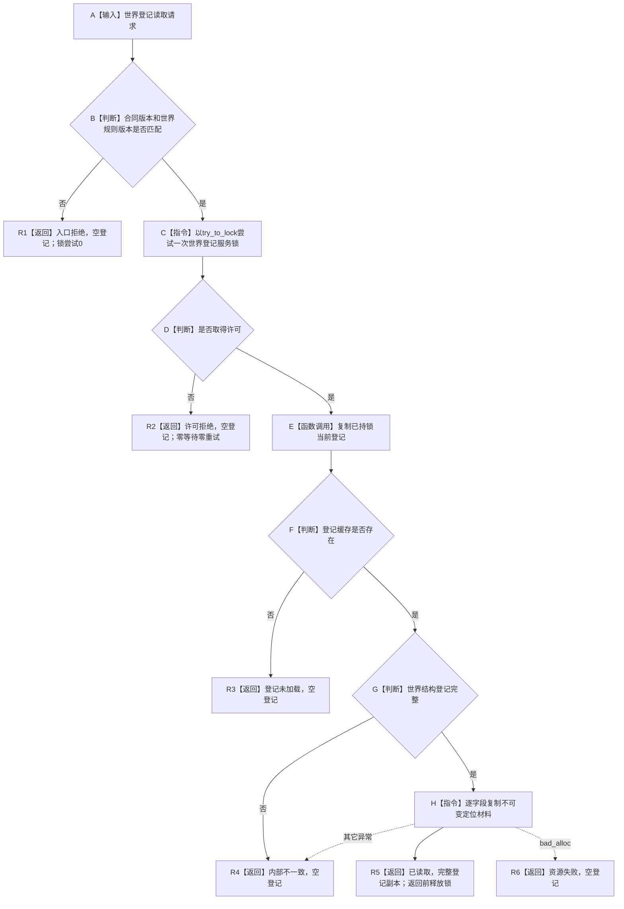
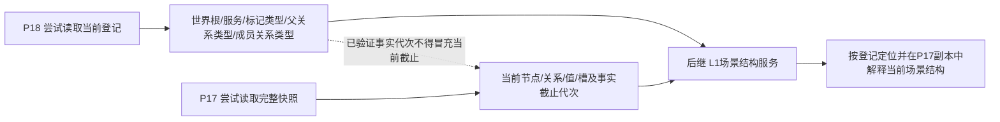
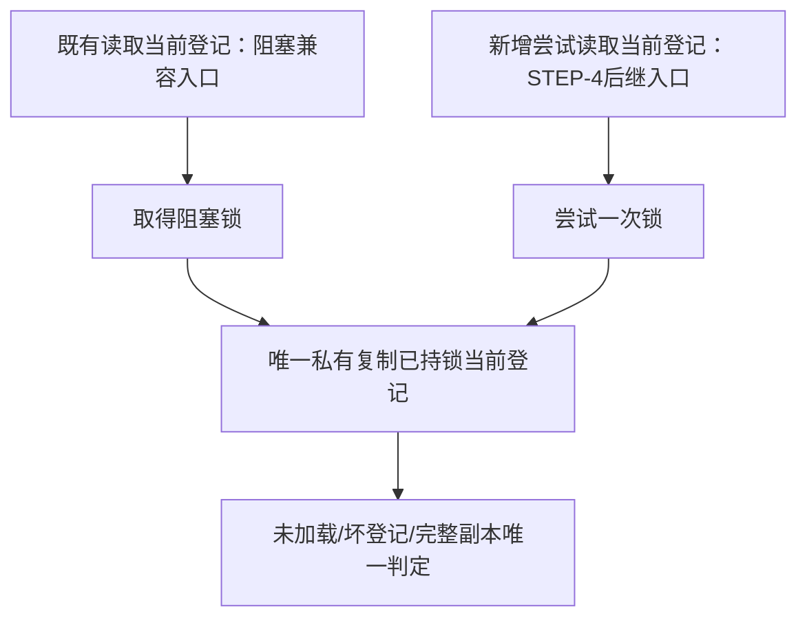

# L1-SIMPLIFY-P18-WORLD-REGISTRY-READ 世界登记非阻塞定位读取函数流程图 v0.1

对应详细设计：`规范/详细设计/20260805_L1-SIMPLIFY-P18-WORLD-REGISTRY-READ_世界登记非阻塞定位读取详细设计_v0.1.md`

## 1. `世界登记服务::尝试读取当前登记`

## 2. 定位材料与当前事实分账

本叶只形成 A—B，不实现 P17、后继场景结构服务或完整世界快照。

## 3. 新旧入口唯一解释

禁止为新入口建立第二缓存或复制登记完整性判断。
