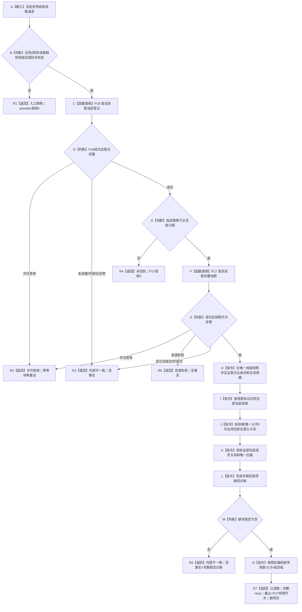
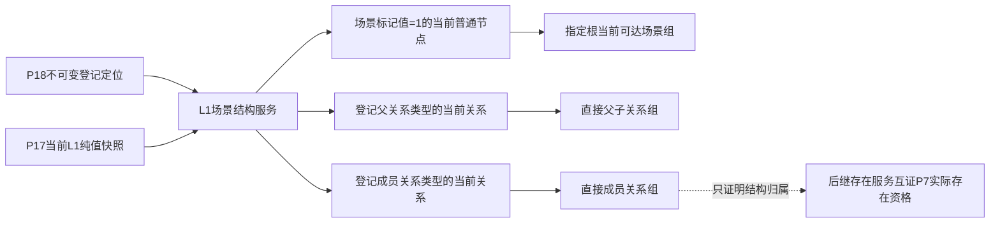
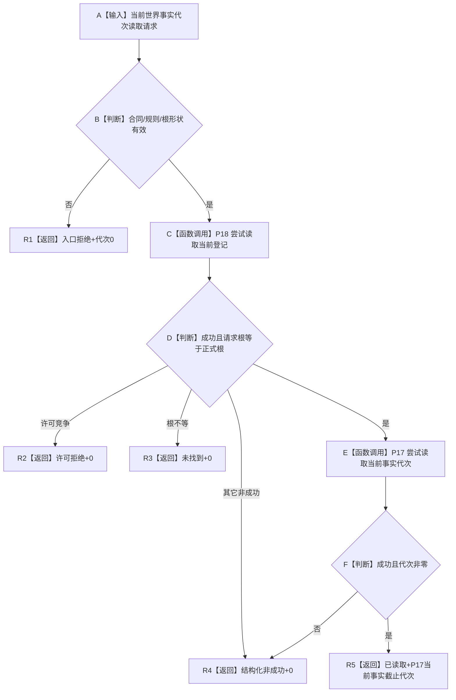

# L1-SIMPLIFY-P19-WORLD-STRUCTURE-READ 指定根当前场景结构读取函数流程图 v0.1

对应详细设计：`规范/详细设计/20260805_L1-SIMPLIFY-P19-WORLD-STRUCTURE-READ_指定根当前场景结构读取详细设计_v0.1.md`

## 1. `L1场景结构服务::读取当前世界结构`

## 2. 场景与直接关系解释边界

L2 组合器不得直接消费 A、B 后复制本图解释；只能调用场景结构服务的公开结果。

## 3. `L1场景结构服务::读取当前事实代次`

P18 的 `已验证事实代次` 不进入 R5；后继总快照以本函数作为 G1 场景领域门面。
