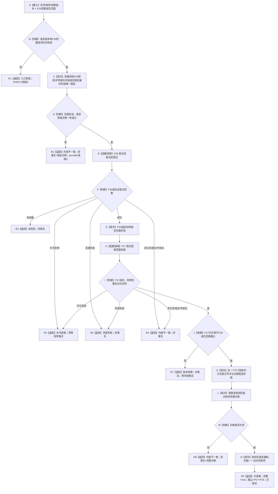
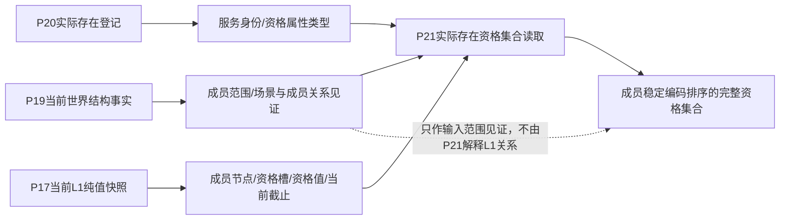
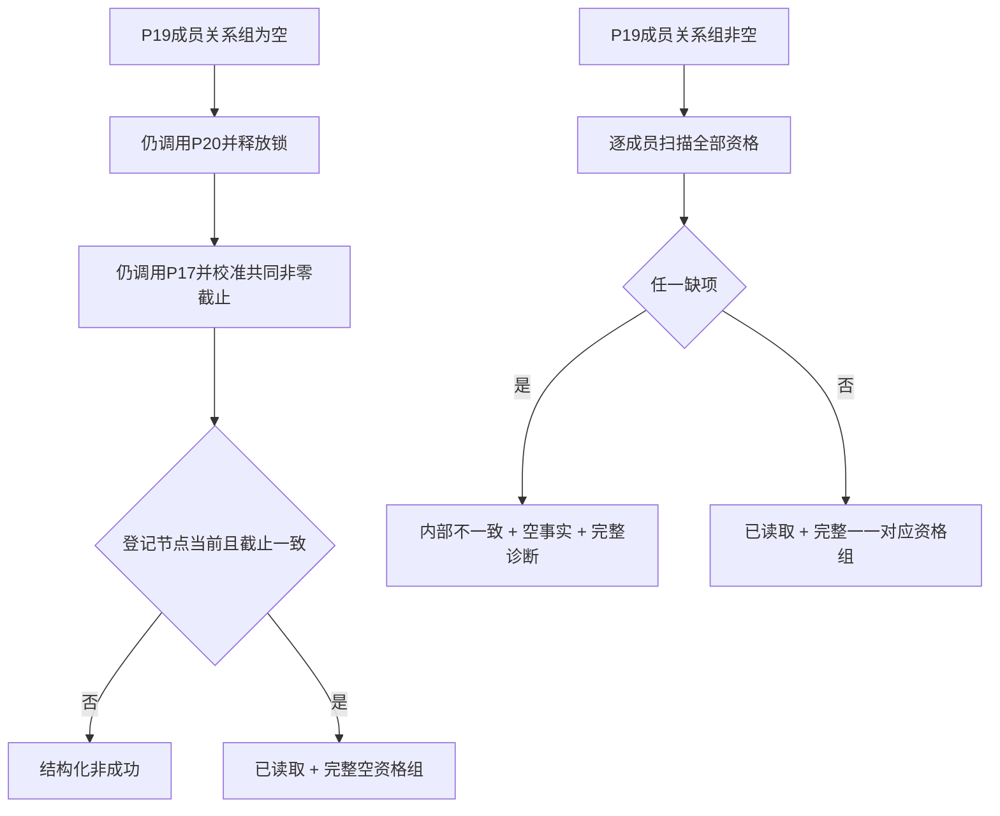

# L1-SIMPLIFY-P21-EXISTENCE-SET-READ 指定根当前实际存在资格集合读取函数流程图 v0.1

对应详细设计：`规范/详细设计/20260805_L1-SIMPLIFY-P21-EXISTENCE-SET-READ_指定根当前实际存在资格集合读取详细设计_v0.1.md`

## 1. `L1实际存在服务::读取当前实际存在资格集合`

## 2. 领域所有权与字段来源

P21 不调用 P19 服务，也不解析 L1 中的场景关系；调用方必须传入 P19 完整成功事实。

## 3. 空成员与全有或全无

禁止返回“已通过成员的部分集合”。
