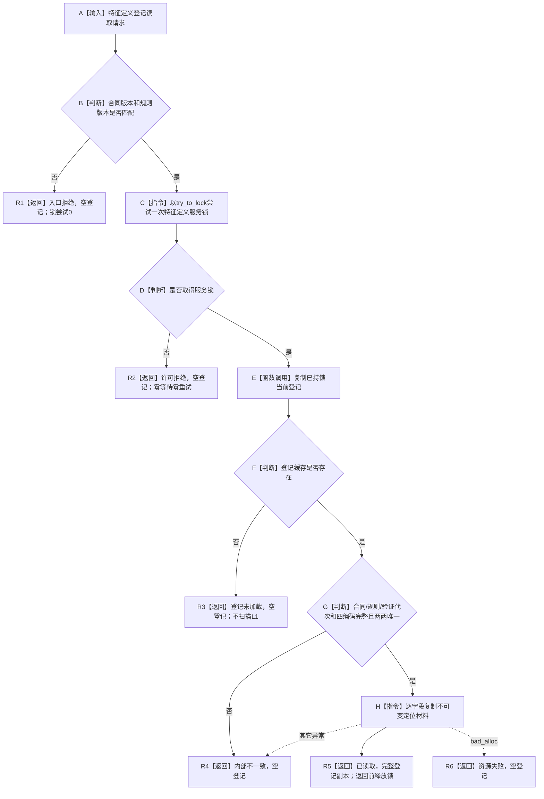
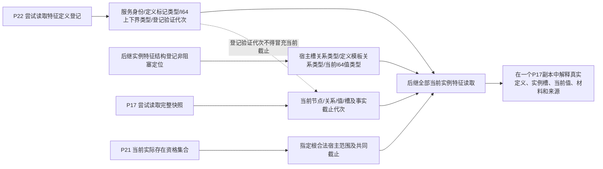
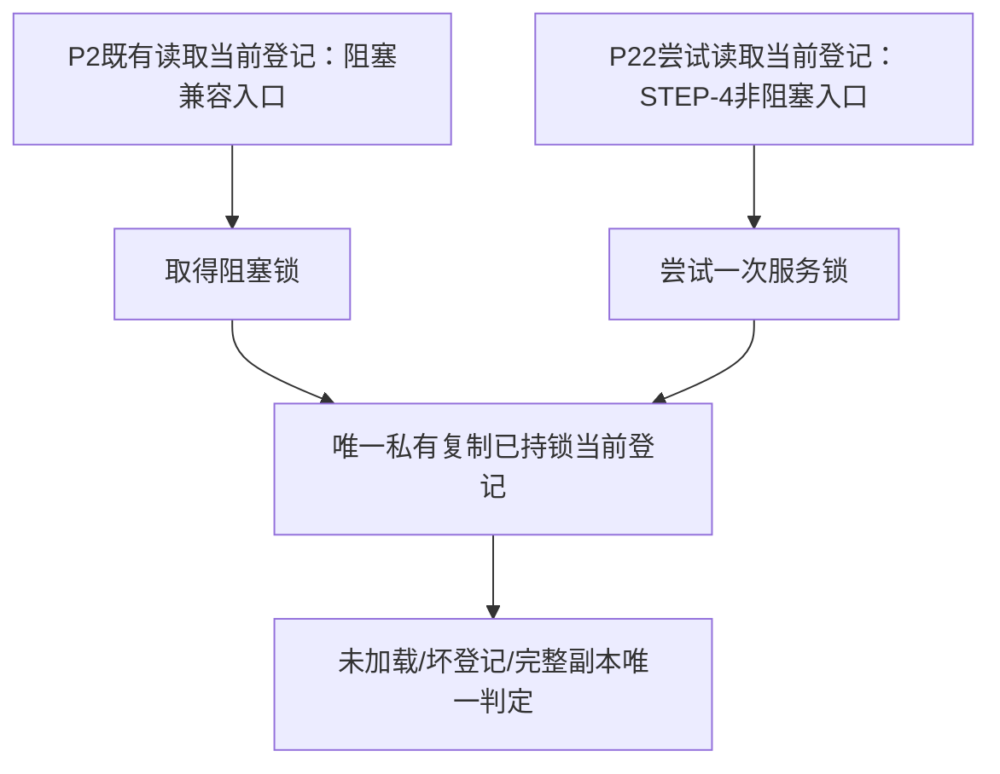

# L1-SIMPLIFY-P22-FEATURE-DEFINITION-REGISTRY-READ 特征定义登记非阻塞定位读取函数流程图 v0.1

对应详细设计：`规范/详细设计/20260805_L1-SIMPLIFY-P22-FEATURE-DEFINITION-REGISTRY-READ_特征定义登记非阻塞定位读取详细设计_v0.1.md`

## 1. `L1特征定义服务::尝试读取当前登记`

## 2. 定义定位与后继当前特征事实分账

本叶只形成 A—B。P22 返回并释放特征定义服务锁后，后继才可调用其它 provider；禁止跨 provider 持锁。

## 3. 新旧入口唯一解释

禁止为新入口建立第二登记缓存或复制登记完整性判断。
