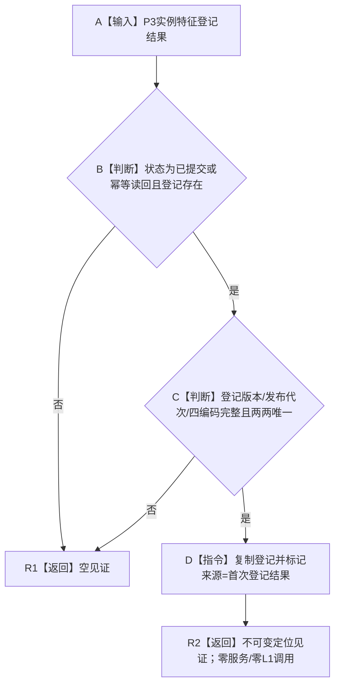
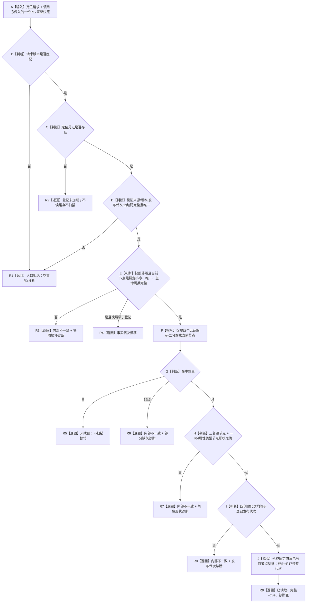
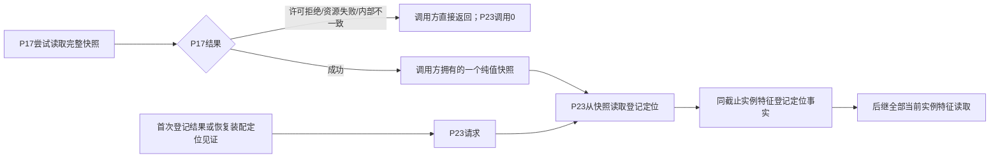

# L1-SIMPLIFY-P23-FEATURE-INSTANCE-REGISTRY-LOCATOR 实例特征结构登记快照定位读取函数流程图 v0.1

对应详细设计：`规范/详细设计/20260805_L1-SIMPLIFY-P23-FEATURE-INSTANCE-REGISTRY-LOCATOR_实例特征结构登记快照定位读取详细设计_v0.1.md`

## 1. 首次登记结果形成定位见证

`已读取` 缓存结果不得冒充首次登记来源；恢复装配见证由未来具名 provider 按同一完整性合同形成。

## 2. `L1实例特征服务::从快照读取登记定位`

根函数是静态纯函数：不访问 `this/登记_/锁_`，不调用 P17、L1 或其它领域 provider。

## 3. 后继依赖与锁边界

P17 返回前已释放 L1 许可；P23 不重新取得任何许可。登记见证只提供候选四编码，成功仍由同一 P17 当前快照互证。
