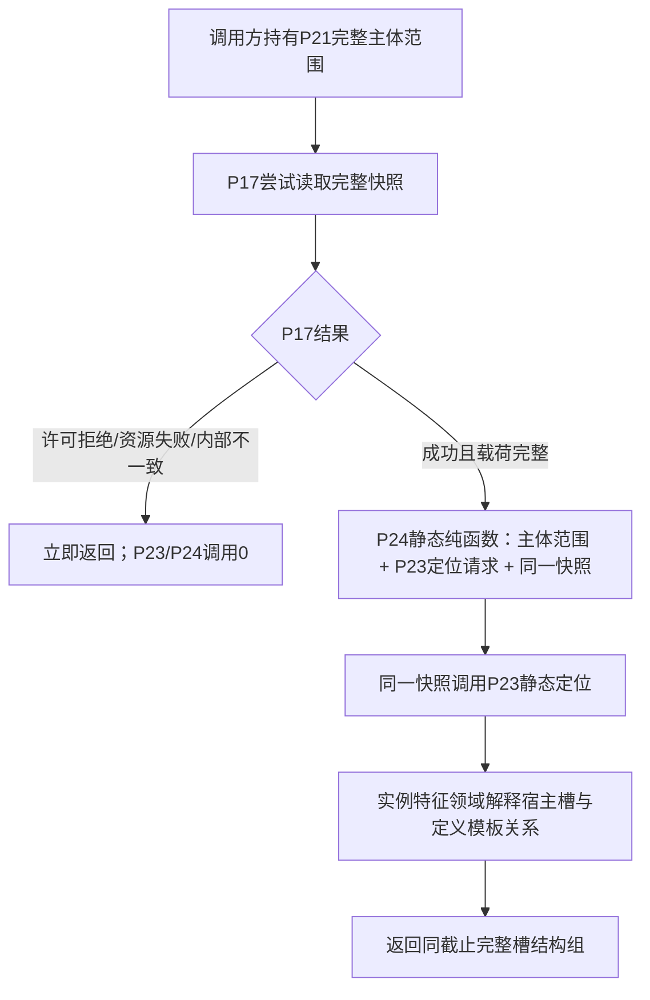
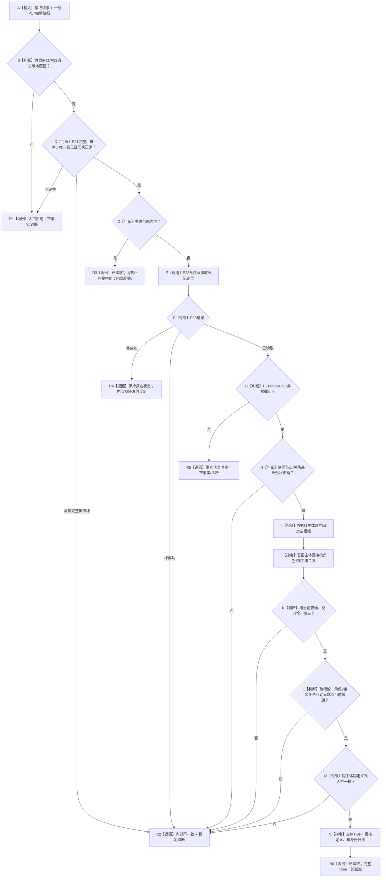
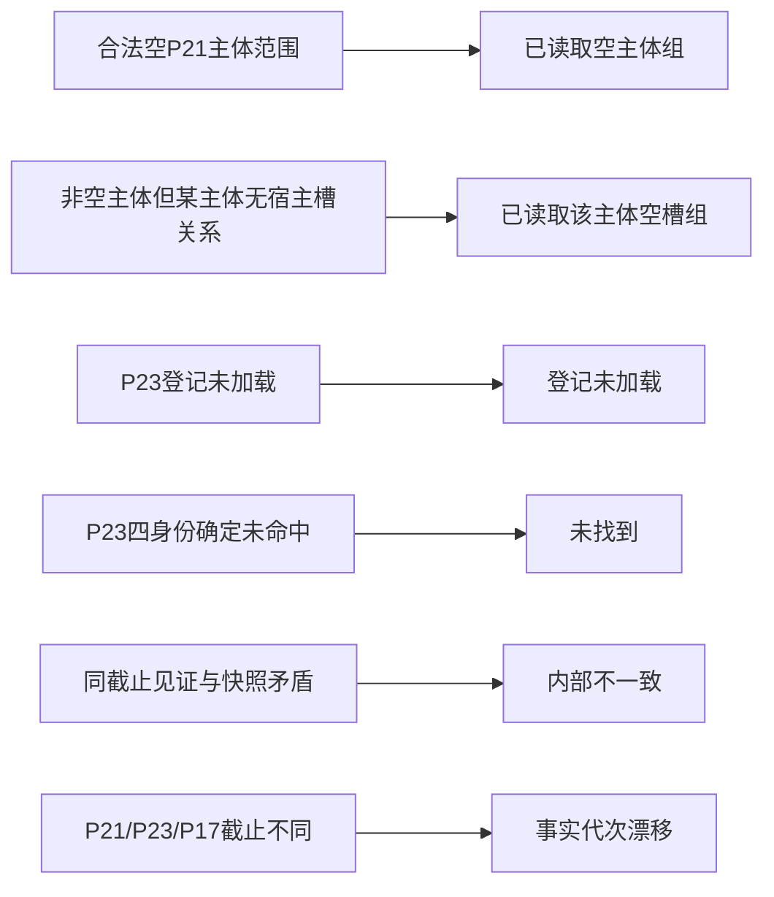
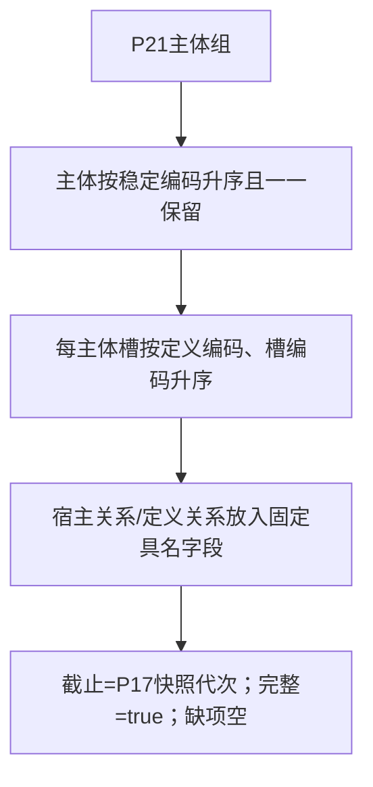

# P24 指定实际存在集合当前实例特征槽结构读取函数流程图 v0.1

日期：2026-08-05

## 1. 调用边界

P24 不调用 P17、P21、P22、L1 服务或其它 provider，不取对象锁，不重取快照。P17 非成功由调用方在进入 P24 前分账。

## 2. `从快照读取当前实际存在实例特征槽集合`

## 3. 零命中与非成功分账

“无槽”是合法完整事实，不得误判未找到；`未找到` 只沿 P23 对必需登记身份的确定未命中传播。

## 4. 稳定输出

本图不包含当前值、属性槽、材料、来源、定义详情、状态或动态读取。
