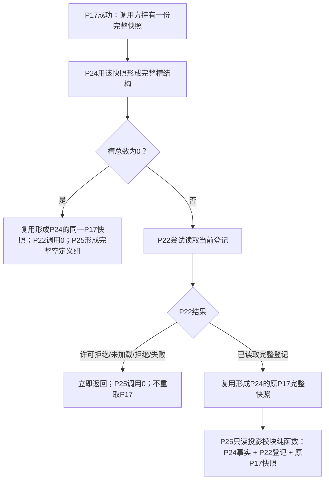
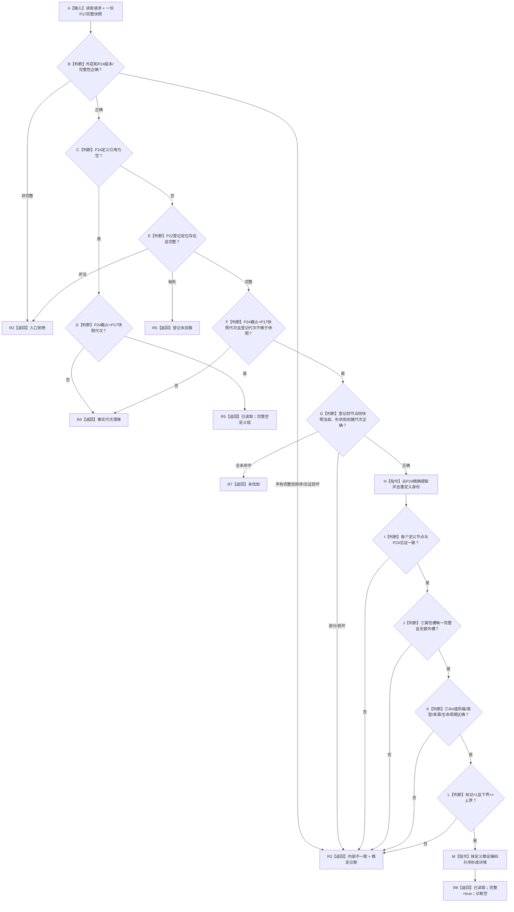
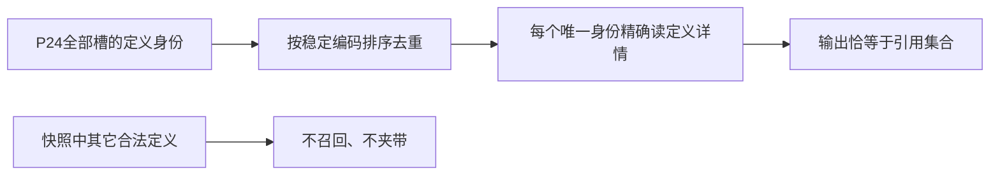

# P25 实例槽引用 I64 特征定义详情集合读取函数流程图 v0.1

日期：2026-08-05

## 1. 调用边界

P22 锁和 P17 许可都在 P25 调用前释放。P25 是特征定义领域的新无状态只读投影模块，不调用 provider、不取锁、不重取快照；现有特征定义 / 实例特征模块不反向导入它。

## 2. `从快照读取实例槽引用I64特征定义详情集合`

## 3. 范围与去重

共享定义只输出一次；当前值后继通过定义稳定编码机械联结，不再解释定义属性结构。

## 4. 非目标

本流程不读取实例槽当前值，不执行上下界判断，不读取历史、状态、动态或恢复材料。
