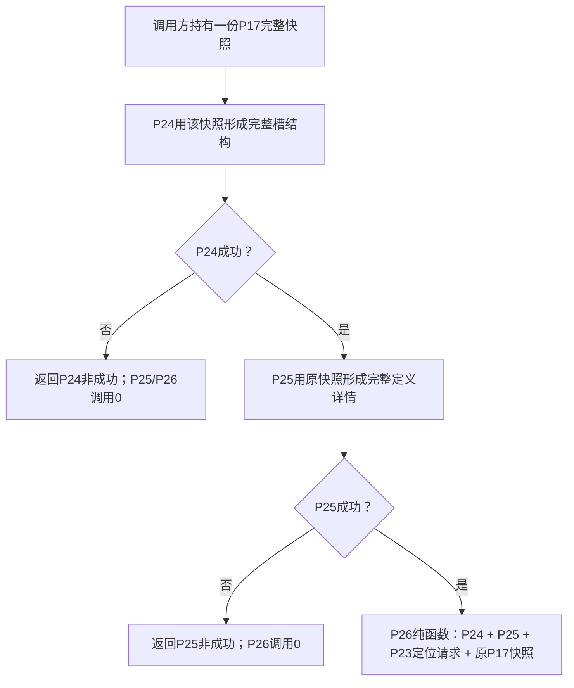
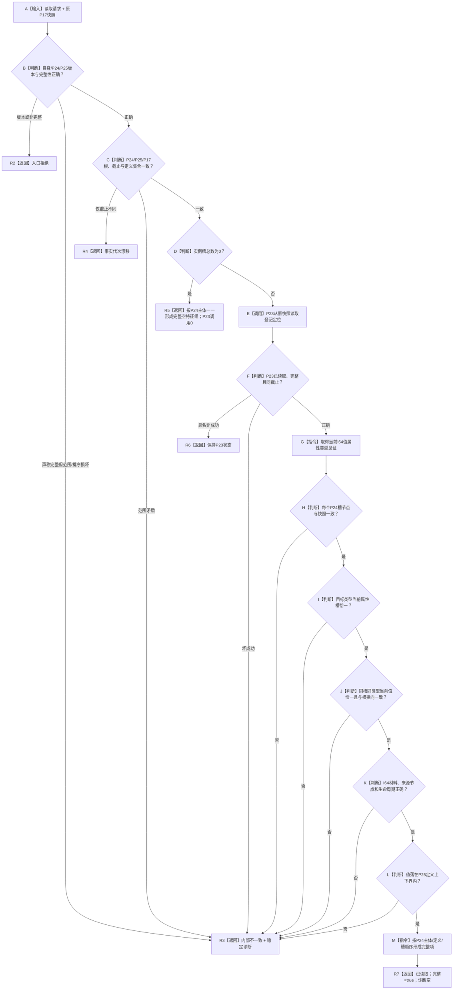
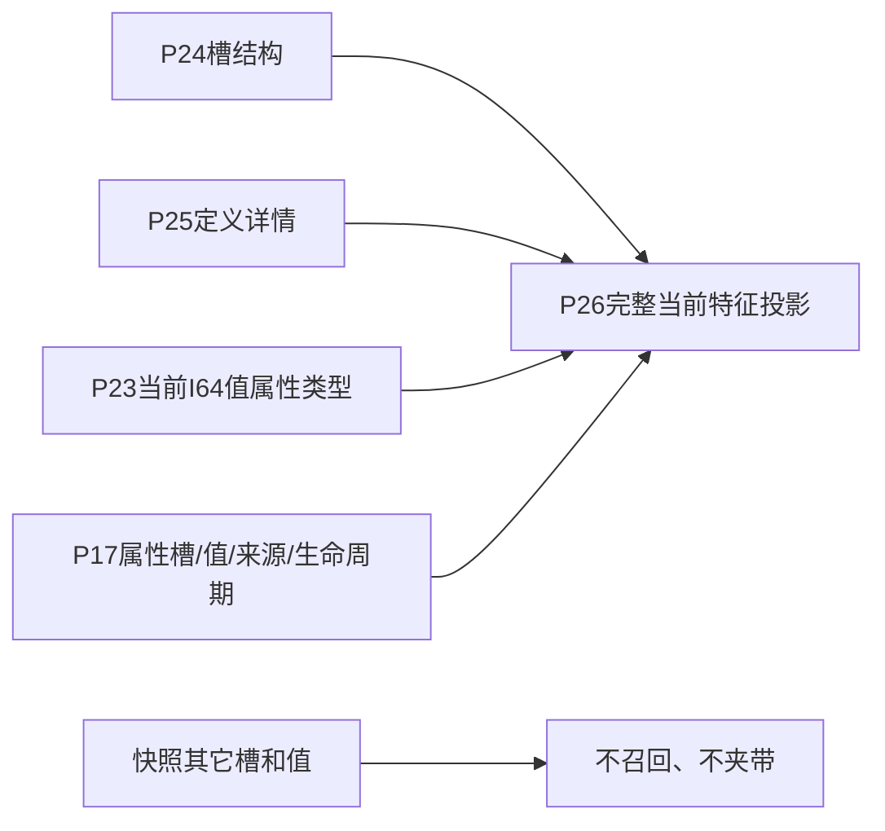

# P26 指定实际存在集合当前 I64 实例特征值读取函数流程图 v0.1

日期：2026-08-05

## 1. 调用边界

P17 许可拒绝发生在 P24 前并立即返回；P26 不重取快照，不调用 P17/P22/P24/P25 服务。P23 仅在非空槽分支以同一快照执行一次无锁纯值定位。

## 2. `从快照读取当前实际存在I64实例特征值集合`

## 3. 字段与所有权

P26 只解释实例槽当前属性和值；P24 关系结构和 P25 定义详情保持其原事实所有权。I64 上下界复核是定义值域准入，不调用比较算法。

## 4. 非目标

不读取历史、审计、恢复材料或独立材料文件，不形成比较、状态、动态、因果、结算、完整世界快照、统一门面或 STEP-5。
