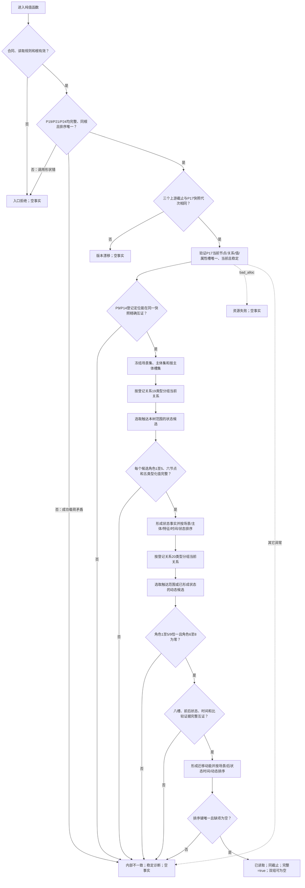
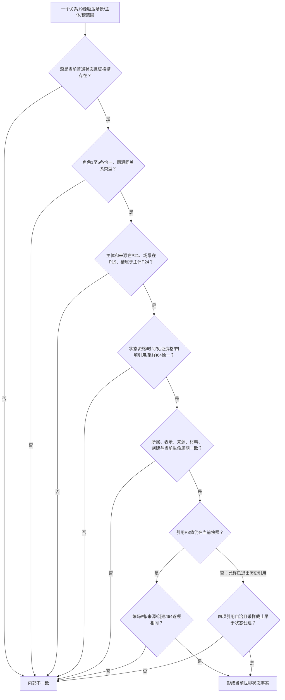
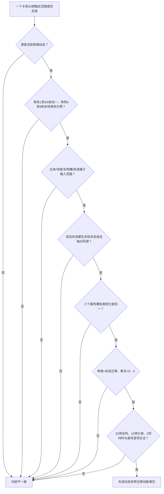
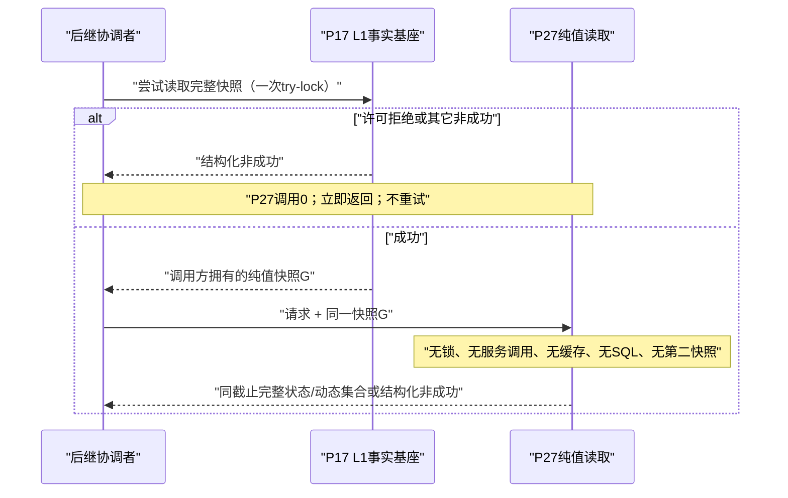

# L1-SIMPLIFY-P27 指定世界根当前状态动态集合读取函数流程图 v0.1

日期：2026-08-05

对应函数：

```cpp
当前世界状态动态集合结果 从快照读取当前世界状态动态集合(
    const 当前世界状态动态集合读取请求& 请求,
    const L1完整快照& 快照);
```

## 主流程



## 状态候选校验



## 动态候选校验



## 调用与锁边界



本图只描述 P27 单函数。4200 的 G0—全部领域读取—G1 与一次完整漂移重试属于后继总世界快照协调者，不在本函数内实现。
