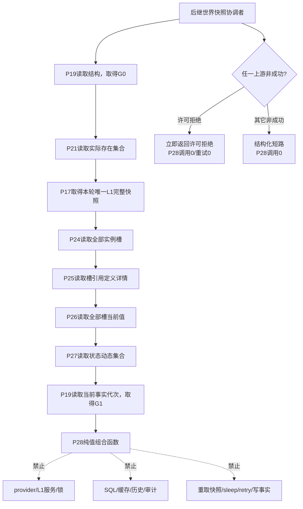
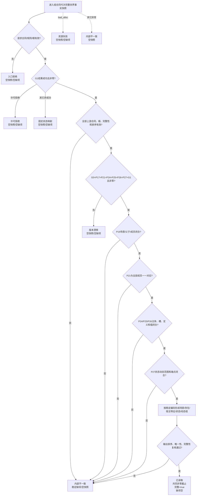
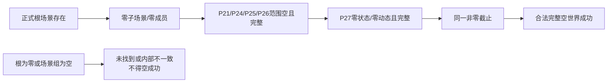

# L1-SIMPLIFY-P28-COMPLETE-WORLD-SNAPSHOT-COMPOSE 同代次完整世界快照纯值组合函数流程图 v0.1

日期：2026-08-05

状态：设计图；代码未实现

对应函数：

```cpp
完整世界快照组合结果 组合同代次完整世界事实快照(
    const 完整世界快照组合请求& 请求,
    const L1完整快照& 快照,
    const 当前世界结构事实& 世界结构,
    const 当前实际存在资格集合事实& 实际存在,
    const 当前实际存在实例特征槽集合事实& 实例槽,
    const 实例槽引用I64特征定义集合事实& 特征定义,
    const 当前实际存在I64实例特征值集合事实& 当前特征值,
    const 当前世界状态动态集合事实& 状态动态,
    const 当前世界事实代次结果& 末次世界事实代次);
```

## 1. 调用边界



P28 只组合已经成功形成的纯值材料。许可拒绝短路和完整漂移重试属于后继协调者；本图冻结调用责任，但不把协调能力伪装成本叶代码结果。

## 2. 单函数流程



## 3. 稳定映射

| 输出 | 唯一来源 | 组合规则 |
| --- | --- | --- |
| 合同/世界/组合/完整性/排序版本 | P28正式常量 | 不接受上游或调用方覆盖 |
| 世界根 | 已验证请求根 | 与全部上游根逐字段相等 |
| 事实截止代次 | G0/P17/全部领域/G1共同值 | 任一不等返回版本漂移 |
| 场景组 | P19 | 按场景编码；父/子/成员关系按关系编码 |
| 存在组 | P19成员关系 + P21资格项 | 一成员关系对应一存在和一个当前场景 |
| 宿主特征组 | P24槽 + P25定义 + P26当前值 | 按宿主、定义、实例槽编码 |
| 状态组 | P27 | 保持场景、主体、特征、发生时间、状态顺序 |
| 动态组 | P27 | 保持场景、后状态时间、动态顺序 |
| 完整 | 全部检查完成后的常量true | 任一失败零部分快照 |
| 缺项组 | P28跨域检查 | 仅内部不一致非空；稳定排序去重 |

## 4. 合法空世界与失败边界



本函数不设计存在/场景对象子快照，不设计统一业务门面，不实现生产重试。后继只能在本函数第一轮因纯代次不等返回版本漂移时完整重读一次；不得重用旧轮材料。
