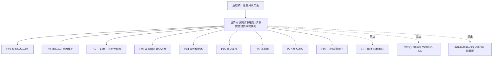
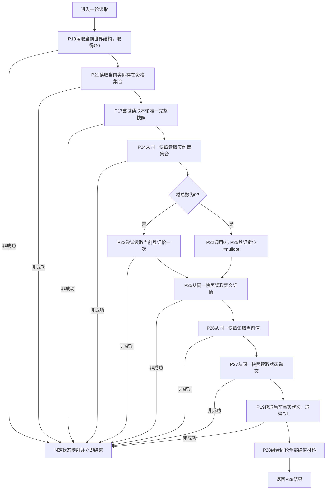
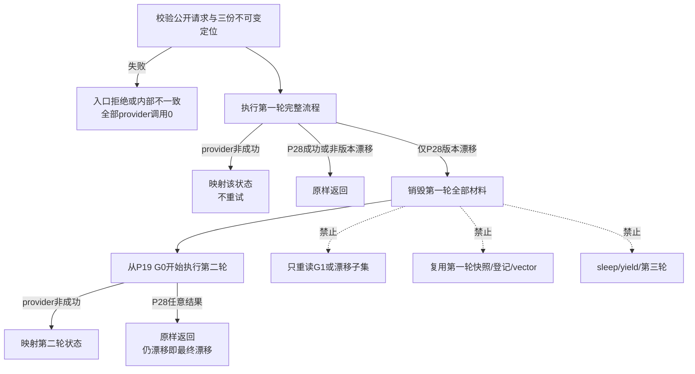

# L1-SIMPLIFY-P29-COMPLETE-WORLD-SNAPSHOT-READ 同代次完整世界快照生产协调读取函数流程图 v0.1

日期：2026-08-05

状态：设计图；代码未实现

对应函数：

```cpp
完整世界快照组合结果 世界树快照读取服务::读取完整世界事实快照(
    const 完整世界快照组合请求& 请求) const;
```

## 1. 调用边界



P29 只把 P17 快照作为不透明值传给 P24—P27；跨域完整性、排序和缺项唯一由 P28 解释。

## 2. 单轮函数流程



任一非成功后，图中后继 provider、P28 和第二轮调用数均为0；许可拒绝不等待、不 sleep。

## 3. 最多两轮总流程



provider 自身返回版本漂移不满足第二轮资格；只有第一轮全部 provider 成功且 P28 因共同截止不等返回版本漂移，才完整执行第二轮。

## 4. 状态与调用数

| 条件 | 对外结果 | 后继调用 | 第二轮 |
| --- | --- | --- | --- |
| 请求错误 | 入口拒绝 | 全部0 | 0 |
| 保存定位损坏 | 内部不一致 | 全部0 | 0 |
| 任一许可拒绝 | 许可拒绝 | 该点后0，P28=0 | 0 |
| 任一其它provider非成功 | 固定同类映射 | 该点后0，P28=0 | 0 |
| 第一轮P28内部不一致/资源失败/未实现 | 原样返回 | 已完成第一轮 | 0 |
| 第一轮P28版本漂移，第二轮成功 | 已读取 | 每轮完整独立 | 1 |
| 两轮P28版本漂移 | 版本漂移 | 每轮完整独立 | 1 |
| 合法空世界 | 已读取完整快照 | P22=0，其余各1 | 0，除非P28漂移 |

成功结果的字段、稳定排序、完整性和缺项组完全由 P28 形成；P29 不二次加工。
