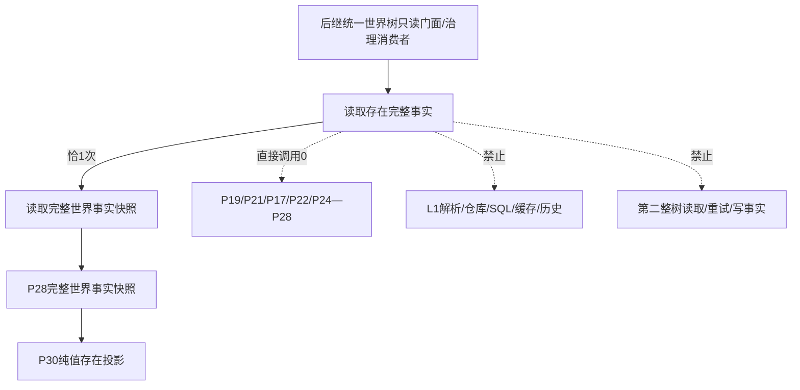
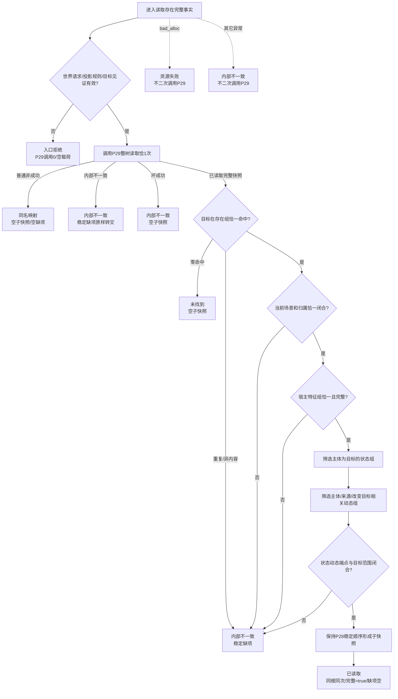
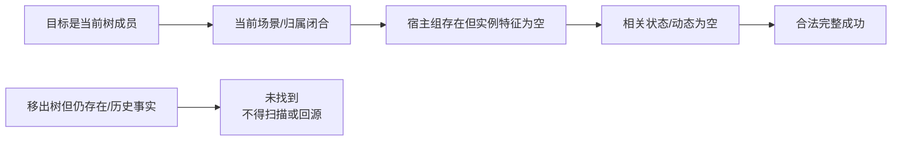

# L1-SIMPLIFY-P30-EXISTENCE-COMPLETE-SNAPSHOT-READ 指定实际存在完整事实子快照读取函数流程图 v0.1

日期：2026-08-05

状态：设计图；代码未实现

对应函数：

```cpp
完整世界存在快照读取结果 世界树快照读取服务::读取存在完整事实(
    const 完整世界对象读取请求& 请求) const;
```

## 1. 调用边界



P30 不形成第二世界读取链。P29 内部最多两轮是唯一漂移重试；P30 无额外 provider 或重试。

## 2. 公开函数流程



## 3. 唯一字段来源

| 输出字段 | 唯一来源 | 规则 |
| --- | --- | --- |
| 合同/世界/组合/完整性/排序版本 | P28完整快照 | 必须等于正式常量 |
| 投影规则版本 | P30常量1 | 请求必须精确等于1 |
| 世界根/截止 | P29成功快照 | 原样复制，截止非零 |
| 存在 | P28存在组唯一目标 | 当前树成员恰一命中 |
| 存在内当前场景/归属 | P28存在事实 + 场景组校验 | 场景和归属双向闭合；不复制完整场景组 |
| 宿主特征 | P28宿主特征组 | 目标恰一组；零槽为空vector |
| 状态组 | P28状态组稳定子序列 | 主体等于目标 |
| 动态组 | P28动态组稳定子序列 | 主体/来源为目标或改变目标属于目标槽 |
| 完整 | 全部检查后的true | 任一失败不形成部分子快照 |
| 缺项 | P28稳定诊断类型 | 仅内部不一致可非空 |

## 4. 合法空组与范围



P30 只在整树中验证当前场景和归属；输出由目标存在事实携带这两个见证，不复制当前场景的其它子场景或成员关系。
