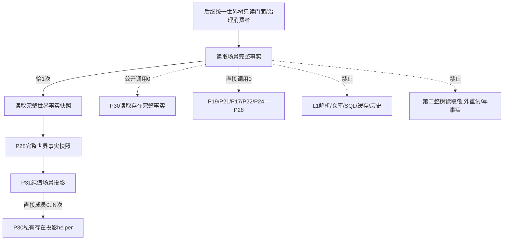
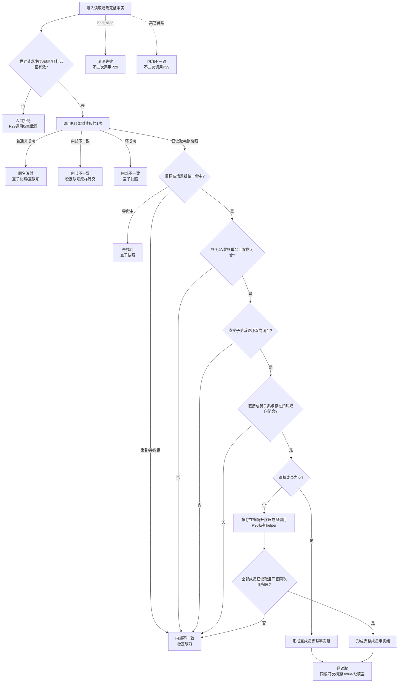
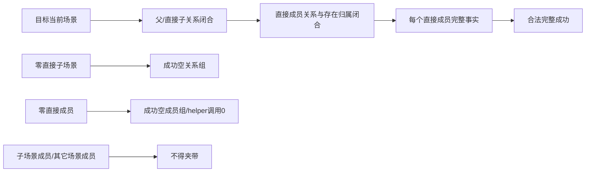

# L1-SIMPLIFY-P31-SCENE-COMPLETE-SNAPSHOT-READ 指定场景完整事实子快照读取函数流程图 v0.1

日期：2026-08-05

状态：设计图；代码未实现；计划待激活

对应函数：

```cpp
完整世界场景快照读取结果 世界树快照读取服务::读取场景完整事实(
    const 完整世界对象读取请求& 请求) const;
```

## 1. 调用边界



P31 不形成第二世界读取链。P29 内部最多两轮是唯一漂移重试；全部成员都在同一 P29 返回的不可变快照上复用 P30 私有纯值 helper。

## 2. 公开函数流程



## 3. 唯一字段来源

| 输出字段 | 唯一来源 | 规则 |
| --- | --- | --- |
| 合同/世界/组合/完整性/排序版本 | P28完整快照 | 必须等于正式常量 |
| 投影规则版本 | P30共享常量1 | 请求必须精确等于1 |
| 世界根/截止 | P29成功快照 | 原样复制，截止非零 |
| 场景 | P28场景组唯一目标 | 含目标、直接父、直接子和直接成员关系 |
| 直接父/子场景 | P28场景事实及关系端点 | 根无父；非根单父；只含直接关系 |
| 直接成员身份与归属 | P28场景关系+存在组 | 双向一一闭合，不含子场景成员 |
| 直接成员完整事实 | 同一世界快照上的P30私有helper | 每成员恰1；公开存在读调用0 |
| 完整 | 全部检查后的true | 任一失败不形成部分子快照 |
| 缺项 | P28稳定诊断类型 | 仅内部不一致可非空 |

## 4. 直接范围与合法空组



场景子快照不是递归子树快照。直接子场景只由关系见证携带身份；其详情和成员不进入本结果。若同一动态同时与两个直接成员相关，可以分别出现在两份成员完整事实中，场景层不去重或重解释。
