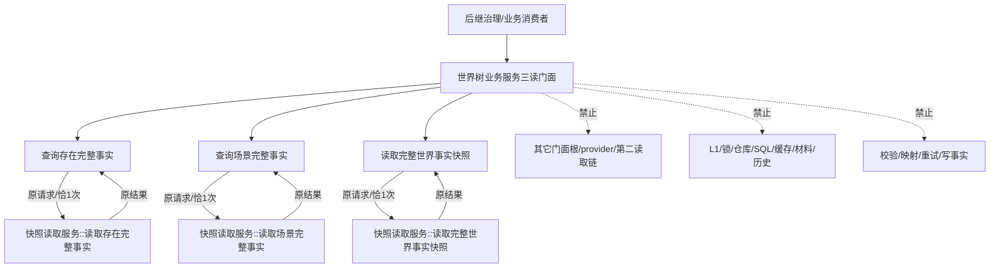
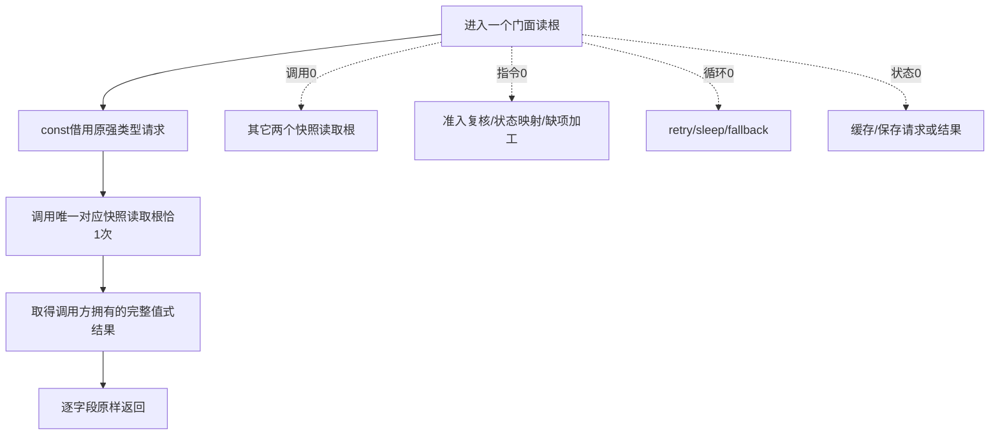
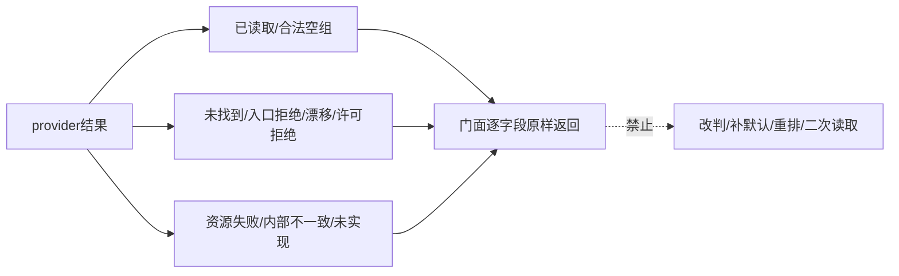

# L1-SIMPLIFY-P32-WORLD-BUSINESS-READ-FACADE 统一世界树业务只读门面函数流程图 v0.1

日期：2026-08-05

状态：设计图；代码未实现；计划待激活

对应函数：

```cpp
完整世界存在快照读取结果 世界树业务服务::查询存在完整事实(
    const 完整世界对象读取请求& 请求) const;
完整世界场景快照读取结果 世界树业务服务::查询场景完整事实(
    const 完整世界对象读取请求& 请求) const;
完整世界快照组合结果 世界树业务服务::读取完整世界事实快照(
    const 完整世界快照组合请求& 请求) const;
```

## 1. 调用边界



门面只改变公开服务身份和依赖方向，不改变任何请求、结果或机器事实语义。

## 2. 三根同构流程



## 3. 一对一映射

| 门面函数 | 唯一被调函数 | 请求 | 返回 | 调用次数 |
| --- | --- | --- | --- | --- |
| `查询存在完整事实` | P30 `读取存在完整事实` | `完整世界对象读取请求` 原样 | `完整世界存在快照读取结果` 原样 | 1 |
| `查询场景完整事实` | P31 `读取场景完整事实` | `完整世界对象读取请求` 原样 | `完整世界场景快照读取结果` 原样 | 1 |
| `读取完整世界事实快照` | P29 同名函数 | `完整世界快照组合请求` 原样 | `完整世界快照组合结果` 原样 | 1 |

## 4. 结果透明边界



P29 的最多两轮、P30/P31 的对象投影和全部缺项诊断继续由快照读取服务唯一拥有；门面不复制这些流程。
