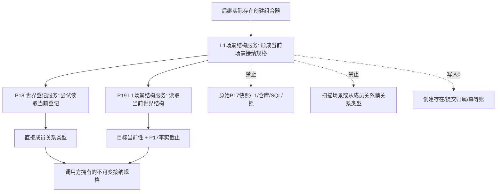
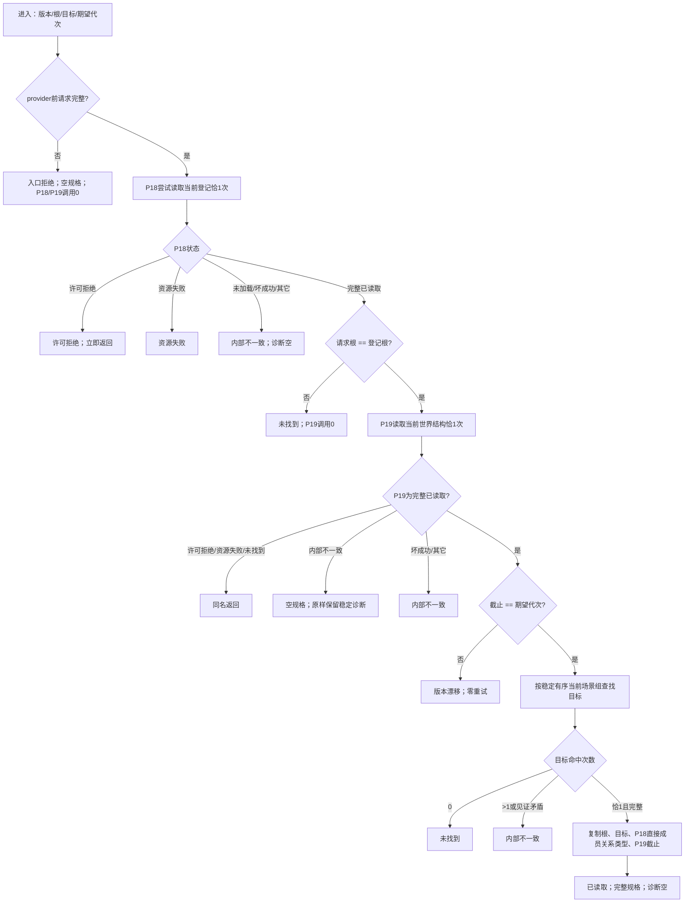
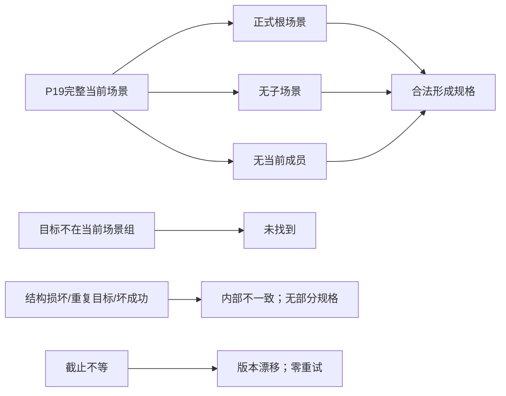

# L1-SIMPLIFY-P33-CURRENT-SCENE-ADMISSION-SPEC 指定当前场景接纳规格函数流程图 v0.1

日期：2026-08-05

状态：设计图；代码未实现；计划待激活

对应函数：

```cpp
当前场景接纳规格结果 L1场景结构服务::形成当前场景接纳规格(
    const 当前场景接纳规格请求& 请求) const;
```

## 1. 调用与所有权边界



P33 只拥有场景侧接纳解释；P18 拥有登记定位，P19 拥有当前场景结构，后继组合器拥有跨存在规格与场景规格的一次原子提交。

P33 函数体直接调用 P18 恰1次、P19 恰1次；P19 内部按其合同再次调用 P18，因此完整成功调用链中 P18 总计2次。两次均为独立 try-lock，任一许可拒绝都立即返回。

## 2. 固定函数流程



## 3. 字段来源与代次绑定

| 输出字段 | 唯一来源 | 禁止替代 |
| --- | --- | --- |
| `指定世界根` | P19 完整事实，且等于 P18 登记根 | 请求回显、显示名、配置 |
| `目标当前场景` | P19 当前场景组唯一命中项 | 父关系出现、编码区间、缓存 |
| `直接成员关系类型` | P18 不可变正式登记 | P19 成员关系反推、扫描 L1 |
| `事实截止代次` | P19 本轮 P17 快照代次 | P18 已验证代次、时间戳、运行期纪元 |

返回后规格不保证仍是最新事实；后继唯一 L1 提交必须原样使用该截止作为期望代次。P33 不重试漂移，也不为调用方刷新规格。

## 4. 空场景与非成功边界



合法空成员场景仍必须从 P18 取得直接成员关系类型；空成员不等于登记缺失，也不允许返回无类型规格。
