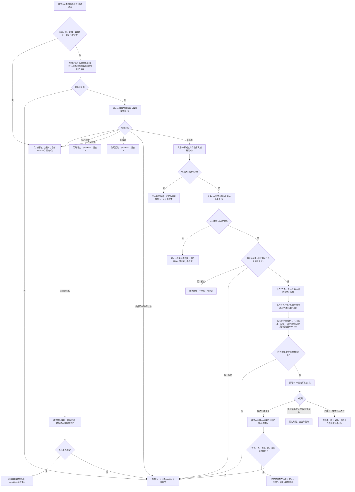
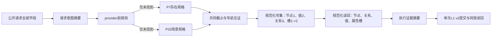

# L1-SIMPLIFY-P34-CURRENT-SCENE-EXISTENCE-CREATE 指定当前场景实际存在原子创建函数流程图 v0.1

日期：2026-08-05

状态：设计流程图；代码未实现；绑定 P15 v0.5、P33 v0.1 与 P7 接受结果

## 1. 函数身份

```cpp
实际存在结果 L1当前场景实际存在发布服务::在当前场景创建实际存在(
    const 当前场景实际存在创建请求& 请求);
```

本函数是场景直接成员关系的具名领域发布者，不是组合服务。它只消费 P7/P33 不可变规格并调用一次 L1 v2；未来世界树门面只能透明委托。

## 2. 主流程



## 3. 摘要与写集固定形状



请求意图不编码 provider、写集、本地键或后来分配的稳定编码。执行证据只在首次未找到路径形成，编码请求摘要、provider版本、共同截止、P7/P33见证、规范化写集和读回计划。

## 4. 结果映射与禁止旁路

| 条件 | 公开结果 | 禁止动作 |
| --- | --- | --- |
| 探测同义 | `幂等读回` | 重调P7/P33、重算执行证据、重提交 |
| 探测异义 | `幂等冲突` | 改用第二幂等域或新身份 |
| P33许可拒绝 | `许可拒绝` | wait、sleep、retry、扫描 |
| provider截止不等 | `版本漂移` | 静默换用新代次 |
| L1首次成功 | `已提交` | 事务释放后普通读回 |
| L1竞态精确重复 | `幂等读回` | 使用本次provider回显替代首次结果 |
| 发布后读回矛盾 | `内部不一致` | 回滚swap、补写、第二提交、降级成功 |

固定禁止：组合服务直连 L1、服务私有幂等缓存、SQL/材料/旧仓/句柄、完整快照重取、第二次提交、特征/状态/动态/因果夹带、生产装配和运行期接线。

## 5. 完成声明边界

本图只冻结 P34 未来函数的控制分支、摘要、写集、读回和错误收口。它不证明函数已经实现、P15/P33 已实现、L1 已发布任意事实、世界树写门面存在、STEP-4 或治理闭环完成。
