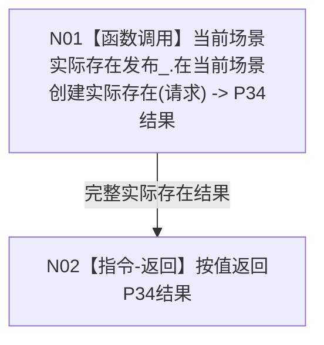

# L1-SIMPLIFY-P35-WORLD-BUSINESS-EXISTENCE-CREATE-FACADE 世界树业务创建存在第一写透明门面函数流程图 v0.1

更新时间：2026-08-05

## 依据

```text
正式规范：0050、4030、4200 §2—§4、§6—§7
直接设计：P32 v0.1 统一世界树业务只读门面；P34 v0.1 指定当前场景实际存在原子创建
当前代码事实：正式 HEAD ba9dd59797db82f52bc5bf49c4de6a260fedd13d 尚无服务.世界树.ixx或P34发布模块；P12 v0.3增量与本图零重叠
```

## 身份与边界

本图是 P35 待实现目标单函数图，一图只冻结 `世界树业务服务::创建存在并接纳到场景`。门面不拥有 P34 内部双摘要、provider、事务或读回流程；复杂被调函数由 P34 配套函数流程图独立冻结。

## 函数合同

```text
根函数：世界树业务服务::创建存在并接纳到场景
归属模块 / 文件 / 层级：海中鱼巣.领域.服务.世界树 / 海中鱼巣/领域/服务.世界树.ixx / L2统一门面
现有或待新增：待新增；P32真实类形成后原位扩展
完整签名：实际存在结果 创建存在并接纳到场景(const 当前场景实际存在创建请求& 请求) const
参数：请求由调用方拥有；本函数同步const借用且不保存；非法形状由P34裁决
返回结果：调用方按值拥有；逐字段等于P34结果，不新增门面状态或包装
被调函数流程图：流程图/20260805_L1-SIMPLIFY-P34-CURRENT-SCENE-EXISTENCE-CREATE_指定当前场景实际存在原子创建函数流程图_v0.1.md
```

## 流程图



## 节点合同

| 节点 | 类型 | 参数 / 输入绑定 | 结果 / 输出绑定 | 事实读写 | 后继条件 | 验证 |
| --- | --- | --- | --- | --- | --- | --- |
| N01 | 函数调用 | `请求` -> `const 当前场景实际存在创建请求&`，同一对象地址、零复制 | `实际存在结果` -> `P34结果` | 事实读写全部由 P34；门面自身0 | 调用正常返回后进入N02；异常不捕获改判 | P34调用恰1，快照/P7/P15/L1直接调用0 |
| N02 | 本函数内指令-返回 | `P34结果` | 按值返回同一完整结果 | 0 | 函数结束 | 状态、optional及全部事实字段默认全等 |

## 关键边界

```text
构造：世界树业务服务必须同时绑定const世界树快照读取服务引用和非const P34发布服务引用；不保留P32单参数构造。
函数：const、非noexcept；门面const仍经非const引用调用P34；不做入口校验、状态映射、成功复核、异常捕获、重试、缓存或日志。
隔离：P34许可拒绝/内部不一致/隔离结果原样返回；门面不降级或补写。
三读：仍只调用P29—P31，绝不访问P34；本写根不访问快照读取。
非目标：初始特征、其它五写、治理路由、装配和STEP-5均不在本图。
```

## 验证

1. Markdown 只含一个 Mermaid 根流程且没有 HTML 配对产物。
2. N01 是唯一函数调用，参数/结果绑定完整；N02 是唯一返回指令。
3. P34 非平凡内部流程只通过具名被调图引用，不压入本图。
4. `git diff --check`、strict、专项静态签名/调用计数和两配置完整自检通过。

本图只冻结待实现函数合同，不证明 P32/P34 或 P35 代码已经形成。
