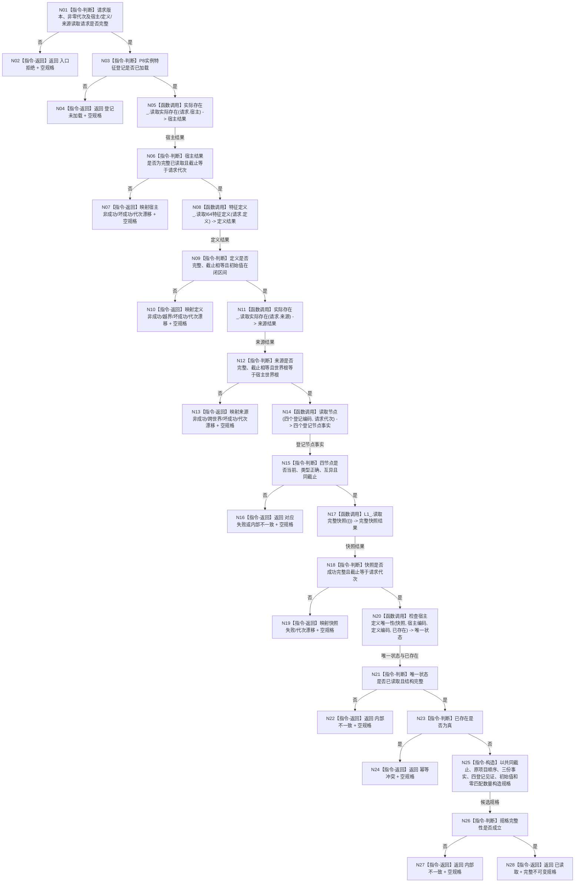

# L1-SIMPLIFY-P36 形成实际存在 I64 初始特征写入规格函数流程图 v0.1

更新时间：2026-08-05

## 依据

```text
规范/4200_子规范_世界树业务服务与同代次完整事实快照.md
规范/4170_子规范_特征批次发布记录与幂等账.md
规范/详细设计/20260805_L1-SIMPLIFY-P36-EXISTENCE-I64-INITIAL-FEATURE-SPEC_实际存在I64初始特征写入规格详细设计_v0.1.md
海中鱼巣/领域/L1实例特征.数据.h
海中鱼巣/领域/服务.L1实例特征.ixx
```

## 身份与边界

本图是 P36 待实现目标函数的正式单函数施工图，只描述零事实写入的单项规格 provider。它不描述后继完整批次发布者、P32 写门面或任何 L1 提交过程。

## 函数合同

```text
根函数：形成实际存在I64初始特征写入规格
归属模块 / 文件 / 层级：海中鱼巣/领域/服务.L1实例特征.ixx / L1实例特征服务 / L1领域事实所有者
现有或待新增：待新增
完整签名：实际存在I64初始特征写入规格结果 L1实例特征服务::形成实际存在I64初始特征写入规格(const 实际存在I64初始特征写入规格请求& 请求) const
参数：请求；const 引用输入；调用方拥有且覆盖同步调用；版本、代次和嵌套请求非法时入口拒绝
返回结果：实际存在I64初始特征写入规格结果；仅已读取携带完整自有值规格，其余状态规格为空
被调函数流程图：P7/P2 当前读函数沿各自正式设计；本图只冻结调用绑定，不展开其内部过程
```

## 流程图



## 节点合同

| 节点 | 类型 | 参数 / 输入绑定 | 结果 / 输出绑定 | 事实读写 | 后继条件 | 验证 |
| --- | --- | --- | --- | --- | --- | --- |
| N01-N04 | 本函数内指令 | 请求全部字段 | 入口或登记状态 | 读本服务不可变登记；零事实写 | 合法且登记已加载 | 依赖调用计数为0 |
| N05 | 函数调用 | `请求.宿主 -> 实际存在读取请求` | `实际存在结果 -> 宿主结果` | P7 当前事实只读 | 调用完成 | 恰1次 |
| N08 | 函数调用 | `请求.定义 -> I64特征定义读取请求` | `I64特征定义结果 -> 定义结果` | P2 当前事实只读 | 调用完成 | 恰1次 |
| N11 | 函数调用 | `请求.来源 -> 实际存在读取请求` | `实际存在结果 -> 来源结果` | P7 当前事实只读 | 调用完成 | 恰1次 |
| N14 | 函数调用 | P8登记四编码、请求代次 | 四个节点事实 | L1当前节点只读 | 四项返回 | 类型/截止/互异 |
| N17 | 函数调用 | 空 L1 完整快照请求 | 完整快照结果 | L1当前事实只读 | 调用完成 | 恰1次，不重试 |
| N20 | 函数调用 | 快照、宿主编码、定义编码、`已存在`输出 | 唯一状态、零/一匹配 | 只遍历自有快照 | 分类完成 | 损坏和重复不降级 |
| N25-N28 | 本函数内指令 | 已互证纯值材料 | 完整规格或内部不一致 | 零事实写 | 完整性成立 | 逐字段等值 |

## 关键边界

```text
根函数只有一个。
所有非成功返回都携带空规格。
许可拒绝立即返回，不等待、不循环。
合法零匹配是已读取；恰一匹配是初始项冲突；重复或损坏不是冲突而是内部不一致。
函数不调用探测幂等或提交写集，不形成摘要、批次账、本地键或稳定编码。
项目顺序只原样承载，完整批次顺序和去重由后继发布者裁决。
```

## 验证

1. Markdown 只含一个 Mermaid fenced block，不生成 HTML。
2. 一图只描述 `形成实际存在I64初始特征写入规格`；被调函数只以具名调用节点出现。
3. 全部调用节点记录实参与结果绑定；全部边标明条件或材料；全部返回均属于公开结果合同。
4. 运行 `git diff --check -- <本文件>`，并与详细设计、计划逐项互证。
