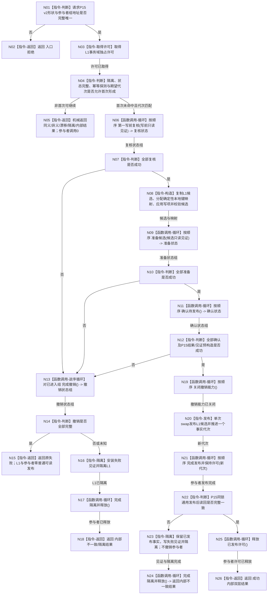

# L1-SIMPLIFY-P37 提交带附属参与者函数流程图 v0.1

更新时间：2026-08-05

## 依据

```text
规范/4015_子规范_L1简化事实基座.md
规范/4040_子规范_不透明结构事务候选确认撤销与最后发布.md
规范/4170_子规范_特征批次发布记录与幂等账.md
规范/4200_子规范_世界树业务服务与同代次完整事实快照.md
规范/详细设计/20260805_L1-SIMPLIFY-P15-POST-PUBLISH-READBACK_L1提交内通用发布后读回隔离详细设计_v0.5.md
规范/详细设计/20260805_L1-SIMPLIFY-P37-L1-INTERNAL-PARTICIPANT-BRIDGE_L1内部附属事务参与者桥接详细设计_v0.1.md
```

## 身份与边界

本图是 P37 待实现目标根的正式单函数施工图。它只描述 L1 仓库内部的业务中性参与桥；不描述具体 4170 参与者、特征批次发布者或公开 L1 服务入口。

## 函数合同

```text
根函数：提交带附属参与者
归属模块 / 文件 / 层级：海中鱼巣/核心/仓库.L1事实基座.ixx / L1事实基座仓库 / 核心固定执行器边界
现有或待新增：待新增；现有提交改为向本根传空组
完整签名：L1内部附属提交结果 L1事实基座仓库::提交带附属参与者(const L1写集请求& 请求, std::span<L1事实附属事务参与者* const> 参与者组)
参数1：请求；const引用输入；调用方拥有并覆盖同步调用；按P15 v2校验
参数2：参与者组；只读span；调用方拥有参与者对象和指针数组并覆盖同步调用；空组合法，非空必须全非空且地址唯一
返回结果：L1内部附属提交结果；写入结果承载P15纯值结果，可选参与失败精确承载失败参与者顺序和内部状态；公开空组提交只取写入结果且参与失败必为空
被调函数流程图：P15提交算法以其正式设计为依据；参与者虚函数由各具体参与者自己的单函数图展开
```

## 流程图



## 节点合同

| 节点 | 类型 | 参数 / 输入绑定 | 结果 / 输出绑定 | 事实读写 | 后继条件 | 验证 |
| --- | --- | --- | --- | --- | --- | --- |
| N01-N05 | 本函数内指令 | 请求、参与者span | P15既有分类 | 只读/既有元数据收口 | 仅首次新键继续 | 参与者0调用短路 |
| N06 | 函数调用循环 | 当前代次、键、两摘要 | 每项复核状态 | 参与者自有侧账写前读 | 全部成功 | 稳定顺序 |
| N08 | 本函数内指令 | 规范化写集、L1当前状态 | 候选、映射、新代次 | 仅未发布候选副本 | 候选完整 | 单映射算法 |
| N09-N12 | 函数调用循环/判断 | 候选见证 | 准备/确认状态 | 自有候选不可见 | 全部确认 | 无遗漏参与者 |
| N13-N18 | 函数调用逆序/收口 | 已进入参与者组 | 撤销或隔离 | 零发布或隔离元数据 | 撤销是否完整 | 逆序与未知结果 |
| N19-N21 | 函数调用循环/发布 | 全部已确认候选 | 新事实代次；参与者仍持许可 | 唯一最后发布区 | 无失败 | 无分配无异常 |
| N22-N26 | 本函数内指令/函数调用循环 | P15读回计划、新权威状态 | 成功释放或发布后隔离释放 | 已发布事实不回滚 | 读回一致性 | 不二次提交 |

## 关键边界

```text
根函数只有一个；公开提交只传空参与者组。
参与者组不从L2公开请求产生，未来只能由获授权具名数据操作在同步调用栈内提供。
参与者不接触L1可变状态、事务、许可或锁，只读取短生命周期强类型见证。
任何失败只在关闭撤销能力之前发生；末区无分配、无异常、无失败分支。
本图不定义4170记录字段，也不把旧句柄参与者伪装为简化L1能力。
```

## 验证

1. Markdown 只含一个 Mermaid fenced block，不生成 HTML。
2. 一图只描述 `提交带附属参与者`；具体参与者内部过程不在本图展开。
3. 每个调用节点均记录输入和状态接收；全部边有条件/材料；全部返回属于 L1 结果合同。
4. 运行 `git diff --check -- <本文件>`，并与详细设计和计划逐项互证。
