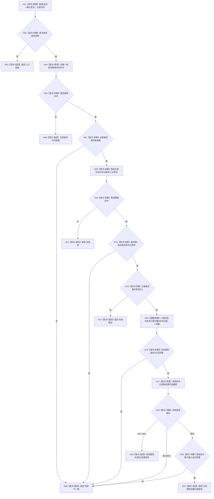

# L1-SIMPLIFY-P38 读取发布记录函数流程图 v0.1

更新时间：2026-08-05

## 依据

```text
规范/4015_子规范_L1简化事实基座.md
规范/4040_子规范_不透明结构事务候选确认撤销与最后发布.md
规范/4170_子规范_特征批次发布记录与幂等账.md
规范/4200_子规范_世界树业务服务与同代次完整事实快照.md
规范/详细设计/20260805_L1-SIMPLIFY-P38-FEATURE-BATCH-LEDGER-READ_简化4170特征批次账读取详细设计_v0.1.md
```

## 身份与边界

本图是 P38 待实现目标根的正式单函数施工图。它只描述按强类型批次身份从本域唯一4170账非阻塞复制一条已发布记录；不描述记录参与者、L1事实互证、批次幂等业务读回或全量冻结。

## 函数合同

```text
根函数：L1实例特征批次数据操作::读取发布记录
归属模块 / 文件 / 层级：海中鱼巣.领域.数据操作.L1实例特征批次 / 海中鱼巣/领域/数据操作.L1实例特征批次.ixx / 领域内部数据操作
现有或待新增：待新增
完整签名：L1特征批次发布记录读取结果 读取发布记录(L1特征批次身份 批次) const
参数：批次；值输入；调用方拥有；零值非法
返回结果：纯值 L1特征批次发布记录读取结果；始终回显批次；仅已读取携带完整记录副本
被调函数流程图：无；完整性helper为无状态纯值校验，不另建非平凡流程图
```

## 流程图



## 节点合同

| 节点 | 类型 | 参数 / 输入绑定 | 结果 / 输出绑定 | 事实读写 | 后继条件 | 验证 |
| --- | --- | --- | --- | --- | --- | --- |
| N01-N03 | 本函数内指令 | 输入批次 | 回显身份、空载荷 | 零账读取 | 零值立即拒绝 | 锁前调用0 |
| N04-N08 | 本函数内事务/判断/返回 | 唯一账 | 许可或隔离分类 | 一次 try-lock 共享读 | 不等待、不重试 | 竞争/隔离矩阵 |
| N09-N14 | 本函数内读取/判断/返回 | 升序内部记录组、批次 | 未找到/损坏/未知格式 | 只读内部账 | 精确命中才继续 | 空账、多项、重复、格式矩阵 |
| N15 | 函数调用 | 命中记录 -> 记录 | bool -> 完整 | 纯值校验 | 返回后判断 | DTO损坏矩阵 |
| N16-N21 | 本函数内判断/构造/返回 | 完整记录 | 自有副本或具名失败 | 只复制，不改账 | 仅成功携带记录 | 深副本、异常、批次回显 |

## 关键边界

```text
按身份二分不是全量枚举，也不得扫描推导批次身份
读取成功不证明 L1 引用结构仍完整，不等于特征批次幂等成功
函数不读取 L1/P8/P36/P37/SQL/材料/旧账，不形成候选或写入
许可竞争立即返回；任何非已读取结果载荷为空
```
