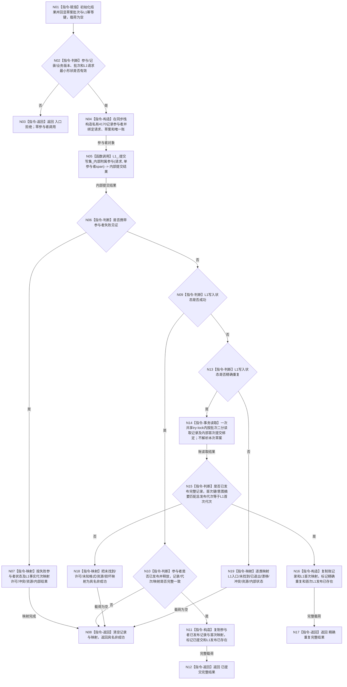

# L1-SIMPLIFY-P39 提交带特征批次记录函数流程图 v0.1

更新时间：2026-08-05

## 依据

```text
规范/0050_项目通用机器逻辑与禁止性规则总纲_20260721.md
规范/4015_子规范_L1简化事实基座.md
规范/4040_子规范_不透明结构事务候选确认撤销与最后发布.md
规范/4170_子规范_特征批次发布记录与幂等账.md
规范/4200_子规范_世界树业务服务与同代次完整事实快照.md
规范/详细设计/20260805_L1-SIMPLIFY-P15-POST-PUBLISH-READBACK_L1提交内通用发布后读回隔离详细设计_v0.6.md
规范/详细设计/20260805_L1-SIMPLIFY-P37-L1-INTERNAL-PARTICIPANT-BRIDGE_L1内部附属事务参与者桥接详细设计_v0.1.md
规范/详细设计/20260805_L1-SIMPLIFY-P38-FEATURE-BATCH-LEDGER-READ_简化4170特征批次账读取详细设计_v0.1.md
规范/详细设计/20260805_L1-SIMPLIFY-P39-FEATURE-BATCH-LEDGER-PARTICIPANT_简化4170特征批次账参与者详细设计_v0.1.md
```

## 身份与边界

本图是 P39 待实现内部根的正式单函数施工图。它只把调用方已经形成的 L1 v2 写集和4170记录草案交给一个私有具体参与者，并映射 P37 结果；不形成 P36 规格集合、摘要、L1写集或公开特征批次业务结果。

## 函数合同

```text
根函数：L1实例特征批次数据操作::提交带特征批次记录
归属模块 / 文件 / 层级：海中鱼巣.领域.数据操作.L1实例特征批次 / 海中鱼巣/领域/数据操作.L1实例特征批次.ixx / 领域内部数据操作
现有或待新增：待新增；原位扩展P38唯一数据操作
完整签名：L1特征批次附属提交结果 提交带特征批次记录(const L1写集请求& 请求, const L1特征批次发布记录草案& 草案)
参数1：请求；const引用；调用方拥有并覆盖同步调用；必须是完整P15 v2请求
参数2：草案；const引用；调用方拥有并覆盖同步调用；批次非零、版本1；项目只在P37首次路径解析
返回结果：纯值L1特征批次附属提交结果；全部回显批次和L1幂等键；仅已提交/精确重复携带完整记录和首次映射；发布后失败只回显事实代次和L1发布已存在
被调函数流程图：P37 `提交带附属参与者` 见 `流程图/20260805_L1-SIMPLIFY-P37-L1-INTERNAL-PARTICIPANT-BRIDGE_提交带附属参与者函数流程图_v0.1.md`；P38 `读取发布记录` 见其正式单函数图
```

## 流程图



## 节点合同

| 节点 | 类型 | 参数 / 输入绑定 | 结果 / 输出绑定 | 事实读写 | 后继条件 | 验证 |
| --- | --- | --- | --- | --- | --- | --- |
| N01-N03 | 本函数内赋值/判断/返回 | 请求、草案 | 回显身份、空载荷或入口拒绝 | 零账/L1访问 | 最小形状通过 | 锁前拒绝矩阵 |
| N04 | 本函数内构造 | 请求/草案const引用、本数据操作 | 私有参与者 | 零发布；同步寿命 | 构造成功 | 引用不外泄 |
| N05 | 函数调用 | 请求 -> 请求；参与者地址 -> 单参与者span | P37内部双层结果 | 由P37编排候选/发布 | 调用恰一次 | P37图与生命周期矩阵 |
| N06-N08 | 本函数内判断/映射/返回 | 参与失败见证、L1结果 | 具名非成功 | 发布前零变化；发布后只回显代次 | 失败即返回 | 无损状态与空载荷 |
| N09-N12 | 本函数内判断/构造/返回 | L1成功、参与者已发布记录 | 已提交完整结果 | 只复制已发布结果 | 三者一致 | 首次成功矩阵 |
| N13-N18 | 判断、事务读取、构造/映射 | L1精确重复、批次、首次键/意图摘要 | 账记录与内部绑定 -> 精确重复或具名失败 | 一次共享许可只读本域已发布账 | 不解析草案、不比较本次执行证据 | 并发同义与缺账/错绑定/损坏矩阵 |
| N19 | 本函数内映射 | 其它L1状态 | 对应内部提交状态 | 零额外事实 | 映射完成 | 全状态表 |

## 关键边界

```text
本图只有一个根函数；具体参与者八回调按P39详细设计状态机实现，由P37单函数图编排。
精确重复必须忽略本次草案项目和执行证据，只在同一共享许可内读取首次已经发布的4170记录并互证首次L1键/意图摘要绑定。
本根恰一次调用P37私有提交；禁止公开L1提交、第二提交、补账或事务后普通快照冒充原读回。
结果不是公开特征批次业务成功；P36聚合、摘要、写集和业务映射由后继最终发布者承担。
```

## 验证

1. Markdown 只含一个 Mermaid fenced block，不生成 HTML。
2. 一图只描述 `提交带特征批次记录`；P37与P38复杂被调根使用双向引用的既有单函数图。
3. 全部参数、返回状态、所有权和生命周期完整；每个返回节点均属于冻结结果合同。
4. 运行 `git diff --check -- <本文件>`，并与详细设计和计划逐项互证。
