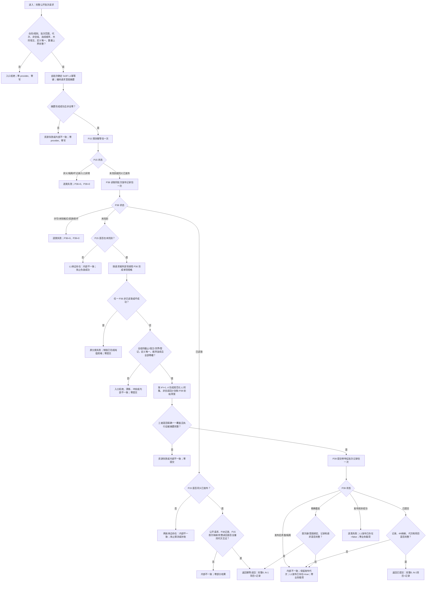

# L1-SIMPLIFY-P40 `发布实际存在I64初始特征批次` 函数流程图 v0.1

日期：2026-08-05

对应详细设计：`规范/详细设计/20260805_L1-SIMPLIFY-P40-EXISTENCE-I64-INITIAL-FEATURE-BATCH-PUBLISH_实际存在I64初始特征批次发布详细设计_v0.1.md`

## 固定边界

- P15/P38 任一已收口时，P36 与 P39 调用次数均为0。
- 首次路径每项 P36 恰一次，P39 恰一次；不调用公开 L1 提交，不逐项提交或重试。
- 成功结果只含本批次0..N-1项目；任一矛盾整体失败，不返回部分集合。
- 发布后失败不删除事实、不补账，明确返回非零代次与 `L1发布已存在=true`。
