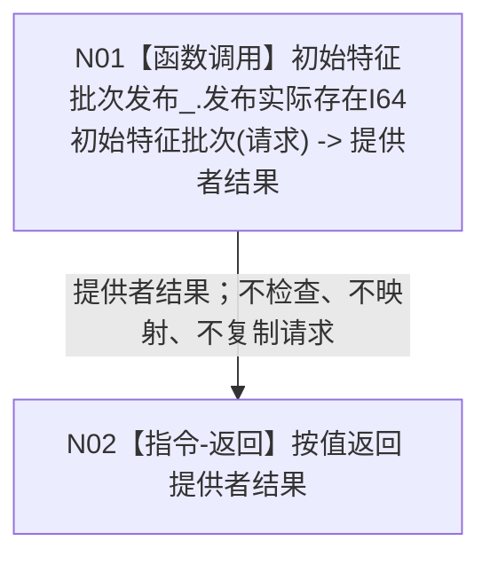

# L1-SIMPLIFY-P41 `世界树业务服务::发布存在初始特征` 函数流程图 v0.1

更新时间：2026-08-05

## 依据

```text
规范/4200_子规范_世界树业务服务与同代次完整事实快照.md §2、§4
流程图/20260802_WORLD-TREE-P1_世界树业务服务业务流程图_v0.1.md F01/F02
规范/详细设计/20260805_L1-SIMPLIFY-P35-WORLD-BUSINESS-EXISTENCE-CREATE-FACADE_世界树业务创建存在第一写透明门面详细设计_v0.1.md
规范/详细设计/20260805_L1-SIMPLIFY-P40-EXISTENCE-I64-INITIAL-FEATURE-BATCH-PUBLISH_实际存在I64初始特征批次发布详细设计_v0.1.md
规范/详细设计/20260805_L1-SIMPLIFY-P41-WORLD-BUSINESS-INITIAL-FEATURE-PUBLISH-FACADE_世界树业务发布存在初始特征第二写透明门面详细设计_v0.1.md
```

## 身份与边界

本图是 P41 正式目标单函数施工图，只冻结一个待新增透明门面函数。它不实现 P40、批次准入、4170事务或治理白名单，不表示代码已经存在或计划已经激活。

## 函数合同

```text
根函数：世界树业务服务::发布存在初始特征
归属模块 / 文件 / 层级：海中鱼巣.领域.服务.世界树 / 海中鱼巣/领域/服务.世界树.ixx / L2组合门面
现有或待新增：待新增；依赖P32/P35目标类与P40目标provider
完整签名：实际存在I64初始特征批次发布结果 发布存在初始特征(const 实际存在I64初始特征批次发布请求& 请求) const
参数：请求；const引用输入；调用方拥有，门面只在同步调用期间借用；非法字段不由门面解释，原样交P40
返回结果：按值实际存在I64初始特征批次发布结果；与P40返回逐字段全等；门面不捕获异常、不承诺noexcept
被调函数流程图：流程图/20260805_L1-SIMPLIFY-P40-EXISTENCE-I64-INITIAL-FEATURE-BATCH-PUBLISH_发布实际存在I64初始特征批次函数流程图_v0.1.md
```

## 流程图



## 节点合同

| 节点 | 类型 | 参数 / 输入绑定 | 结果 / 输出绑定 | 事实读写 | 后继条件 | 验证 |
| --- | --- | --- | --- | --- | --- | --- |
| N01 | 函数调用 | 门面`请求` -> P40形参`请求`，同一对象const借用 | P40按值返回 -> `提供者结果` | 门面不直接读写事实；P40独占批次准入和发布 | 调用正常返回；异常原样越过门面 | P40调用恰1次；其它provider调用0；请求地址/字段不变 |
| N02 | 本函数内指令-返回 | `提供者结果` | 函数按值返回，全部字段全等 | 无新增事实读写 | 函数结束 | 全状态、optional、项目组、记录、发布布尔逐字段全等 |

## 关键边界

```text
门面校验次数 = 0
门面状态映射次数 = 0
P40调用次数 = 1
快照/P34/L1/P15/P36/P38/P39内部入口调用次数 = 0
缓存、锁、日志、retry、fallback、try/catch = 0
成功、逻辑内非成功、发布后失败和异常均保持P40原语义
```

## 验证

1. Markdown 只含一个根函数和一个 Mermaid fenced block，不生成 HTML。
2. 函数签名、参数方向、生命周期、返回与异常边界完整。
3. N01 是唯一函数调用，N02 是唯一返回指令；不存在抽象“处理”节点。
4. P40复杂内部过程由其独立函数图承载，本图只作具名调用和双向引用。
5. `git diff --check`、strict、P32/P35回归及 P41顺序500专项必须通过。
