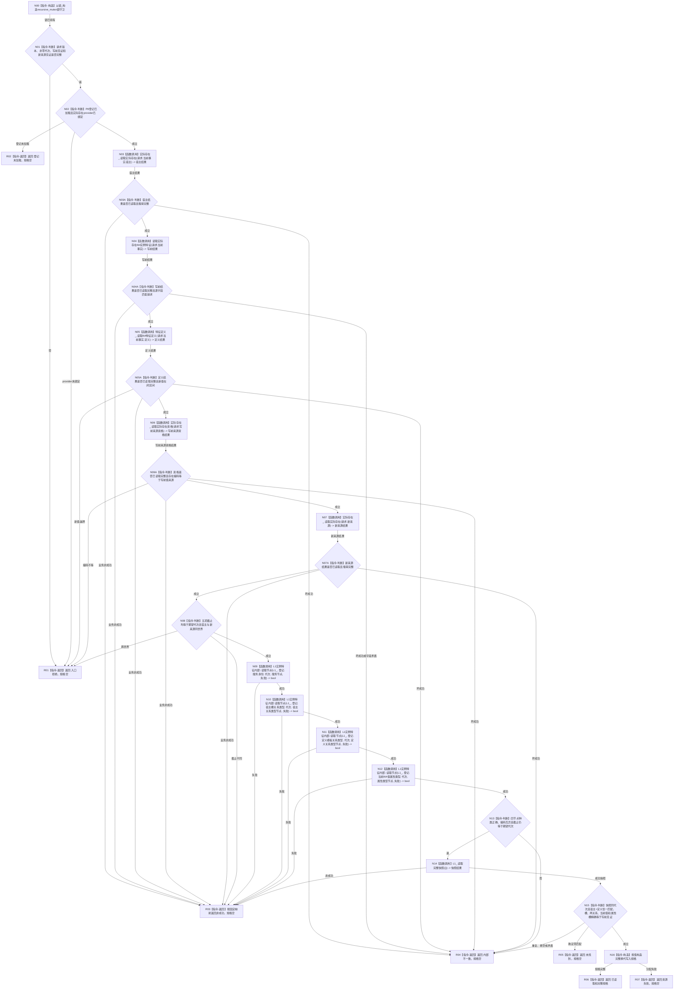

# 形成实际存在 I64 已有特征换代写入规格函数流程图 v0.1

更新时间：2026-08-05

## 依据

```text
规范/4170_子规范_特征批次发布记录与幂等账.md
规范/4200_子规范_世界树业务服务与同代次完整事实快照.md
规范/详细设计/20260805_L1-SIMPLIFY-P42-EXISTENCE-I64-FEATURE-REPLACEMENT-SPEC_实际存在I64已有特征换代写入规格详细设计_v0.1.md
当前基线：d521e32efedbf6d8e8bd08278ee9d21be8c1bf29
```

## 身份与边界

本图是 P42 待实现目标函数的正式单函数流程图，只冻结一个零写规格 provider。它不形成批次、不提交 L1、不调用 P10/P38/P39/P40，也不表示代码已经实现。

## 函数合同

```text
根函数：L1实例特征服务::形成实际存在I64已有特征换代写入规格
归属模块 / 文件 / 层级：海中鱼巣.领域.服务.L1实例特征 / 海中鱼巣/领域/服务.L1实例特征.ixx / L2实例特征事实所有者
现有或待新增：待新增；原位扩展唯一L1实例特征服务
完整签名：实际存在I64已有特征换代写入规格结果 形成实际存在I64已有特征换代写入规格(const 实际存在I64已有特征换代写入规格请求& 请求) const
参数：请求由调用方拥有；函数同步const借用且不保存；请求携带两版本、非零期望事实代次、原项目顺序、完整写前读取见证、写前来源实际存在资格见证、新I64值和新来源读取见证
非法值：坏版本、零代次、坏写前/来源见证、写前来源资格编码不等于写前值来源、新值越界或新来源跨世界；项目顺序不在本函数判断连续性
返回结果：调用方按值拥有；仅已读取携带完整规格，其余状态规格为空；许可拒绝立即返回
生命周期：函数持有既有递归互斥量期间完成全部读取；任何L1/P7/P8/P2许可都不跨调用保存
被调函数流程图：P7/P8/P2/L1均为既有提供者；本图不重画其内部过程
```

## 流程图



## 节点合同

| 节点 | 类型 | 参数 / 输入绑定 | 结果 / 输出绑定 | 事实读写 | 后继条件 | 验证 |
| --- | --- | --- | --- | --- | --- | --- |
| N00 | 本函数内构造 | `锁_` | 递归互斥锁守卫 | 只持有本服务锁 | 构造完成到N01 | 并发无死锁，函数返回自动释放 |
| N01—N02 | 本函数内判断 | 请求、登记、provider绑定 | 入口分类 | 只读本服务值 | 成立才调用provider | 坏版本/零代次/未登记/未绑定调用计数0 |
| N03 | 函数调用 | `请求.当前事实.宿主 -> 请求` | `实际存在结果 -> 宿主结果` | 只读宿主事实 | 调用完成 | 恰1次 |
| N04 | 函数调用 | `请求.当前事实 -> 请求` | `I64实例特征结果 -> 写前结果` | 只读槽、关系、当前值 | 调用完成 | 恰1次，逐字段绑定 |
| N05 | 函数调用 | `请求.当前事实.定义 -> 请求` | `I64特征定义结果 -> 定义结果` | 只读定义和值域 | 调用完成 | 恰1次 |
| N06 | 函数调用 | `请求.写前来源资格 -> 请求` | `实际存在资格结果 -> 写前来源资格结果` | 只读旧来源资格 | 调用完成 | 恰1次，编码等于写前值来源；不要求当前场景归属 |
| N07 | 函数调用 | `请求.新来源 -> 请求` | `实际存在结果 -> 新来源结果` | 只读新来源存在 | 调用完成 | 恰1次，同世界 |
| N03A—N07A | 本函数内判断 | 各provider结果与原请求 | 继续材料或立即结构化返回 | 无写入 | 仅成功完整进入下一调用 | 许可/未找到立即返回，坏成功不继续 |
| N08 | 本函数内判断 | 五结果、期望代次 | 同代次材料 | 无写入 | 完整才读登记节点 | 同代次和新来源同世界矩阵 |
| N09—N12 | 函数调用 | 四个登记编码逐一绑定 | 四个节点事实 | 只读L1当前节点 | 全成功到N13 | 各恰1次，不循环重试 |
| N13 | 本函数内判断 | 四节点事实 | 完整登记见证 | 无写入 | 正确到N14 | 种类、当前性、互异、代次 |
| N14 | 函数调用 | 空读取请求 | `L1读取结果 -> 快照结果` | 只读完整快照 | 成功到N15 | 恰1次 |
| N15 | 本函数内判断 | 快照、写前见证、登记 | 恰一/零/损坏分类 | 无写入 | 恰一到N16 | 槽、关系、值、属性槽完整矩阵 |
| N16 | 本函数内构造 | 全部自有值式材料 | 完整规格 | 无写入 | 成功到R06 | 每字段逐值断言 |
| R01—R07 | 本函数内返回 | 对应分支材料 | 结构化结果 | 无写入 | 函数结束 | 非成功规格恒空 |

## 关键边界

```text
函数对L1写入/提交、4170账和P10写入口的调用数恒为0；只允许图中具名L1读取。
新值等于旧值不在规格阶段折叠；后继新批次身份仍可形成一次值编码换代。
项目顺序只回显，不在单项provider内排序、去重或判断连续。
许可拒绝立即返回，不等待、不循环、不重取快照。
只有同一非零截止下的完整写前结构进入成功规格；结果不保存引用、许可、锁或缓存。
任一阶段分配失败由函数边界返回资源失败；其它未知异常返回内部不一致，规格均为空。
```

## 验证

1. Markdown 只含一个 Mermaid fenced block 和一个根函数。
2. 全部调用节点具名参数绑定、结果接收和调用次数；全部返回路径符合 DTO 合同。
3. `git diff --check -- <本文件>` 通过；不生成或同步 HTML。
