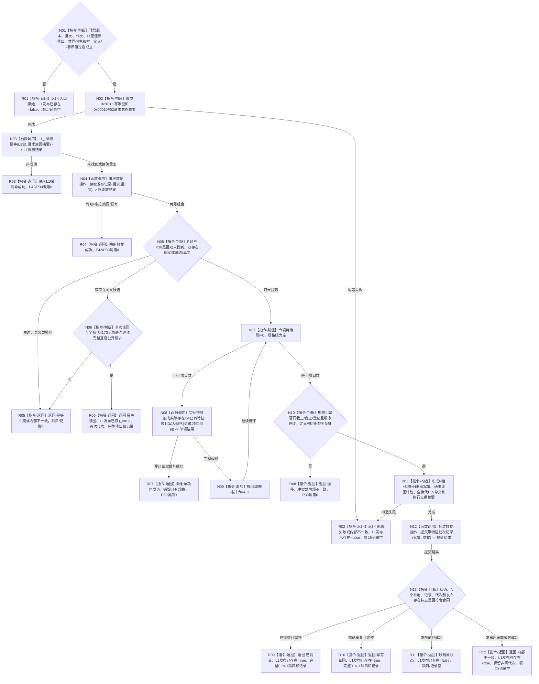

# 发布实际存在 I64 已有特征换代批次函数流程图 v0.1

更新时间：2026-08-05

## 依据

```text
规范/4170_子规范_特征批次发布记录与幂等账.md
规范/4200_子规范_世界树业务服务与同代次完整事实快照.md
规范/详细设计/20260805_L1-SIMPLIFY-P39-FEATURE-BATCH-LEDGER-PARTICIPANT_简化4170特征批次账参与者详细设计_v0.1.md
规范/详细设计/20260805_L1-SIMPLIFY-P42-EXISTENCE-I64-FEATURE-REPLACEMENT-SPEC_实际存在I64已有特征换代写入规格详细设计_v0.1.md
规范/详细设计/20260805_L1-SIMPLIFY-P43-EXISTENCE-I64-FEATURE-REPLACEMENT-BATCH-PUBLISH_实际存在I64已有特征完整换代批次发布详细设计_v0.1.md
当前基线：3047ceb04b4b78e3570c27b79ee27a1677e6b5f2
```

## 身份与边界

本图是 P43 待实现目标函数的正式单函数流程图。它只形成全换代批次的领域发布闭环；P42、P15、P38、P39 内部过程由各自正式设计/函数图承担，不在本图展开。本图不表示代码已经实现。

## 函数合同

```text
根函数：实际存在I64已有特征换代批次发布服务::发布实际存在I64已有特征换代批次
归属模块 / 文件 / 层级：海中鱼巣.领域.服务.L1实例特征 / 海中鱼巣/领域/服务.L1实例特征.ixx / L2实例特征领域业务发布者
现有或待新增：待新增；不修改P40初始批次类
完整签名：实际存在I64已有特征换代批次发布结果 发布实际存在I64已有特征换代批次(const 实际存在I64已有特征换代批次发布请求& 请求)
参数：请求由调用方拥有，函数同步const借用且不保存；携带两版本、域内批次身份、非零期望代次和非空连续P42请求组
非法值：坏版本/批次/代次、空组、顺序不连续、项目代次不等、不同宿主、重复定义/槽/写前值或数量溢出
返回结果：调用方按值拥有；成功/幂等携带本批次完整项目和4170记录；发布前非成功无项目/记录；发布后内部失败保留代次和发布存在标志但无部分项目
异常：分配失败在发布前为资源失败，其它异常为内部不一致；进入P39后按其发布见证收口，不抛出服务边界
被调函数流程图：P42函数图为本图逐项规格调用的正式内部过程；P39/P15/P38按各自正式设计和函数图承担事务/账过程
```

## 流程图



## 节点合同

| 节点 | 类型 | 参数 / 输入绑定 | 结果 / 输出绑定 | 事实读写 | 后继条件 | 验证 |
| --- | --- | --- | --- | --- | --- | --- |
| N01 | 本函数内判断 | 完整公开请求 | 入口准入 | 无写入 | 合法到N02 | provider前拒绝矩阵 |
| N02 | 本函数内构造 | 请求全部公开字段 | L1键、意图摘要 | 无写入 | 完成到N03 | 标准向量、字段/顺序扰动 |
| N03 | 函数调用 | L1键、意图摘要 | L1探测结果 | 只读P15首次账 | 合法到N04 | 恰1次，P42前 |
| N04 | 函数调用 | 请求批次 | P38账读取结果 | 只读4170账 | 合法到N05 | 恰1次，不持许可跨调用 |
| N05—N06 | 本函数内判断 | 双账、公开请求 | 首次/幂等分支 | 无写入 | 双未找到到N07；同义到R06 | 双账矩阵、全换代互证 |
| N07 | 本函数内赋值/循环判断 | 项目数、i、规格组 | 循环控制 | 无写入 | i<N到N08；否则N10 | 0..N-1恰一次 |
| N08 | 函数调用 | `请求.项目组[i] -> P42请求` | P42结果 -> 单项结果 | P42零写读取 | 完整到N09 | 每项恰1次 |
| N09 | 本函数内追加 | 单项规格、i | 有序规格组、新i | 无写入 | 回N07 | 不排序、不丢项 |
| N10 | 本函数内判断 | 全部规格与顶层请求 | 完整集合 | 无写入 | 成立到N11 | 同截止/宿主/登记/唯一性 |
| N11 | 本函数内构造 | 请求、规格组 | 写集、读回计划、草案、证据摘要 | 只形成未发布纯值材料 | 完成到N12 | N值+N槽+N退出、局部键1..N |
| N12 | 函数调用 | 写集、草案 | P39提交结果 | 唯一单事务写入 | 调用完成到N13 | 恰1次 |
| N13 | 本函数内判断 | P39完整结果 | 结构化分类 | 无追加写入 | 对应R09—R12 | 映射N、记录、代次、发布边界 |
| R01—R12 | 本函数内返回 | 分支材料 | P43公开结果 | 无补写 | 函数结束 | 非成功零部分项目 |

## 关键边界

```text
P42调用严格发生在P15/P38双未找到之后；幂等读回不重跑provider。
首次路径只调用P39一次；P10、公开L1提交和事务后补账调用0。
每项只有1个新值本地键、1个槽切换和1个旧值退出；节点/关系写入0。
新值等于旧材料仍换代；同完整请求重试只读回首次结果。
发布后矛盾不撤销、不补写、不返回部分项目。
```

## 验证

1. Markdown 只含一个 Mermaid fenced block和一个根函数。
2. 每个调用节点均具名实参、返回接收和后继；每个返回节点符合公开结果合同。
3. `git diff --check -- <本文件>` 通过；不生成或同步 HTML。
