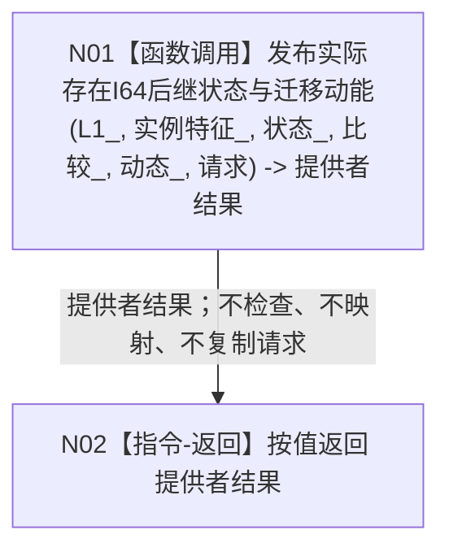

# L1-SIMPLIFY-P45 `世界树业务服务::发布状态并整理动态` 函数流程图 v0.1

更新时间：2026-08-05

## 依据

```text
规范/4190_子规范_语义分层世界结构与状态动态因果边界.md §6—§9
规范/4200_子规范_世界树业务服务与同代次完整事实快照.md §2、§4、§7
流程图/20260802_WORLD-TREE-P1_世界树业务服务业务流程图_v0.1.md S00
规范/详细设计/20260805_L1-SIMPLIFY-P16-STATE-DYNAMIC-ATOMIC-PUBLISH_实际存在I64后继状态动态原子发布详细设计_v0.1.md
规范/详细设计/20260805_L1-SIMPLIFY-P44-WORLD-BUSINESS-FEATURE-REPLACEMENT-FACADE_世界树业务更新存在已有特征第三写透明门面详细设计_v0.1.md
规范/详细设计/20260805_L1-SIMPLIFY-P45-WORLD-BUSINESS-STATE-DYNAMIC-PUBLISH-FACADE_世界树业务发布状态并整理动态第四写透明门面详细设计_v0.1.md
当前正式基线：1e1cf221a54b56ee7d508a5f687386dd6c681df0
```

## 身份与边界

本图是 P45 正式目标单函数施工图，只冻结一个待新增透明门面函数。P16 的状态/动态准入、P13/P14规格、P15探测与事务、状态/动态独立读回由 P16 独立函数图承担；本图不重复其内部流程，不表示代码已实现或计划已激活。

## 函数合同

```text
根函数：世界树业务服务::发布状态并整理动态
归属模块 / 文件 / 层级：海中鱼巣.领域.服务.世界树 / 海中鱼巣/领域/服务.世界树.ixx / L2组合门面
现有或待新增：待新增；依赖P32/P35/P41/P44目标类与P16目标provider
完整签名：状态动态原子发布结果 发布状态并整理动态(const 状态动态原子发布请求& 请求) const
参数：请求；const引用输入；调用方拥有，门面只在同步调用期间借用且不保存；非法字段由P16裁决
返回结果：按值状态动态原子发布结果；与P16返回逐字段全等；门面不捕获异常、不承诺noexcept
被调函数流程图：流程图/20260805_L1-SIMPLIFY-P16-STATE-DYNAMIC-ATOMIC-PUBLISH_实际存在I64后继状态动态原子发布函数流程图_v0.1.md
```

## 流程图



## 节点合同

| 节点 | 类型 | 参数 / 输入绑定 | 结果 / 输出绑定 | 事实读写 | 后继条件 | 验证 |
| --- | --- | --- | --- | --- | --- | --- |
| N01 | 函数调用 | 门面五个服务引用和`请求`原样传给P16 | P16按值返回 -> `提供者结果` | 门面不直接读写事实；P16独占状态动态发布 | 调用正常返回到N02；异常原样越过门面 | P16调用恰1次；其它provider直接调用0；请求不变 |
| N02 | 本函数内指令-返回 | `提供者结果` | 函数按值返回，全部字段全等 | 无新增事实读写 | 函数结束 | 全状态、证据、后状态、可选动态和失败见证逐字段全等 |

## 关键边界

```text
门面校验次数 = 0
门面状态映射次数 = 0
P16调用次数 = 1
P13/P14/P15/P9/P11直接调用次数 = 0
快照/P34/P40/P43调用次数 = 0
缓存、锁、日志、retry、fallback、try/catch = 0
成功、幂等、无前状态、发布前非成功、发布后内部不一致和异常均保持P16原语义
```

## 验证

1. Markdown只含一个根函数和一个 Mermaid fenced block，不生成 HTML。
2. 函数签名、参数方向、生命周期、返回与异常边界完整。
3. N01是唯一函数调用，N02是唯一返回指令，不存在抽象处理节点。
4. P16复杂内部过程由其独立函数图承载，本图只作具名调用和双向引用。
5. `git diff --check`、strict、P32/P35/P41/P44回归及P45顺序540专项必须通过。
