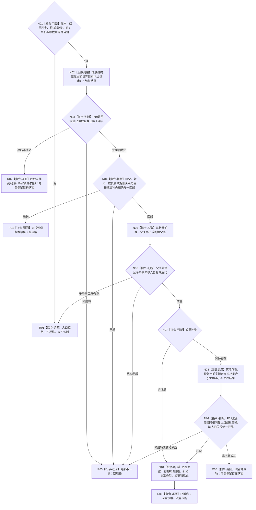

# L1-SIMPLIFY-P46 `形成世界树成员移动规格` 函数流程图 v0.1

更新时间：2026-08-05

## 依据

```text
规范/4190_子规范_语义分层世界结构与状态动态因果边界.md §4、§9
规范/4200_子规范_世界树业务服务与同代次完整事实快照.md §3、§7、§9
流程图/20260802_WORLD-TREE-P1_世界树业务服务业务流程图_v0.1.md M01
规范/详细设计/20260805_L1-SIMPLIFY-P19-WORLD-STRUCTURE-READ_指定根当前场景结构读取详细设计_v0.1.md
规范/详细设计/20260805_L1-SIMPLIFY-P21-EXISTENCE-SET-READ_指定根当前实际存在资格集合读取详细设计_v0.1.md
规范/详细设计/20260805_L1-SIMPLIFY-P46-WORLD-MEMBER-MOVE-SPEC_指定世界树成员移动规格详细设计_v0.1.md
当前正式基线：076f76a6eddf8af11060065c3236fddc61652aa8
```

## 身份与边界

本图是P46正式目标单函数施工图，只冻结一个零写移动规格函数。P19解释当前场景结构，P21解释实际存在资格；本函数只校准值式结果与请求并形成不可变规格，不形成移动幂等、写集、稳定编码、事务或读回。

## 函数合同

```text
根函数：形成世界树成员移动规格
归属模块 / 文件 / 层级：海中鱼巣.领域.服务.世界树成员移动规格 / 海中鱼巣/领域/服务.世界树成员移动规格.ixx / L2无状态组合规格
现有或待新增：待新增；依赖P19/P21冻结合同
完整签名：世界树成员移动规格结果 形成世界树成员移动规格(const L1场景结构服务& 场景结构,const L1实际存在服务& 实际存在,const 世界树成员移动规格请求& 请求)
参数：两个服务为只读同步借用且不保存；请求为调用方拥有的const借用，携带完整根、成员种类、成员、旧父、旧关系、新父和期望截止
返回结果：调用方拥有的按值结果；仅已形成携带完整规格；非成功规格为空，结构/存在缺项只在对应内部不一致分支保留
被调函数流程图：P19、P21各自正式函数图；本图不展开其内部L1读取
```

## 流程图



## 节点合同

| 节点 | 类型 | 参数 / 输入绑定 | 结果 / 输出绑定 | 事实读写 | 后继条件 | 验证 |
| --- | --- | --- | --- | --- | --- | --- |
| N01 | 本函数内指令-判断 | 请求全部公开字段 | 自洽真/假 | 无 | 真到N02；假到R01 | provider前拒绝、调用0 |
| N02 | 函数调用 | 请求版本/规则/根 -> P19请求 | P19结果 -> 结构结果 | 只读P19 | 到N03 | 恰1次，不重试 |
| N03—N04 | 本函数内指令-判断 | P19结果和请求见证 | 完整性、截止与精确旧边分类 | 无 | 匹配到N05 | 成员种类不靠猜测 |
| N05 | 本函数内指令-构造 | P19父子关系、新父和根 | 新父到根父链 | 无 | 到N06 | 语义顺序、根空链 |
| N06—N07 | 本函数内指令-判断 | 父链、成员和成员种类 | 防环与分支 | 无 | 子场景到N10；存在到N08 | 根/自身/后代矩阵 |
| N08 | 函数调用 | P19完整事实 -> P21成员范围 | P21结果 -> 资格结果 | 只读P21 | 到N09 | 实际存在恰1，子场景0 |
| N09 | 本函数内指令-判断 | P21结果、成员、旧关系和截止 | 资格匹配分类 | 无 | 成功到N10 | 同根同截止、资格唯一 |
| N10 | 本函数内指令-构造 | P19/P21匹配材料 | 完整移动规格 | 无 | 到R06 | 字段来源逐项固定 |
| R01—R06 | 本函数内指令-返回 | 分支材料 | 合同允许结果 | 无 | 结束 | 非成功无部分规格 |

## 关键边界

```text
P19调用次数 = 1
P21调用次数 = 实际存在1 / 子场景0
L1提交、幂等探测、稳定编码分配、写集、锁、缓存和重试 = 0
实际存在资格只来自P21；场景、旧边、新父、关系类型和父链只来自P19
旧节点直接场景骨架调用 = 0
```

## 验证

1. Markdown只有一个根函数和一个Mermaid fenced block，不生成HTML。
2. 所有参数、所有权、生命周期、返回和非成功语义完整。
3. P19/P21是仅有的函数调用节点，其余节点均为本函数内具体指令。
4. 每条返回路径均产生合同允许的空规格或完整规格。
5. `git diff --check`、strict、P19/P21回归和P46顺序545专项必须通过。
