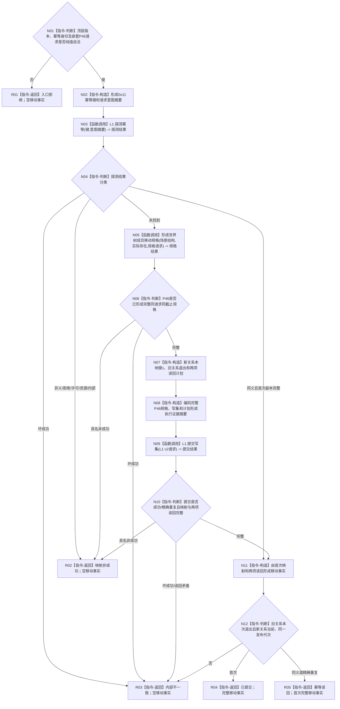

# L1-SIMPLIFY-P47 `移动世界树成员` 函数流程图 v0.1

更新时间：2026-08-05

## 依据

```text
规范/4015_子规范_L1简化事实基座.md §2—§5
规范/4200_子规范_世界树业务服务与同代次完整事实快照.md §3、§4、§7
规范/详细设计/20260805_L1-SIMPLIFY-P15-POST-PUBLISH-READBACK_L1提交内通用发布后读回隔离详细设计_v0.9.md
规范/详细设计/20260805_L1-SIMPLIFY-P46-WORLD-MEMBER-MOVE-SPEC_指定世界树成员移动规格详细设计_v0.1.md
规范/详细设计/20260805_L1-SIMPLIFY-P47-WORLD-MEMBER-MOVE-PUBLISH_世界树成员移动原子发布详细设计_v0.1.md
当前正式基线：8efd9e686bad870446b7d25780f85d07d51babb3
```

## 身份与边界

本图是P47正式目标单函数施工图，只冻结一个具名移动领域发布方法。它消费P46不可变规格，并复用P15 L1 v2探测/提交/读回；不建立移动账、参与者、第五写门面或移除入口。

## 函数合同

```text
根函数：L1世界树成员移动发布服务::移动世界树成员
归属模块 / 文件 / 层级：海中鱼巣.领域.服务.世界树成员移动发布 / 海中鱼巣/领域/服务.世界树成员移动发布.ixx / L2具名领域原子发布者
现有或待新增：待新增；依赖P46和P15届时正式合同
完整签名：世界树成员移动发布结果 L1世界树成员移动发布服务::移动世界树成员(const 世界树成员移动发布请求& 请求) const
参数：请求为调用方拥有的const同步借用，携带顶层版本、移动幂等身份和完整P46规格请求；服务只借用L1、场景结构和实际存在三个宿主引用
返回结果：调用方拥有的按值结果；仅已提交/幂等读回携带完整世界树成员移动事实，全部非成功事实为空
被调函数流程图：P46 `形成世界树成员移动规格`正式函数图；P15探测/提交内部过程不在本图重复展开
```

## 流程图



## 节点合同

| 节点 | 类型 | 参数 / 输入绑定 | 结果 / 输出绑定 | 事实读写 | 后继条件 | 验证 |
| --- | --- | --- | --- | --- | --- | --- |
| N01 | 本函数内指令-判断 | 请求全部公开字段 | 自洽真/假 | 无 | 真到N02；假到R01 | 后继调用0拒绝矩阵 |
| N02 | 本函数内指令-构造 | 已验证请求 | 0x11键、意图摘要 | 无 | 到N03 | 域/标签/标准向量 |
| N03 | 函数调用 | 探测请求 -> P15 L1 | 探测结果 | 只读L1幂等账 | 到N04 | 恰1次、provider前 |
| N04 | 本函数内指令-判断 | 探测结果 | 首次/同义/非成功分类 | 无 | 未找到到N05 | 同义P46/提交0 |
| N05 | 函数调用 | 三引用和嵌套请求 -> P46 | 规格结果 | P46内部只读P19/P21 | 到N06 | 首次恰1次 |
| N06 | 本函数内指令-判断 | P46结果和公开请求 | 完整规格或失败 | 无 | 完整到N07 | 字段/截止逐项等 |
| N07 | 本函数内指令-构造 | 完整P46规格 | 0/1/0/0+1写集及两项计划 | 无 | 到N08 | 精确形状、本地键1 |
| N08 | 本函数内指令-构造 | 意图、规格、写集、计划 | 执行证据摘要 | 无 | 到N09 | 全字段确定编码 |
| N09 | 函数调用 | L1 v2请求 -> P15 L1 | 首次或重复提交结果 | 单次L1事务 | 到N10 | 最多1次提交 |
| N10—N12 | 本函数内指令-判断/构造 | 映射、两关系读回和请求 | 完整移动事实或内部不一致 | 无 | 到R03/R04/R05 | 退出/创建同代次 |
| R01—R05 | 本函数内指令-返回 | 分支材料 | 合同允许结果 | 无新增写入 | 结束 | 非成功零事实 |

## 关键边界

```text
P15探测 = 恰1次
P46 = 首次未找到恰1次 / 同义0次
P47直接P19/P21 = 0
L1提交 = 首次最多1次 / 同义0次
写集 = 0节点 + 1新关系 + 0值 + 0槽 + 1旧关系退出
读回 = 旧关系本次发布退出 + 新关系当前
P37/P38/P39/4170、移动账、参与者、仓库、SQL、缓存、锁、普通快照、第二提交 = 0
```

## 验证

1. Markdown只有一个根函数和一个Mermaid fenced block，不生成HTML。
2. 每个调用节点均绑定实参、结果和后继；P46复杂内部过程由其正式函数图承载。
3. 全部返回路径只产生空事实或完整移动事实。
4. `git diff --check`、strict、P46/P15回归和P47顺序546专项必须通过。
