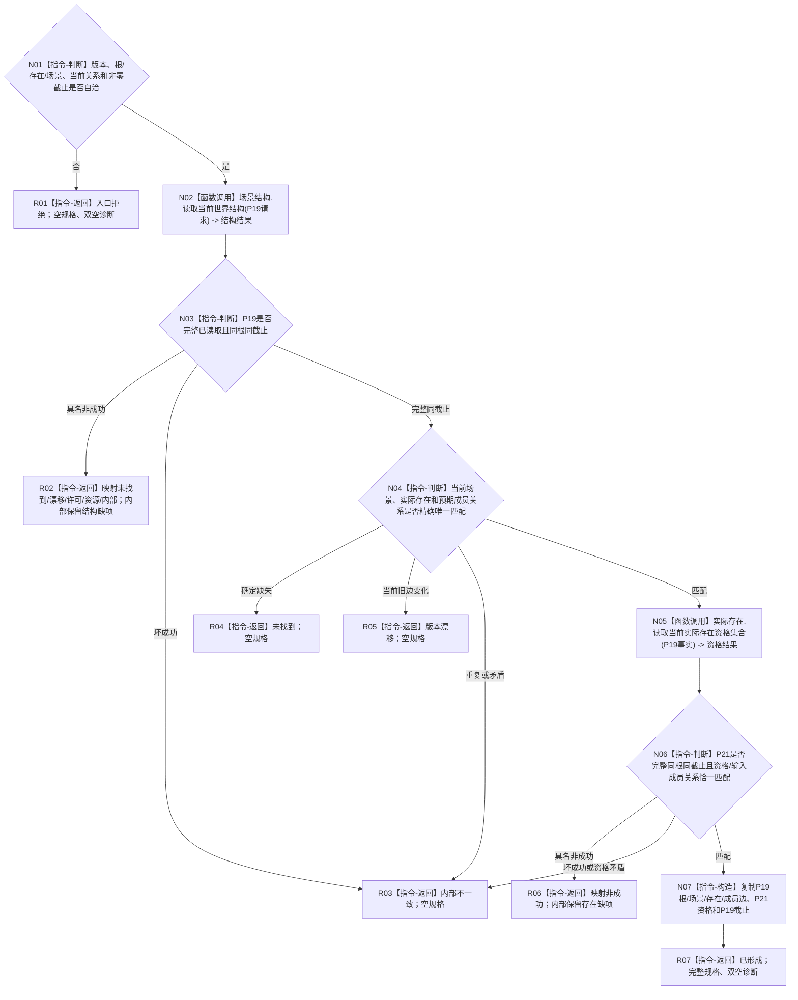

# L1-SIMPLIFY-P49 `形成世界树实际存在移除规格` 函数流程图 v0.1

更新时间：2026-08-05

## 依据

```text
规范/4200_子规范_世界树业务服务与同代次完整事实快照.md §3.9、§3.11、§5—§7
规范/详细设计/20260805_L1-SIMPLIFY-P19-WORLD-STRUCTURE-READ_指定根当前场景结构读取详细设计_v0.1.md
规范/详细设计/20260805_L1-SIMPLIFY-P21-EXISTENCE-SET-READ_指定根当前实际存在资格集合读取详细设计_v0.1.md
规范/详细设计/20260805_L1-SIMPLIFY-P49-WORLD-EXISTENCE-REMOVE-SPEC_指定世界树实际存在移除规格详细设计_v0.1.md
当前正式基线：36f9ec1b57083be8e2b584604aec581e88f23571
```

## 身份与边界

本图只冻结一个实际存在移除零写规格函数。它不接受场景或成员种类，不删除存在本体，不扫描特征/状态/动态，不形成幂等、摘要、编码、写集、事务或读回。

## 函数合同

```text
根函数：形成世界树实际存在移除规格
归属模块 / 文件 / 层级：海中鱼巣.领域.服务.世界树实际存在移除规格 / 海中鱼巣/领域/服务.世界树实际存在移除规格.ixx / L2无状态组合规格
现有或待新增：待新增；依赖P19/P21冻结合同
完整签名：世界树实际存在移除规格结果 形成世界树实际存在移除规格(const L1场景结构服务& 场景结构,const L1实际存在服务& 实际存在,const 世界树实际存在移除规格请求& 请求)
参数：两个服务为只读同步借用且不保存；请求为调用方拥有的const借用，携带根、实际存在、预期当前场景、完整预期成员关系和期望截止
返回：调用方拥有的按值结果；仅已形成携带完整规格；非成功规格为空，结构/存在缺项仅在对应内部不一致分支保留
被调函数：P19读取当前世界结构；P21读取当前实际存在资格集合；本图不展开两者内部读取
```

## 流程图



## 节点合同

| 节点 | 类型 | 输入绑定 | 输出绑定 | 事实读写 | 验证 |
| --- | --- | --- | --- | --- | --- |
| N01 | 本函数内指令-判断 | 请求全部字段 | 自洽真/假 | 无 | provider前拒绝、调用0 |
| N02 | 函数调用 | 根与版本形成P19请求 | P19结果 | 只读P19 | 恰1次、零重试 |
| N03—N04 | 本函数内指令-判断 | P19事实、请求见证 | 完整性、截止、精确旧边分类 | 无 | 缺失/漂移/矛盾分账 |
| N05 | 函数调用 | 本轮P19完整事实 | P21结果 | 只读P21 | 恰1次、零重取P19 |
| N06 | 本函数内指令-判断 | P21结果、存在、旧边和截止 | 资格匹配分类 | 无 | 同根同截止、资格唯一 |
| N07 | 本函数内指令-构造 | P19/P21匹配材料 | 完整移除规格 | 无 | 字段来源逐项固定 |
| R01—R07 | 本函数内指令-返回 | 分支材料 | 合同允许结果 | 无 | 非成功无部分规格 |

## 关键边界与验证

```text
P19调用次数 = 1
P21调用次数 = P19完整同截止且旧边匹配后1，否则0
场景成员移除、子树扫描、特征/状态/动态扫描 = 0
L1提交、P15、幂等、摘要、稳定编码、写集、事务、读回、锁、缓存和重试 = 0
```

Markdown只有一个根函数和一个Mermaid fenced block，不生成HTML。P49顺序548专项须覆盖全部返回边、字段来源、调用次数、引用非拒绝边界和零写；创建侧与实施侧均执行diff check和strict。
