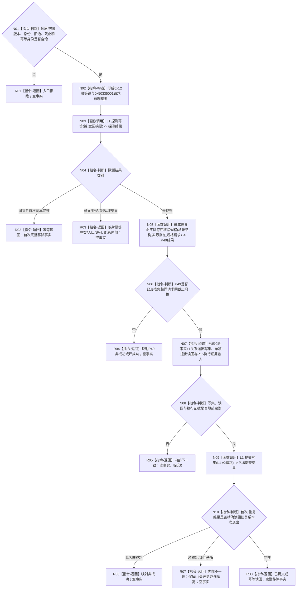

# L1-SIMPLIFY-P50 `移除世界树存在` 函数流程图 v0.1

更新时间：2026-08-05

## 依据

```text
规范/4015_子规范_L1简化事实基座.md
规范/4200_子规范_世界树业务服务与同代次完整事实快照.md §3.9、§3.11、§4、§7
规范/详细设计/20260805_L1-SIMPLIFY-P49-WORLD-EXISTENCE-REMOVE-SPEC_指定世界树实际存在移除规格详细设计_v0.1.md
规范/详细设计/20260805_L1-SIMPLIFY-P15-POST-PUBLISH-READBACK_L1提交内通用发布后读回隔离详细设计_v0.10.md（已发布并可执行，代码待实现，只作P50激活门禁）
规范/详细设计/20260805_L1-SIMPLIFY-P50-WORLD-EXISTENCE-REMOVE-PUBLISH_世界树存在移除原子发布详细设计_v0.1.md
创建侧正式基线：d2ed120d71046e0921c463f41c8e6a5eb5ef434b
```

## 身份与边界

本图只冻结一个具名领域原子发布函数：消费P49实际存在移除规格，以一次L1 v2事务退出唯一当前成员关系并同锁读回。它不删除存在或其它事实，不支持场景移除，不形成第六写世界树门面。

## 函数合同

```text
根函数：L1世界树存在移除发布服务::移除世界树存在
归属模块 / 文件 / 层级：海中鱼巣.领域.服务.世界树存在移除发布 / 海中鱼巣/领域/服务.世界树存在移除发布.ixx / L2具名领域发布者
现有或待新增：待新增；P49与P15最终正式接口为待实现依赖
完整签名：世界树存在移除发布结果 L1世界树存在移除发布服务::移除世界树存在(const 世界树存在移除发布请求& 请求) const
参数：请求为调用方拥有的const借用，含顶层版本、稳定幂等身份和完整P49规格请求；服务借用L1/场景结构/实际存在三个宿主且不保存调用材料
返回结果：调用方按值接收；仅已提交/幂等读回携带完整移除事实，全部非成功事实为空
被调函数流程图：P49形成规格图；P15最终探测/提交与同锁读回图须以正式版本为准，本图不展开其内部恢复载体
```

## 流程图



## 节点合同

| 节点 | 类型 | 参数 / 输入绑定 | 结果 / 输出绑定 | 事实读写 | 后继条件 | 验证 |
| --- | --- | --- | --- | --- | --- | --- |
| N01—N02 | 本函数内具体指令 | 公开请求全部字段 | 准入分类、键、摘要 | 无 | 自洽到N03 | provider前拒绝；0x12/标签唯一 |
| N03 | 函数调用 | 键、意图摘要 -> P15探测 | 探测结果 | 只读L1幂等账 | 到N04 | 恰1次 |
| N04 | 本函数内具体指令 | 探测结果 | 首次/同义/非成功分类 | 无 | 未找到到N05 | 同义P49/提交0 |
| N05 | 函数调用 | 三依赖中的场景/存在服务与嵌套请求 | P49结果 | P49内部只读P19/P21 | 到N06 | 首次恰1，旁路0 |
| N06—N08 | 本函数内具体指令 | P49结果与公开请求 | 规格分类、写集、读回、证据输入 | 无 | 完整到N09 | 0+0+0+0+1；读回1 |
| N09 | 函数调用 | 写集、读回与执行证据绑定后的L1 v2请求 -> P15 L1 | P15提交结果 | 一次L1 v2原子发布与同锁读回 | 到N10 | 首次最多1 |
| N10 | 本函数内具体指令 | P15结果、P49规格 | 领域事实或错误分类 | 无新增写 | 到R06/R07/R08 | 生命周期与代次逐字段匹配 |
| R01—R08 | 本函数内具体指令 | 分支材料 | 合同允许结果 | 无额外写 | 结束 | 非成功无部分事实 |

## 关键边界

```text
P15探测 = 每次请求1；P49 = 仅首次未找到1；P15提交 = 首次最多1
写集 = 0节点 + 0新关系 + 0值 + 0槽 + 1当前成员关系退出
读回 = 1项关系本次发布退出；新稳定编码映射必须为空
删除/退役存在、场景移除、其它事实退出、引用扫描、普通快照、补写、第二提交 = 0
P15恢复载体由P15最终正式合同拥有，本函数只提供操作专属确定材料
```

## 验证

1. Markdown只有一个根函数和一个Mermaid fenced block，不生成HTML。
2. 每个调用节点均固定参数、结果和调用次数；所有返回产生合同允许状态。
3. 顺序549专项覆盖准入、幂等、P49、精确退出写集、同锁读回、并发、失败隔离和零删除。
4. 创建侧与施工侧分别执行目标diff check与strict；施工侧再执行双配置构建/自检和MSVC模块扫描。
