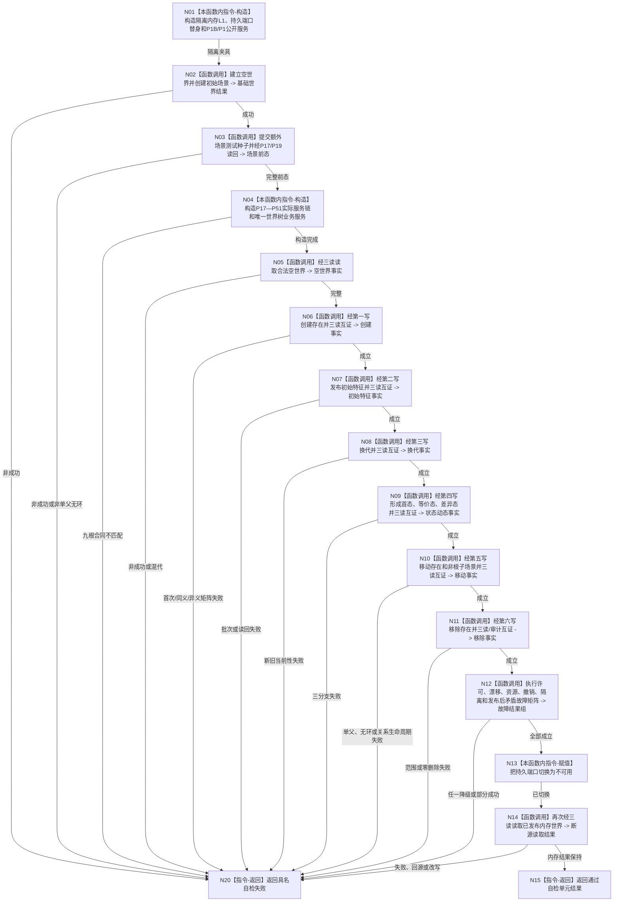

# L1-SIMPLIFY-P52 `运行世界树业务九能力合同预验收自检` 函数流程图 v0.1

更新时间：2026-08-05

## 依据

```text
规范/4200_子规范_世界树业务服务与同代次完整事实快照.md §3—§10
规范/详细设计/20260804_SELF-GOV-CLOSURE_自我内部治理初始闭环实现方案_v0.2.md §12顺序4
规范/详细设计/20260805_L1-SIMPLIFY-P51-WORLD-BUSINESS-EXISTENCE-REMOVE-FACADE_世界树业务移除世界树存在第六写透明门面详细设计_v0.1.md
规范/详细设计/20260805_L1-SIMPLIFY-P52-WORLD-BUSINESS-NINE-CAPABILITY-PREACCEPTANCE_世界树业务九能力确定性合同预验收详细设计_v0.1.md
创建侧基线：11c9c13518fa6eeb15c0b613e26e96a6eab441d9
```

## 身份与边界

本图是P52唯一目标函数的正式施工图。它只表示隔离内存确定性自检，不是生产运行期装配、旧栈退出或集成验收；P17—P51复杂内部算法继续由各自函数图拥有。

## 函数合同

```text
根函数：运行世界树业务九能力合同预验收自检
归属模块 / 文件 / 层级：海中鱼巣.领域.自检.世界树业务合同预验收 / 海中鱼巣/领域/自检.世界树业务合同预验收.ixx / 测试专属
现有或待新增：待新增；只消费P17—P51及P1B/P1/P15正式公开合同
完整签名：自检单元结果 运行世界树业务九能力合同预验收自检()
参数：无
返回结果：按值自检单元结果；任一具名断言失败返回失败和定位，全部联合合同成立返回通过
被调函数流程图：P17—P51各正式函数图；本图不展开其内部过程
```

## 流程图



## 节点合同

| 节点 | 类型 | 参数 / 输入绑定 | 结果 / 输出绑定 | 事实读写 | 后继条件 | 验证 |
| --- | --- | --- | --- | --- | --- | --- |
| N01—N04 | 构造 / 函数调用 | 无外部材料；确定性常量 | 隔离世界、场景前态、实际十一引用门面 | 只写隔离夹具；额外场景种子单独标记 | 任一失败到N20 | 零SQL/缓存/运行期；种子不算业务成功 |
| N05—N11 | 函数调用 | 同一世界、递增具名幂等身份 | 三读和六写联合事实 | 只经世界树业务九根形成业务结果 | 每步完整才后继 | 写后读、同义/异义、稳定排序、零删除 |
| N12 | 函数调用 | 独立故障夹具 | 结构化非成功组 | 发布前零变化；未知隔离 | 全部边界成立到N13 | 不把异常或内部错误降级 |
| N13—N14 | 赋值 / 函数调用 | 已发布内存事实、断开的持久端口 | 断源后三读结果 | 不写世界事实 | 保持内存权威到N15 | SQL/端口回源调用0 |
| N15/N20 | 返回 | 汇总断言或首个失败 | 通过/失败自检单元结果 | 无 | 函数结束 | 失败定位具名且不继续伪造证据 |

## 关键边界

```text
生产文件修改 = 0
运行期装配/消费者调用 = 0
九能力成功证据绕过世界树业务门面 = 0
额外场景测试种子 = 恰一次且只提供前态
旧世界服务调用 = 0
正式集成验收结论 = 0
4200 §9.9旧栈零引用结论 = 0
```

## 验证

1. Markdown只含一个根函数和一个Mermaid fenced block，不生成HTML。
2. N02—N14均为具名函数调用或本函数内具体指令，没有抽象“处理”节点。
3. 九项业务成功只来自同一世界树业务对象；额外场景种子只作测试前态。
4. P17—P51内部过程由各自函数图承载，本图不复制算法。
5. `git diff --check`、strict、顺序552专项、P17—P51回归、双配置完整自检和模块扫描必须通过。
