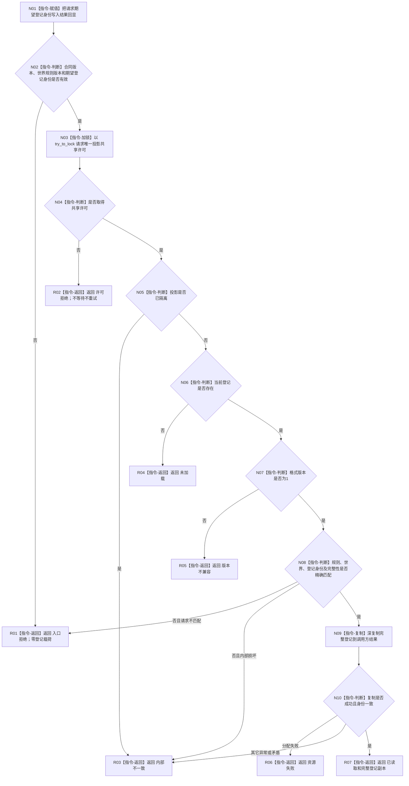

# L1-SIMPLIFY-P53 读取自我结构登记函数流程图 v0.1

更新时间：2026-08-05

## 依据

```text
规范/4015_子规范_L1简化事实基座.md
规范/4200_子规范_世界树业务服务与同代次完整事实快照.md
规范/6120_子规范_自我存在服务与生存基本因果闭环_20260720.md
规范/6130_子规范_自我根特征抽象定义与自检缺口_20260720.md
规范/7130_子规范_自我内部世界成员特征与事实读取投影.md
规范/详细设计/20260805_L1-SIMPLIFY-P53-SELF-STRUCTURE-REGISTRY-READ_简化7130自我结构登记读取详细设计_v0.1.md
```

## 身份与边界

本图是待新增单函数的正式施工设计图，只表达一个非阻塞读取根。登记发布、L1读写、完整自我创建、根定义和运行期装配不在本图。

## 函数合同

```text
根函数：L1自我结构登记数据操作::读取自我结构登记
归属模块 / 文件 / 层级：海中鱼巣.领域.数据操作.L1自我结构登记 / 海中鱼巣/领域/数据操作.L1自我结构登记.ixx / L2领域内部
现有或待新增：待新增
完整签名：自我结构登记读取结果 读取自我结构登记(const 自我结构登记读取请求& 请求) const;
参数：请求；const借用，仅调用期间有效；合同版本、世界规则版本和期望登记身份必须有效
返回结果：调用方拥有的值式结果；仅已读取携带完整登记
被调函数流程图：无；锁和纯值完整性检查均为本函数内指令
```

## 流程图



## 节点合同

| 节点 | 类型 | 参数 / 输入绑定 | 结果 / 输出绑定 | 事实读写 | 后继条件 | 验证 |
| --- | --- | --- | --- | --- | --- | --- |
| N01—N02 | 本函数内指令 | 请求 | 身份回显、入口裁决 | 零事实写 | 合法/非法 | 无效输入锁前拒绝 |
| N03—N04 | 本函数内指令 | 唯一投影锁 | 共享许可或许可拒绝 | 只读同步 | 取得/竞争 | 竞争立即返回 |
| N05—N08 | 本函数内指令 | 内部投影 | 状态、完整性裁决 | 只读投影 | 未加载/损坏/匹配 | 版本与损坏分账 |
| N09—N10 | 本函数内指令 | 已验证登记 | 调用方副本 | 零权威写 | 成功/异常 | 深复制与异常矩阵 |
| R01—R07 | 本函数内指令 | 分支状态 | 完整值式结果 | 零事实写 | 返回 | 仅已读取携带登记 |

## 关键边界

```text
单根函数、单一共享许可、零等待、零重试、零L1/SQL/材料读取。
登记投影不是第二权威账；后继发布者只在L1已发布且同锁读回成立后更新它。
本函数不创建自我，不解释旧句柄，不形成安全/服务根事实。
```
