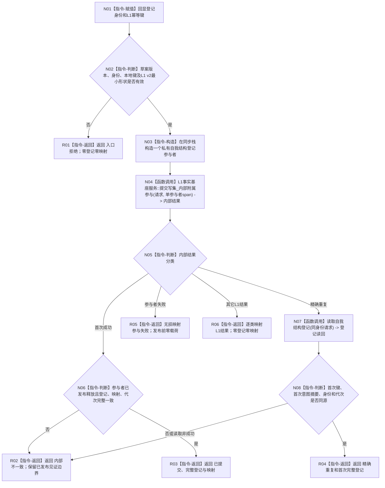

# L1-SIMPLIFY-P54 提交带自我结构登记函数流程图 v0.1

更新时间：2026-08-05

## 依据

```text
规范/4040_子规范_不透明结构事务候选确认撤销与最后发布.md
规范/7130_子规范_自我内部世界成员特征与事实读取投影.md
规范/详细设计/20260805_L1-SIMPLIFY-P37-L1-INTERNAL-PARTICIPANT-BRIDGE_L1内部附属事务参与者桥接详细设计_v0.1.md
规范/详细设计/20260805_L1-SIMPLIFY-P53-SELF-STRUCTURE-REGISTRY-READ_简化7130自我结构登记读取详细设计_v0.1.md
规范/详细设计/20260805_L1-SIMPLIFY-P54-SELF-STRUCTURE-REGISTRY-PARTICIPANT_简化7130自我结构登记参与者详细设计_v0.1.md
```

## 身份与边界

正式待实施单函数图。唯一根只编排一个P53具体参与者和一次P37内部提交；参与者回调细节由P37接口和P54详细设计冻结，不在本图伪装成多个公开函数。

## 函数合同

```text
根函数：L1自我结构登记数据操作::提交带自我结构登记
归属模块 / 文件 / 层级：海中鱼巣.领域.数据操作.L1自我结构登记 / 海中鱼巣/领域/数据操作.L1自我结构登记.ixx / L2领域内部
现有或待新增：待新增
完整签名：自我结构登记附属提交结果 提交带自我结构登记(const L1写集请求& 请求, const 自我结构登记草案& 草案);
参数：请求与草案均const借用且仅同步调用期间有效；不得保存引用
返回结果：调用方拥有的值式结果；仅已提交/精确重复携带完整登记与映射
被调函数流程图：P37内部附属提交算法由P37详细设计展开；本图只绑定一次调用
```

## 流程图



## 节点合同

| 节点 | 类型 | 输入绑定 | 输出绑定 | 事实读写 | 验证 |
| --- | --- | --- | --- | --- | --- |
| N01—N03 | 本函数内指令 | 请求、草案 | 回显、同步参与者 | 零事实写 | 无效输入与引用寿命 |
| N04 | 函数调用 | 请求、单参与者span | P37内部结果 | 一次L1事务及附属投影 | 调用恰一次 |
| N05—N06 | 本函数内指令 | 内部结果、参与者状态 | 首次成功裁决 | 只读结果 | 坏成功隔离边界 |
| N07 | 函数调用 | 登记身份 | P53值式读回 | 只读P53投影 | 精确重复参与者0调用 |
| N08 | 本函数内指令 | 私有首次绑定、读回 | 同源裁决 | 零事实写 | 不比较后来执行证据 |
| R01—R06 | 本函数内指令 | 分支状态 | 值式结果 | 零额外写 | 仅两成功携带登记 |

## 关键边界

```text
一次P37内部提交、零公开第二提交、零等待、零重试。
P53候选只由私有参与者在P37事务内形成；事务外不得直接赋值投影。
本根不形成写集、摘要、登记业务请求或完整自我结构。
```
