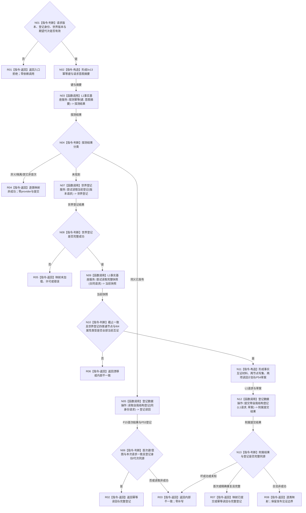

# L1-SIMPLIFY-P55 建立自我结构登记函数流程图 v0.1

更新时间：2026-08-05

## 依据

```text
规范/4015_子规范_L1简化事实基座.md
规范/4040_子规范_不透明结构事务候选确认撤销与最后发布.md
规范/7130_子规范_自我内部世界成员特征与事实读取投影.md
规范/详细设计/20260805_L1-SIMPLIFY-P17-NONBLOCKING-READ_L1非阻塞当前快照与事实代次读取详细设计_v0.1.md
规范/详细设计/20260805_L1-SIMPLIFY-P18-WORLD-REGISTRY-READ_世界登记非阻塞定位读取详细设计_v0.1.md
规范/详细设计/20260805_L1-SIMPLIFY-P54-SELF-STRUCTURE-REGISTRY-PARTICIPANT_简化7130自我结构登记参与者详细设计_v0.1.md
规范/详细设计/20260805_L1-SIMPLIFY-P55-SELF-STRUCTURE-REGISTRY-PUBLISH_简化7130自我结构登记原子发布详细设计_v0.1.md
```

## 身份与边界

正式待实施单函数图。唯一根形成登记业务意图、事实互证执行材料和精确两节点写集，再调用P54一次；P15/P17/P18/P54内部复杂流程由各自详细设计负责，本图不复制。

## 函数合同

```text
根函数：L1自我结构登记发布服务::建立自我结构登记
归属模块 / 文件 / 层级：海中鱼巣.领域.发布.L1自我结构登记 / 海中鱼巣/领域/发布.L1自我结构登记.ixx / L2登记领域业务发布
现有或待新增：待新增
完整签名：自我结构登记发布结果 建立自我结构登记(const 自我结构登记发布请求& 请求);
参数：请求为const借用，仅同步调用期间有效；包含版本、登记身份、世界规则版本和期望事实代次
返回结果：调用方拥有的值式结果；仅已提交/幂等读回携带完整登记
被调函数流程图：P17、P18、P54分别由其既有详细设计或单函数图展开
```

## 流程图



## 节点合同

| 节点 | 类型 | 参数 / 输入绑定 | 结果 / 输出绑定 | 事实读写 | 后继条件 | 验证 |
| --- | --- | --- | --- | --- | --- | --- |
| N01—N02 | 本函数内指令 | 请求 | 键、意图摘要 | 零事实写 | 输入有效 | 锁前拒绝、编码向量 |
| N03 | 函数调用 | 键、意图摘要 | P15探测结果 | 只读幂等账 | 探测完成 | provider前恰一次 |
| N05 | 函数调用 | 登记身份与世界版本 | P53值式登记 | 只读P53投影 | 同义路径 | P18/P17/P54均0次 |
| N07 | 函数调用 | P18版本请求 | 世界登记副本 | 只读登记投影 | 未找到首次路径 | 一次try-lock |
| N09 | 函数调用 | P17合同请求 | L1当前快照副本 | 只读L1 | P18成功 | 一次try-lock |
| N10—N11 | 本函数内指令 | 登记、快照、请求 | 执行材料、写集、计划、草案 | 零已发布写 | 全部互证 | 模式2、组1/5、键1/2 |
| N12 | 函数调用 | L1请求、P54草案 | 附属提交结果 | 一次L1事务与P53附属投影 | 调用完成 | 恰一次、零公开提交 |
| N13、R01—R08 | 本函数内指令 | 分支结果 | 值式公开结果 | 零额外写 | 返回 | 仅两成功携带登记 |

## 关键边界

```text
不建立独立写入规格：P54已冻结两节点、两本地键、读回计划和草案对应。
非空L1首次登记只使用P15事实互证模式，不使用空仓纯G0。
本函数不建立完整自我、五条固定关系、安全/服务根、实例槽、根值或根需求。
```
