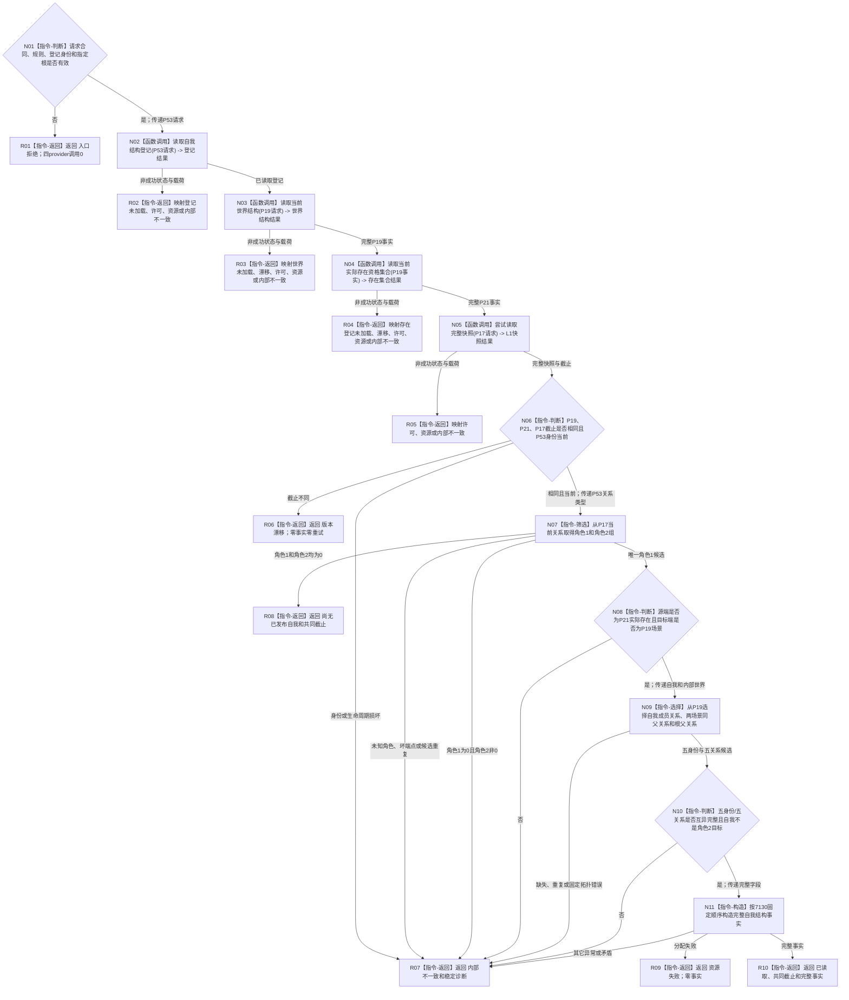

# L1-SIMPLIFY-P56 读取完整自我结构函数流程图 v0.1

更新时间：2026-08-05

## 依据

```text
规范/4015_子规范_L1简化事实基座.md
规范/4190_子规范_语义分层世界结构与状态动态因果边界.md
规范/4200_子规范_世界树业务服务与同代次完整事实快照.md
规范/7130_子规范_自我内部世界成员特征与事实读取投影.md
规范/详细设计/20260804_SELF-GOV-CLOSURE_自我内部治理初始闭环实现方案_v0.2.md
规范/详细设计/20260805_L1-SIMPLIFY-P56-COMPLETE-SELF-STRUCTURE-READ_7130完整自我结构非阻塞读取详细设计_v0.1.md
```

## 身份与边界

本图是待新增单函数的正式施工设计图，只表达7130完整自我结构非阻塞读取根。完整自我创建规格、L1事务发布、出生期成员、实例槽、根定义和运行期装配不在本图。

## 函数合同

```text
根函数：L1完整自我结构服务::读取完整自我结构
归属模块 / 文件 / 层级：海中鱼巣.领域.服务.L1完整自我结构 / 海中鱼巣/领域/服务.L1完整自我结构.ixx / L2领域聚合读取
现有或待新增：待新增
完整签名：完整自我结构读取结果 读取完整自我结构(const 完整自我结构读取请求& 请求) const;
参数：请求；const借用，仅调用期间有效；合同/读取/世界规则、登记身份和指定世界根必须有效
返回结果：调用方拥有的值式结果；仅已读取携带五身份五固定关系完整事实；尚无已发布自我可携带共同截止但不携带事实
被调函数流程图：P53读取自我结构登记、P19读取当前世界结构、P21读取当前实际存在资格集合、P17尝试读取完整快照均引用各自现行单函数流程图
```

## 流程图



## 节点合同

| 节点 | 类型 | 参数 / 输入绑定 | 结果 / 输出绑定 | 事实读写 | 后继条件 | 验证 |
| --- | --- | --- | --- | --- | --- | --- |
| N01 | 本函数内指令 | 公开请求 | 入口裁决 | 零事实写 | 合法/非法 | 无效输入provider调用0 |
| N02 | 函数调用 | 请求版本/登记身份 -> P53请求 | 登记结果 -> 登记 | 只读P53投影 | 已读取/非成功 | 恰一次、不持锁跨调用 |
| N03 | 函数调用 | 世界规则/根 -> P19请求 | 世界结构结果 -> P19事实 | 只读场景结构 | 完整/非成功 | 不复制P19语义 |
| N04 | 函数调用 | P19事实 -> P21请求 | 存在集合结果 -> P21事实 | 只读实际存在资格 | 完整/非成功 | 输入原样、一一对应 |
| N05 | 函数调用 | L1合同请求 -> P17请求 | 快照结果 -> P17快照 | 只读L1当前事实 | 成功/非成功 | 恰一次try-lock读取 |
| N06—N07 | 本函数内指令 | 三截止、登记、P17当前关系 | 当前角色1/2候选与诊断 | 零权威写 | 一致/漂移/损坏 | 只解释P53具名关系类型 |
| N08—N10 | 本函数内指令 | P19/P21事实、唯一角色1 | 五身份、五关系候选 | 零权威写 | 完整/诊断 | 资格、拓扑、自我非成员 |
| N11 | 本函数内指令 | 已验证候选 | 完整值式事实 | 零权威写 | 构造成功/异常 | 7130固定字段顺序 |
| R01—R10 | 本函数内指令 | 分支状态与材料 | 结构化读取结果 | 零事实写 | 返回 | 仅已读取携带完整事实 |

## 关键边界

```text
单根函数；P53→P19→P21→P17固定调用顺序；provider间不持锁。
共同截止不同只返回版本漂移，不拼接、不重试。
P19/P21分别保留场景和实际存在解释权；本函数只组合成功值式事实并解释关系21。
零L1写、零P15/P37、零缓存、零SQL/材料/旧栈、零完整自我创建。
```
