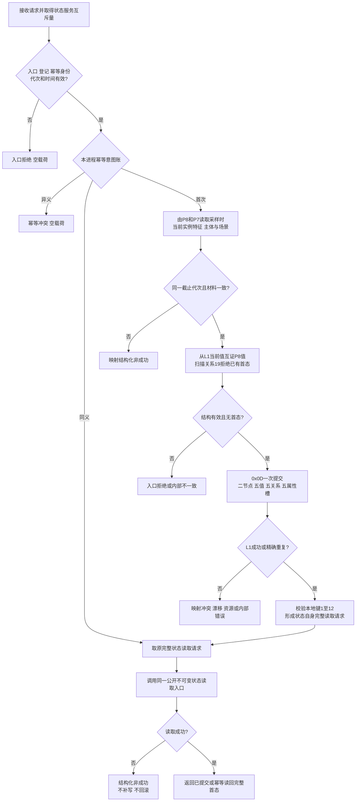
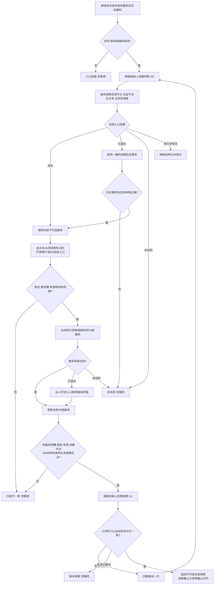

# 发布与读取实际存在 I64 基准状态函数流程图 v0.2

## 发布函数

```cpp
实际存在I64基准状态结果 L1状态服务::发布实际存在I64首个基准状态(
    const 实际存在I64首个基准状态发布请求& 请求);
```



## 读取函数

```cpp
实际存在I64基准状态结果 L1状态服务::读取实际存在I64基准状态(
    const 实际存在I64基准状态读取请求& 请求) const;
```



边界：P10 换代后旧 P8 值从历史入口互证；场景移动后仍返回状态角色2冻结的采样场景。本入口不选择当前或相邻状态，不生成关系20或动态。
