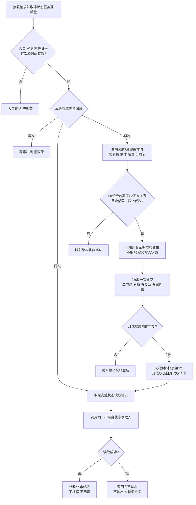
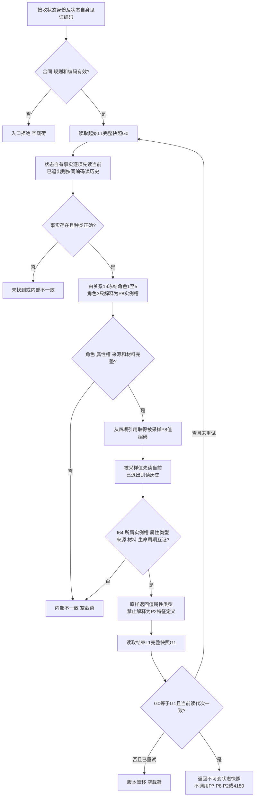

# 发布与读取实际存在 I64 基准状态函数流程图 v0.3

## 发布函数

```cpp
实际存在I64基准状态结果 L1状态服务::发布实际存在I64首个基准状态(
    const 实际存在I64首个基准状态发布请求& 请求);
```



## 读取函数

```cpp
实际存在I64基准状态结果 L1状态服务::读取实际存在I64基准状态(
    const 实际存在I64基准状态读取请求& 请求) const;
```



后继边界：3E以P9角色3实例槽与P10/P8新当前实例槽相等证明同一具体特征，再使用P10/P8合法返回的P2定义路由4180；不得使用P8值属性类型代替定义。
